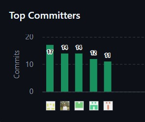

# **Registro de Versiones del Informe**

| **Versión** | **Fecha** | **Autor**  |   **Descripción**  |
| ----------- | --------- |----------- |--------------------|
| AV1 | 20/04/2026 | Tello Palacios, Fabrizio Rafael    Esquicha Alcántara, Diego Alonso    Rocha Cotrina, Alvaro    Quispe llacsahuanga, César Agusto    Checa Burga, Oscar Diego |  Creacion de estructura de informe en github y redacción de los 5 capítulos. Hicimos el despliegue de la primera versión de la Landing Page |

# **Project Report Collaborations Insights**

Nuestro proyecto fue hecho en el repositorio "upcpre-2026101asi0729-12029-Veltrix-report-av1-"

**Enlaze del repositorio:** [link del repositorio](https://github.com/user20-bit/upcpre-2026101asi0729-12029-Veltrix-report-av1-)

AV1: Se creo un repositorio colaborativo en github para el desarrollo del reporte de nuestro proyecto. Utilizamos gitflow para poder avanzar el informe sin problemas y de manera organizada. A continuación se evidencia los commits de cada integrante que aportó al desarrollo del informe de AV1.

**Evidencia**

# **Student Outcome**

El curso contribuye al cumplimiento del Student Outcome **ABET: ABET – EAC - Student Outcome 3** 

Criterio: Capacidad de comunicarse efectivamente con un rango de audiencias. En el siguiente cuadro se describe las acciones realizadas y enunciados de conclusiones por parte del grupo, que permiten sustentar el haber alcanzado el logro del *ABET – EAC - Student Outcome 3.* 

En el siguiente cuadro se describe las acciones realizadas y enunciados de conclusiones por parte del grupo, que permiten sustentar el haber alcanzado el logro del ABET – EAC - Student Outcome 3. 

| **Criterio Específico** | **Acciones realizadas** | **Conclusiones** |
|--------------------------|-------------------------------|------------------|
| **Comunica oralmente con efectividad a diferentes rangos de audiencia.** | **Tello Palacios, Fabrizio Rafael**  **AV1**  Se comunicó eficazmente los avances del proyecto al equipo y la explicación del flujo de trabajo en Git (rama develop). Esto permitió transmitir de forma clara tanto los requerimientos como la estructura y gestión del proyecto.    **Checa Burga, Oscar Diego** **AV1**  Se comunicó eficientemente durante los avances del proyecto, permitiendo realizar avances más rápidos. Esto permitio una mejor organización del proyecto y la realización del mismo   **Quispe llacsahuanga, César Agusto** **AV1** escribe aqui   **Esquicha Alcántara, Diego Alonso** **AV1** escribe aqui    **Rocha Cotrina, Alvaro**  **AV1** esqcribe aqui| El desarrollo del proyecto permitió integrar herramientas de análisis, diseño y control de versiones, logrando una solución coherente y bien estructurada. Asimismo, se evidenció la importancia de una comunicación clara y adaptada a distintos tipos de audiencia para asegurar la comprensión y el éxito del trabajo realizado.

| **Comunica por escrito con efectividad a diferentes rangos de audiencia** | **Tello Palacios, Fabrizio Rafael**  **AV1**  Se comunicaron por escrito los avances del proyecto de forma clara y estructurada la documentación del flujo de trabajo en Git. Esto permitió adaptar el contenido tanto para audiencias técnicas como no técnicas.    **Checa Burga, Oscar Diego** **AV1**  escribe aqui    **Quispe llacsahuanga, César Agusto** **AV1** escribe aqui   **Esquicha Alcántara, Diego Alonso** **AV1** escribe aqui    **Rocha Cotrina, Alvaro**  **AV1** esqcribe aqui|  En conclusión, la documentación desarrollada evidenció la capacidad de transmitir información de manera escrita con claridad y coherencia, facilitando la comprensión del proyecto en distintos niveles. Asimismo, se demostró que el uso de recursos estructurados y visuales mejora la comunicación y el entendimiento entre los diferentes actores involucrados. |

# Introducción
## 1.1 Startup Profile
### 1.1.1 Descripción de la Startup

Somos una startup peruana denominada **Veltrix**, creada por estudiantes de la carrera de Ingeniería de Software de la Universidad Peruana de Ciencias Aplicadas (UPC), que tiene como objetivo principal optimizar la gestión y control de dispositivos electrónicos en hogares y pequeñas empresas mediante el uso de tecnología IoT.

Nuestra misión es lograr que ninguna persona o negocio gestione sus dispositivos eléctricos de forma manual o desorganizada, promoviendo un control centralizado, automatizado y accesible que permita mejorar la eficiencia energética, la seguridad y la comodidad en el día a día.

Para cumplir con este propósito, hemos desarrollado el proyecto **DomotiCore**, una plataforma web de domótica que permite a los usuarios gestionar, monitorear y automatizar dispositivos electrónicos de manera centralizada. La solución ofrece control en tiempo real, programación de horarios, monitoreo del estado de los dispositivos y una interfaz intuitiva que facilita la interacción del usuario sin necesidad de conocimientos técnicos avanzados.

### 1.1.2. Perfiles de los Miembros del Equipo

docs: update formatting and improve table structure in readme.
| Foto | Apellido y Nombre | 
| --- | --- | 
 | *Checa Buga Oscar Diego - u20231e492* Soy estudiante de la carrera de ingeniería de software de 5to ciclo, interesado en el desarrollo de soluciones tecnológicas. Destaco por mi trabajo en equipo y comunicación constante. Tengo conocimiento en base de datos, desarrollo de aplicaciones y programación. Me gusta ir adaptándome a las nuevas tecnologías y aprender de estas, para poder desarrollar más en el ámbito profesional.
 | *Esquicha Alcántara Diego Alonso - u202411799* Soy un estudiante de la carrera de ingeniería de software de quinto ciclo, me destaco por mis habilidades de comunicación y liderazgo para trabajar en equipo. Una de mis fortalezas es el desarrollo de la documentación necesaria para dar a marcha un proyecto o trabajo grupal y la comodidad de aprender de manera rápida y eficiente alguna herramienta tecnológica.  
 | *Quispe Llacsahuanga César Agusto - u202417405* Soy estudiante de Ingeniería de Software, interesado en el desarrollo de soluciones tecnológicas y el aprendizaje continuo en herramientas de programación. Cuento con conocimientos en lógica de programación, bases de datos y desarrollo de aplicaciones, lo que me permite contribuir en la construcción de sistemas eficientes. Me caracterizo por ser responsable, proactivo y con buena disposición para el trabajo en equipo, adaptándome a nuevos retos y aportando en el cumplimiento de los objetivos del proyecto. 
 | *Rocha Cotrina Alvaro - u202411243* Soy estudiante de Ingeniería de Software, con enfoque en el desarrollo backend, bases de datos y lógica de programación. Cuento con experiencia en la creación de aplicaciones y resolución de problemas mediante programación, especialmente en lenguajes como C++ y el diseño de sistemas estructurados. Me caracterizo por ser organizado, responsable y comprometido con el trabajo en equipo, aportando en la construcción de soluciones eficientes y en la correcta estructuración de la arquitectura del sistema. Además, tengo una gran capacidad de aprendizaje y adaptación a nuevas tecnologías, lo que me permite contribuir activamente en el desarrollo del proyecto.
 | *Tello Palacios Fabrizio Rafael - u202113310*  Soy estudiante de la carrera de Ingeniería de Software. Considero que soy una persona comprometida en cada trabajo y tarea y siempre trato de dar lo mejor de mi en cada situación. A veces tengo complicaciones con la organización de mi tiempo, pero siempre estoy atento a cualquier problema dentro del equipo para poder pensar en soluciones y llegar a la mejor posible. Me gustan los retos, porque son esos retos los que me motivan a ser mejor como persona y como estudiante. Tengo muchas  cosas en las que mejorar y sé que lo lograré con disciplina y perseverancia.

## 1.2 Solution Profile

### 1.2.1 Antecedentes y Problemática

**What / ¿QUÉ?**  
Se presenta una falta de control centralizado y automatización en la gestión de dispositivos electrónicos, lo que genera ineficiencia en el uso de energía y dependencia de procesos manuales en hogares y pequeñas empresas.  

**When / ¿CUÁNDO?**  
El problema se manifiesta de manera crítica cuando los usuarios olvidan apagar dispositivos, requieren activarlos de forma remota o necesitan programar su funcionamiento en horarios específicos sin intervención manual.  

**Where / ¿DÓNDE?**  
Se observa principalmente en entornos domésticos y pequeños negocios donde múltiples dispositivos eléctricos operan de forma independiente sin integración en un sistema centralizado.  

**Who / ¿QUIÉN?**  
Afecta a propietarios de viviendas, emprendedores y administradores de pequeños negocios que buscan optimizar el control de sus dispositivos eléctricos y reducir costos operativos.  

**Why / ¿POR QUÉ?**  
Sucede debido a la ausencia de soluciones accesibles y centralizadas que integren dispositivos IoT en una sola plataforma, generando procesos manuales, falta de automatización y desperdicio energético.  

**How / ¿CÓMO?**  
A diferencia de un sistema automatizado donde los dispositivos responden a configuraciones inteligentes, el problema se presenta como una gestión manual constante, provocando ineficiencia operativa y pérdida de control.  

**How Much / ¿CUÁNTO?**  
Los usuarios pueden perder entre un 15% y 25% de eficiencia energética debido al uso manual e inadecuado de dispositivos, lo que se traduce en mayores costos de electricidad y menor optimización de recursos.  

---

## 1.2.2 Lean UX Process

### 1.2.2.1 Lean UX Problem Statements

El estado actual de la gestión de dispositivos electrónicos en hogares y pequeñas empresas depende en gran medida de controles manuales y soluciones aisladas, lo que genera falta de automatización, desperdicio energético y dificultad para ejercer control remoto.  

Los productos actuales no resuelven de manera eficiente la necesidad de una plataforma centralizada, accesible y fácil de usar que permita integrar y gestionar dispositivos IoT sin requerir conocimientos técnicos especializados.  

DomotiCore abordará esta problemática mediante una plataforma web que centraliza el control de dispositivos, permite su automatización mediante horarios programados y proporciona monitoreo en tiempo real desde cualquier ubicación.  

Nuestro enfoque inicial estará dirigido a usuarios domésticos y pequeños negocios que buscan optimizar su consumo energético y mejorar la gestión de sus dispositivos. Sabremos que hemos tenido éxito cuando observemos una reducción en el consumo eléctrico, una mayor adopción de automatizaciones y un uso recurrente de la plataforma.  

---

### 1.2.2.2 Lean UX Assumptions

#### A. Business Assumptions

- Creemos que nuestros clientes necesitan: Centralizar el control de sus dispositivos electrónicos y automatizar su funcionamiento para mejorar la eficiencia energética y operativa.  

- Estas necesidades se resuelven con: Una plataforma web de domótica (DomotiCore) que integre control remoto, monitoreo y automatización en una única interfaz.  

- Nuestros primeros clientes serán:  
Usuarios de hogares inteligentes y pequeños negocios que buscan optimizar recursos y reducir costos.  

- Valor #1 esperado:  
Control centralizado y automatización en tiempo real.  

- Beneficios adicionales:  
Reducción del consumo energético, ahorro económico, mayor comodidad y seguridad.  

- Adquisición:  
Difusión en redes sociales, demostraciones funcionales y validación mediante proyectos académicos.  

- Ingresos: Modelo freemium con funcionalidades básicas gratuitas y opciones avanzadas bajo suscripción.  

- Competencia principal: Soluciones de domótica como Google Nest y Amazon Alexa.  

- Ventaja competitiva: Plataforma web accesible, intuitiva y enfocada en usuarios sin experiencia técnica.  

- Mayor riesgo de producto: Complejidad en la integración con dispositivos físicos IoT.  

- Mitigación: Uso de dispositivos estándar (ESP32/Arduino), simulación de hardware y arquitectura escalable.  

#### B. User Assumptions

- ¿Quién es el usuario?  
Usuarios domésticos y emprendedores que buscan automatizar su entorno.  

- ¿Dónde encaja el producto?  
En la gestión diaria de dispositivos del hogar o negocio.  

- Problema a resolver:  
Falta de control remoto y automatización eficiente.  

- Uso típico:  
Encender/apagar dispositivos, programar horarios, monitorear estados.  

- Características importantes:  
Dashboard en tiempo real, automatización programada, control remoto.  

- Look & feel:  
Interfaz moderna, limpia, intuitiva y accesible desde navegador web.  

#### C. User Outcome & Benefit Assumptions

- Visibilidad total del estado de los dispositivos  
- Reducción del consumo energético  
- Automatización de tareas repetitivas  
- Mayor comodidad y control remoto  

#### D. Business Outcome Assumptions

- Reducción del 20% en el consumo energético en los primeros meses  
- Incremento del 30% en el uso de automatizaciones  
- Alcanzar 100 usuarios activos en el primer año  
- Retención superior al 80%  

#### E. Feature Assumptions

- Dashboard Centralizado: permitirá visualizar todos los dispositivos en una sola interfaz  
- Automatización Programada: reducirá la intervención manual  
- Control Remoto: aumentará la frecuencia de uso y satisfacción  

---

### 1.2.2.3 Lean UX Hypothesis Statements

#### Control Centralizado
Creemos que al ofrecer un dashboard en tiempo real que centralice el estado de todos los dispositivos, reduciremos la interacción manual de los usuarios en un 25% y mejoraremos su capacidad de control sobre el entorno. Sabremos que estamos bien cuando veamos los siguientes comentarios del mercado: "Ahora puedo controlar todos mis dispositivos desde un solo lugar" y/o los registros del sistema muestren que los usuarios acceden al dashboard de manera diaria para monitorear y gestionar sus dispositivos.  

#### Automatización de Dispositivos
Creemos que al permitir la programación de horarios y automatizaciones, los usuarios podrán optimizar el uso de sus dispositivos, reduciendo el consumo energético en un 20%. Sabremos que estamos bien cuando veamos los siguientes comentarios del mercado: "Ya no tengo que preocuparme por apagar mis dispositivos, todo funciona automáticamente" y/o los datos de uso reflejen una alta frecuencia en la configuración de automatizaciones recurrentes.  

#### Acceso Remoto
Creemos que al ofrecer acceso remoto desde cualquier ubicación, incrementaremos la satisfacción del usuario y su percepción de control sobre sus dispositivos. Sabremos que estamos bien cuando veamos los siguientes comentarios del mercado: "Puedo controlar mi casa incluso cuando no estoy ahí" y/o los registros del sistema indiquen un uso frecuente de la plataforma fuera de la red local.  

#### Optimización energética
Creemos que al proporcionar monitoreo del estado de los dispositivos y fomentar su uso eficiente, los usuarios lograrán reducir el desperdicio energético en sus hogares o negocios. Sabremos que estamos bien cuando veamos los siguientes comentarios del mercado: "He notado una reducción en mi consumo de electricidad" y/o se registren patrones de uso más eficientes en los dispositivos controlados mediante la plataforma.  

---

| **Business Problem** | **Solutions** | **Business Outcomes** |
| :------------------- | :------------ | :------------------- |
|El estado actual de la gestión de dispositivos electrónicos en hogares y pequeños negocios se caracteriza por una alta dependencia de controles manuales, interruptores físicos y soluciones aisladas que no se encuentran integradas entre sí. Esta situación genera un uso ineficiente de la energía, falta de automatización, baja capacidad de monitoreo remoto y pérdida de control sobre los dispositivos. Los usuarios suelen depender de su presencia física para gestionar equipos eléctricos, lo que incrementa el riesgo de olvidos, consumo innecesario y problemas de seguridad. Además, las soluciones existentes suelen ser costosas o complejas, dificultando su adopción por parte de usuarios sin conocimientos técnicos. DomotiCore busca cerrar esta brecha mediante una plataforma web de domótica que centraliza el control, automatiza el funcionamiento de dispositivos y proporciona monitoreo en tiempo real. Nuestro enfoque inicial está dirigido a usuarios domésticos y pequeños negocios que buscan optimizar su consumo energético y mejorar su calidad de vida. Sabremos que hemos tenido éxito cuando logremos reducir el consumo energético, aumentar el uso de automatizaciones y generar una adopción constante de la plataforma.. | **- Dashboard centralizado:** Visualización en tiempo real del estado de todos los dispositivos conectados en una sola interfaz   **- Automatización por horarios:** Configuración de encendido y apagado automático de dispositivos según rutinas del usuario.   **- Control remoto:** Acceso desde cualquier lugar para gestionar dispositivos sin necesidad de presencia física.   **- Monitoreo en tiempo real:** Seguimiento del estado de dispositivos para mejorar el control y la toma de decisiones. | - Reducción del 20% en el consumo energético en los primeros meses de uso.   - Disminución del uso manual de dispositivos en al menos un 25%.   - Incremento del 30% en la adopción de automatizaciones por parte de los usuarios.   - Alcanzar 100 usuarios activos en el primer año.   - Retención de usuarios superior al 80% mediante una experiencia simple e intuitiva. |

| **Users** | **User Outcomes & Benefits** |
| :-------- | :-------------------------- |
| **- Usuarios domésticos:** “Quiero tener control total de los dispositivos de mi hogar sin depender de mi presencia física, optimizando el consumo energético y evitando errores por olvidos.”   **- Emprendedores / pequeños negocios:** “Necesito optimizar el consumo energético y mejorar el control operativo de mis equipos para reducir costos, aumentar la eficiencia y evitar pérdidas por falta de supervisión.”    | **- Usuarios domésticos:** Control total de sus dispositivos electrónicos desde cualquier lugar, permitiendo la automatización de tareas repetitivas y una gestión más eficiente del hogar. La solución les permite reducir la dependencia de acciones manuales y mejorar la organización de su rutina diaria. Beneficios: Ahorro de energía, mayor tranquilidad al evitar olvidos (luces o equipos encendidos), incremento en la comodidad y mejor control del entorno doméstico.   **- Pequeños negocios / emprendedores:** Optimización del consumo energético y mayor control operativo sobre los dispositivos del negocio, especialmente en contextos donde el propietario no se encuentra físicamente presente. La plataforma permite supervisar, automatizar y tomar decisiones rápidas sobre el uso de equipos eléctricos. Beneficios: Reducción de costos operativos, disminución de errores humanos (como olvidar apagar equipos), mayor eficiencia en la gestión diaria y mejor control del negocio en tiempo real.  |

| **Hypotheses** | **What’s the most important thing we need to learn first?** | **What’s the least amount of work we need to do to learn the next most important thing?** |
| :------------- | :------------------------ | :----------------------- |
| **- Creemos que** reduciremos el consumo energético en un 20% si los usuarios utilizan la automatización programada de DomotiCore en lugar del control manual de sus dispositivos electrónicos.   **- Creemos que** aumentaremos la frecuencia de uso de la plataforma en un 30% si ofrecemos un dashboard centralizado con información clara, accesible y en tiempo real sobre el estado de los dispositivos.   **- Creemos que** incrementaremos la satisfacción del usuario en un 25% si permitimos el acceso remoto desde cualquier dispositivo, facilitando el control de su hogar o negocio sin importar su ubicación.   **- Creemos que** lograremos una adopción inicial rápida si la plataforma presenta una interfaz intuitiva con onboarding guiado que no requiera conocimientos técnicos previos.   **- Creemos que** disminuiremos los errores operativos (como dejar dispositivos encendidos) si los usuarios reciben notificaciones o alertas automáticas sobre el estado de sus equipos.   - **Creemos que** mejoraremos la eficiencia operativa en pequeños negocios si centralizamos el control de múltiples dispositivos en una sola plataforma accesible. | - ¿La automatización realmente representa el mayor valor para los usuarios o prefieren mantener control manual con supervisión remota?   - ¿Están los usuarios dispuestos a confiar en una plataforma digital para controlar dispositivos críticos de su hogar o negocio?   - ¿Qué tipo de dispositivos (luces, enchufes inteligentes, electrodomésticos) son considerados prioritarios para automatizar?   - ¿La facilidad de uso es un factor decisivo para la adopción o existen otras barreras como el costo o la seguridad?   - ¿Los pequeños negocios perciben el ahorro energético como un beneficio relevante o priorizan más el control operativo? | - Realizar entrevistas a usuarios domésticos y emprendedores para identificar sus principales “pain points” en la gestión de dispositivos eléctricos.   - Desarrollar un prototipo navegable de alta fidelidad (Figma) que simule el dashboard y las funcionalidades de control remoto y automatización.   - Implementar una simulación básica de dispositivos IoT (usando ESP32 o entornos virtuales) para validar el funcionamiento del sistema.   - Ejecutar pruebas de usabilidad con usuarios reales para evaluar la comprensión de la interfaz y la facilidad de uso.   - Recoger feedback directo mediante sesiones de prueba y encuestas para validar qué funcionalidades generan mayor valor. |

## 1.3 Segmentos Objetivos

### Segmento 1: Usuarios de Hogares Inteligentes

Corresponde a los usuarios finales que buscan mejorar su calidad de vida mediante la automatización de su entorno doméstico, conformado por personas entre 20 y 50 años con acceso a tecnología y familiarizadas con el uso de smartphones, aplicaciones móviles y servicios digitales, incluyendo estudiantes, profesionales y familias jóvenes que valoran la comodidad, la seguridad y la eficiencia en su día a día; en su rutina enfrentan problemas como olvidar apagar dispositivos, depender de acciones manuales constantes o no tener visibilidad del estado de sus equipos cuando están fuera de casa, lo que genera pequeñas ineficiencias acumulativas; psicográficamente, priorizan soluciones prácticas, intuitivas y accesibles que no requieran conocimientos técnicos avanzados, buscando herramientas que automaticen tareas repetitivas y optimicen su tiempo; en este contexto, una plataforma como DomotiCore representa una solución integral que no solo mejora la organización del hogar, sino que también contribuye al ahorro energético y brinda mayor tranquilidad mediante el control remoto de los dispositivos.

### Segmento 2: Pequeños Negocios y Emprendedores

Define a los usuarios a nivel operativo y comercial que gestionan pequeños negocios y requieren optimizar el uso de sus recursos para mantener la rentabilidad, conformado por emprendedores y propietarios de establecimientos como farmacias, tiendas o locales comerciales, generalmente con equipos reducidos de trabajo y recursos limitados; estos negocios utilizan múltiples dispositivos eléctricos en su operación diaria, los cuales suelen ser gestionados de forma manual o sin un sistema centralizado, generando problemas como consumo energético innecesario, falta de control cuando el propietario no está presente y dependencia de terceros para supervisar el funcionamiento; psicográficamente, valoran soluciones confiables, accesibles y que generen un impacto directo en la reducción de costos y mejora operativa, priorizando herramientas fáciles de usar que no impliquen alta complejidad técnica; en el contexto actual, esta falta de automatización puede traducirse en pérdidas económicas y menor eficiencia, por lo que una plataforma como DomotiCore representa no solo una mejora tecnológica, sino una oportunidad estratégica para optimizar procesos, reducir gastos y mejorar el control del negocio desde cualquier lugar.

