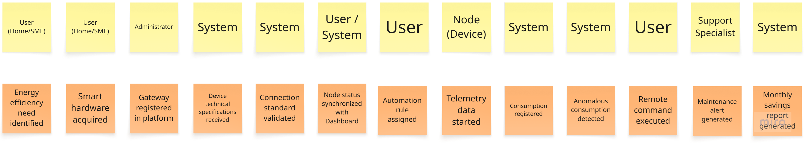

# Requirements Elicitation & Analysis

La recolección y análisis de requisitos es una etapa fundamental en el desarrollo de la plataforma DomotiCore, ya que permite identificar y comprender las necesidades de los stakeholders involucrados en la gestión, monitoreo y automatización. A través de técnicas como entrevistas, análisis de la competencia y evaluación de escenarios de uso, se busca obtener una visión clara de problemáticas como la falta de visibilidad, la fragmentación de la información y la ausencia de estandarización en los procesos. Este análisis permite definir los requerimientos clave del sistema, estableciendo una base sólida para el diseño y desarrollo de una solución que optimice la gestión de proyectos y mejore la toma de decisiones dentro de las organizaciones.

## 2.1 Competidores
En la siguiente sección se presentarán los principales competidores de nuestra solución, así como un análisis general de sus características en comparación con el servicio propuesto.

**Control4**:
 Es una de las plataformas más completas en el ámbito de la domótica, orientada a la automatización integral del hogar. Permite gestionar y controlar dispositivos como iluminación, climatización, audio, video y sistemas de seguridad desde una sola interfaz. Ofrece una alta capacidad de personalización e integración con múltiples marcas, lo que la hace muy potente para proyectos complejos. Sin embargo, suele requerir instalación profesional y su costo es elevado, lo que la hace menos accesible para usuarios promedio.

**Hive**:
 Es una solución de hogar inteligente enfocada en el control y monitoreo de dispositivos como termostatos, luces y sensores. Permite gestionar los equipos mediante una aplicación móvil intuitiva, destacando por su facilidad de uso y enfoque en la eficiencia energética. Hive es ideal para usuarios que buscan soluciones simples y funcionales. No obstante, su ecosistema es limitado en comparación con otras plataformas y depende en gran medida de sus propios dispositivos.

**Eve Systems**:
 Es una solución de domótica que se enfoca en el control de dispositivos inteligentes con un fuerte énfasis en la privacidad del usuario. Sus productos permiten gestionar sensores, enchufes y consumo energético a través de aplicaciones compatibles con ecosistemas como Apple HomeKit. Destaca por su funcionamiento local sin necesidad de la nube. Sin embargo, su compatibilidad está limitada principalmente a dispositivos del ecosistema de Apple, lo que restringe su adopción.

 ### 2.1.1 Analisis Competitivo

| **¿Por qué llevar a cabo este análisis?** | Analizar y comparar a Veltrix con competidores como Control4, Hive y Eve Systems para identificar oportunidades de diferenciación, ventajas competitivas y áreas de mejora en el mercado de la domótica. |
| ----------------------------------------- | -------------------------------------------------------------------------------------------------------------------------------------------------------- |

| **Categoría**                              | **Veltrix (Startup)**                                                                                        | **Control4**                                                         | **Hive**                                                             | **Eve systems**                                           |
| ------------------------------------------ | ---------------------------------------------------------------------------------------------------------------- | ---------------------------------------------------------------- | ---------------------------------------------------------------- | --------------------------------------------------------------- |
| **Perfil**                                 |                                                                                                                  |                                                                  |                                                                  |                                                                 |
| **Overview**                               | Plataforma digital de domótica enfocada en el control, monitoreo y automatización de dispositivos desde una sola app, con enfoque en simplicidad y accesibilidad. | Plataforma avanzada de automatización del hogar con integración total de dispositivos y soluciones personalizadas.          | Sistema de hogar inteligente centrado en control de dispositivos y eficiencia energética mediante app móvil.              | Solución de domótica enfocada en privacidad y control local de dispositivos compatibles con Apple.   |
| **Ventaja competitiva (valor al cliente)** | Plataforma simple, accesible y abierta, con monitoreo en tiempo real y posible analítica inteligente.| Alta personalización e integración profesional de múltiples dispositivos. | Facilidad de uso y enfoque práctico en ahorro energético.      | Privacidad, seguridad de datos y funcionamiento sin depender de la nube. |
| **Perfil de Marketing**                    |                                                                                                                  |                                                                  |                                                                  |                                                                 |
| **Mercado objetivo**                       | Usuarios domésticos y pequeñas empresas que buscan soluciones accesibles y fáciles de usar.| Segmento premium, hogares de alto nivel y proyectos personalizados.  | Usuarios promedio interesados en automatización básica y ahorro energético. |Usuarios del ecosistema Apple preocupados por la privacidad. |
| **Estrategias de marketing**               | Marketing digital, enfoque en simplicidad, bajo costo y experiencia de usuario. | Distribuidores certificados, instalación profesional y branding premium. | Publicidad masiva, enfoque en facilidad de uso y ahorro.| Marketing enfocado en privacidad y usuarios Apple.  |
| **Perfil de Producto**                     |                                                                                                                  |                                                                  |                                                                  |                                                                 |
| **Productos & Servicios**                  | Web de monitoreo, control remoto, automatización e integración de dispositivos IoT.| Sistema completo de automatización (hardware + software). | Dispositivos inteligentes (termostatos, sensores, luces) + app. | Dispositivos inteligentes compatibles con Apple HomeKit.|
| **Precios & Costos**                       | Bajo o modelo freemium / suscripción accesible. | Alto costo, instalación profesional requerida. | Precios medios, accesibles para usuarios comunes.| Precios medios-altos por enfoque premium.   |
| **Canales de distribución**                | App Web      | Distribuidores autorizados  | App móvil + venta online   | App móvil + tiendas |
| **Análisis SWOT**                          |                                                                                                                  |                                                                  |                                                                  |                                                                 |
| **Fortalezas**                             | • Accesible.   • Fácil uso.   • Flexible e integrador.                             | • Potente y reconocido.   • Personalizable.        | • Fácil de usar.   • Interfaz amigable y adaptable.             | • Alta privacidad.   • Seguridad.          |
| **Debilidades**                            | • Nuevo en el mercado.   • Bajo reconocimiento de marca.                                                        | • Complejo.   • Alto costo.                   | • Ecosistema limitado. | • Dependiente del ecosistema Apple.
| **Oportunidades**                          | • Crecimiento del mercado IoT.   • Usuarios buscan soluciones simples y económicas.             | • Expansión ágil.   • Integración con nuevas tecnologías.       | • Mayor adopción de smart homes.   • Aumento del mercado.   | • Crecimiento de usuarios Apple. |
| **Amenazas**                               | • Competidores fuertes.   • Grandes empresas como Google o Amazon.                                            | • Competidores más accesibles.   • Saturación del mercado ágil. | • Competidores más completos.   • Competencia de grandes ecosistemas. | • Limitación de compatibilidad.   |

### 2.1.2. Estrategias y tácticas frente a competidores.

Para destacar frente a la competencia en el mercado de soluciones de domótica e IoT, es fundamental que Veltrix, a través de su plataforma DomotiCore, implemente estrategias y tácticas que le permitan diferenciarse de soluciones consolidadas y captar tanto a usuarios domésticos como a pequeños negocios que buscan alternativas más accesibles, simples y centralizadas. A continuación, se describen las principales estrategias y tácticas que se implementarán:

1. **Enfoque en simplicidad y accesibilidad**

Estrategia:
Diferenciar la plataforma mediante un enfoque orientado a la simplicidad de uso y accesibilidad, frente a soluciones más complejas o técnicas presentes en el mercado.

Táctica:
Diseñar una interfaz intuitiva y amigable que permita a los usuarios gestionar y automatizar dispositivos sin requerir conocimientos técnicos avanzados, reduciendo la barrera de entrada para nuevos usuarios.

2. **Centralización del control de dispositivos**

Estrategia:
Ofrecer una solución que permita el control centralizado de múltiples dispositivos electrónicos desde una sola plataforma.

Táctica:
Implementar un panel unificado que muestre el estado en tiempo real de los dispositivos, facilite el encendido/apagado remoto y permita la automatización de acciones, evitando la dependencia de múltiples aplicaciones.

3. **Orientación a la eficiencia energética**

Estrategia:
Posicionar a DomotiCore como una herramienta que contribuye directamente al ahorro energético y la optimización del consumo eléctrico.

Táctica:
Incorporar funcionalidades de monitoreo de consumo, programación de horarios y alertas automáticas que ayuden a los usuarios a reducir el uso innecesario de energía en hogares y pequeños negocios.

4. **Enfoque en control remoto y seguridad**

Estrategia:
Brindar mayor tranquilidad a los usuarios mediante el control y monitoreo de dispositivos desde cualquier lugar.

Táctica:
Desarrollar acceso remoto seguro que permita verificar el estado de los dispositivos en tiempo real, recibir notificaciones y ejecutar acciones correctivas cuando el usuario no se encuentre físicamente en el lugar.

5. **Estrategia de adopción y crecimiento**

Estrategia:
Facilitar la adopción de la plataforma mediante un modelo accesible que incentive su uso progresivo.

Táctica:
Ofrecer versiones gratuitas o planes iniciales de bajo costo, junto con guías de uso y configuraciones predefinidas que permitan a los usuarios experimentar rápidamente los beneficios de DomotiCore.

6. **Apertura e integración con distintos dispositivos IoT**

Estrategia:
Diferenciarse de soluciones cerradas promoviendo una plataforma abierta y adaptable a distintos ecosistemas IoT.

Táctica:
Diseñar DomotiCore con capacidad de integración progresiva con diversos dispositivos y tecnologías IoT, permitiendo su escalabilidad y evitando la dependencia de un único fabricante o ecosistema cerrado.

## 2.2 Entrevistas

### 2.2.1 Diseño de Entrevistas
 #### Preguntas presentación

- ¿Cual es su nombre?
- ¿Cuántos años tiene?
- ¿Cuál es su distrito de residencia?
- ¿En qué escuela trabaja?

 ### Segmento 1: Usuarios de Hogares Inteligentes

#### Preguntas principales:

1. ¿Cuántas personas viven en su hogar y cuál es su rutina diaria?
2. ¿Qué dispositivos electrónicos utiliza con mayor frecuencia en casa?
3. ¿Cómo controla actualmente sus dispositivos (luces, enchufes, etc.)?
4. ¿Ha tenido problemas por olvidar apagar algún dispositivo? ¿Cuál?
5. ¿Le gustaría poder controlar sus dispositivos cuando no está en casa? ¿Por qué?
6. ¿Utiliza actualmente alguna tecnología inteligente (Alexa, apps, timers, etc.)?
7. ¿Qué tan importante es para usted el ahorro de energía en el hogar?
8. ¿Qué dificultades encuentra al gestionar sus dispositivos diariamente?
9. ¿Qué características le gustaría tener en una solución de automatización del hogar?
10. ¿Estaría dispuesto a usar una plataforma web para controlar sus dispositivos?
#### Preguntas complementarias:
11. ¿Qué tan cómodo se siente usando nuevas tecnologías?
12. ¿Qué tan seguido utiliza internet en casa?
13. ¿Qué lo motivaría a adoptar una solución como esta?

### Segmento 2: Pequeños Negocios y Emprendedores

#### Preguntas principales:
1. ¿A qué se dedica su negocio y cuántas personas trabajan con usted?
2. ¿Qué tipo de dispositivos eléctricos utiliza en su negocio?
3. ¿Cómo controla actualmente el uso de estos dispositivos?
4. ¿Ha tenido problemas por consumo excesivo de energía?
5. ¿Ha ocurrido alguna vez que se olviden equipos encendidos? ¿Qué pasó?
6. ¿Cómo gestiona el control de su negocio cuando no está presente?
7. ¿Qué herramientas utiliza para supervisar sus operaciones diarias?
8. ¿Qué problemas enfrenta al gestionar varios equipos o áreas del negocio?
9. ¿Qué funcionalidades le gustaría tener en una solución tecnológica?
10. ¿Estaría dispuesto a usar una plataforma que centralice el control de sus dispositivos?
#### Preguntas complementarias:
11. ¿Los dispositivos funcionan de manera simultánea o en horarios específicos?
12. ¿Utiliza celular o computadora para gestionar su negocio?
13. ¿Confía en soluciones digitales para controlar su negocio? ¿Por qué?

### 2.2.2 Registro de Entrevistas
En esta sección presentamos los registros de las entrevistas que hicimos para cada segmento objetivo de nuestra aplicación.

**Segmento 1:**

<table>
<colgroup>
</colgroup>
<thead>
  <tr>
    <th colspan="2">Entrevista #1 </th>
  </tr>
</thead>
<tbody>
  <tr>
    <td>Nombre</td>
    <td>Magali</td>
  </tr>
  <tr>
    <td>Apellidos</td>
    <td>Alcántara Morales</td>
  </tr>
  <tr>
    <td>Edad</td>
    <td>46 años</td>
  </tr>
  <tr>
    <td>Distrito</td>
    <td>Barranco</td>
  </tr>
  <tr>
    <td>Evidencia</td>
    <td>
</td>
  </tr>
  <tr>
    <td>Link</td>
    <td>
<a target="_blank"  href="https://upcedupe-my.sharepoint.com/:v:/g/personal/u202411799_upc_edu_pe/IQDMOpzsdtJiQa1N8vOIV_00AZWnkIsKWCCDzgBvojaQPPk?nav=eyJyZWZlcnJhbEluZm8iOnsicmVmZXJyYWxBcHAiOiJPbmVEcml2ZUZvckJ1c2luZXNzIiwicmVmZXJyYWxBcHBQbGF0Zm9ybSI6IldlYiIsInJlZmVycmFsTW9kZSI6InZpZXciLCJyZWZlcnJhbFZpZXciOiJNeUZpbGVzTGlua0NvcHkifX0&e=y9HEGJ" title="Title">Microsoft Stream
</td>
  </tr>
  <tr>
    <td>Duracion </td>
    <td>0:00 min - 07:53 min</td>
  </tr>
  <tr>
    <td>Resumen</td>
    <td>
		Magali Alcántara es una usuaria de hogar inteligente que vive con tres personas más y combina su rutina diaria entre trabajo, emprendimiento y labores del hogar, utilizando de forma constante dispositivos electrónicos como el celular, la televisión, cargadores y computadoras. Actualmente controla todos sus dispositivos de manera manual, lo que le ha generado problemas como olvidar apagar cargadores o dejar encendida la laptop, ocasionando riesgos y consumo innecesario de energía. Considera muy importante el ahorro energético por su impacto en la economía del hogar y reconoce dificultades para gestionar sus dispositivos de forma práctica y segura. Aunque no utiliza tecnologías inteligentes como asistentes virtuales, manifiesta un alto interés en poder controlar sus dispositivos de manera remota mediante una aplicación o plataforma web, principalmente por motivos de seguridad, ahorro de tiempo y tranquilidad. Está dispuesta a adoptar nuevas tecnologías, siempre que sean fáciles de usar y realmente simplifiquen su estilo de vida, destacando que el acceso permanente a internet facilitaría la implementación de una solución de automatización del hogar.
</td>
  </tr>
</tbody>
</table>

<table>
  <colgroup>
  </colgroup>
  <thead>
    <tr>
      <th colspan="2">Entrevista #2 </th>
    </tr>
  </thead>

  <tbody>
    <tr>
      <td>Nombre</td>
      <td>Fabio Joaquin</td>
    </tr>
    <tr>
      <td>Apellidos</td>
      <td>Córdova Valdivia</td>
    </tr>
    <tr>
      <td>Edad</td>
      <td>22 años</td>
    </tr>
    <tr>
      <td>Distrito</td>
      <td>Comas</td>
    </tr>
    <tr>
      <td>Evidencia</td>
      <td>
</td>
    </tr>
    <tr>
      <td>Link</td>
      <td>
<a target ="_blank" href="https://upcedupe-my.sharepoint.com/:v:/g/personal/u202411799_upc_edu_pe/IQAUOHGLrCUIR527GO5SWTG5AbI5zz-ehj7E7MfOU94RLng?nav=eyJyZWZlcnJhbEluZm8iOnsicmVmZXJyYWxBcHAiOiJPbmVEcml2ZUZvckJ1c2luZXNzIiwicmVmZXJyYWxBcHBQbGF0Zm9ybSI6IldlYiIsInJlZmVycmFsTW9kZSI6InZpZXciLCJyZWZlcnJhbFZpZXciOiJNeUZpbGVzTGlua0NvcHkifX0&e=K96Sr0">Microsoft Stream
</td>
    </tr>
    <tr>
      <td>Duración</td>
      <td>0:00 min - 03:13 min</td>
    </tr>
    <tr>
      <td>Resumen</td>
      <td>Fabio Cordova es un usuario de hogar inteligente y vive con 4 personas quienes también están familiarizados con el uso de tecnología en su día a día; como celulares, smart TVs, aspiradora inteligente. Fabio comenta que el consumo energético en estos últimos dos meses han aumnentado considerablemente y considera que tener una app o tecnología que permita ver el consumo energético en tiempo real de sus dispositivos sería de mucha ayuda, ya que podría ver el consumo de luz que tiene cada dispositivo con más exactitud y disminuir su uso cotidiano si fuese necesario.
      Él ya ah usado anteriormente asistentes inteligentes como Alexa, que controlan ciertos dispositivos del hogar. Comenta que Alexa le ah sido un asistente muy útil porque le ahorraba tiempo en hacer ciertas cosas en su casa, sin embargo, un equipo como este requiere de una inversión alta y que los dispositvos del hogar tengan compatibilidad con la conexión a Alexa. 
      Fabio concluye diciendo que una aplicación web que le permita a un usuario ver en tiempo real el consumo de luz de sus dispositivos inteligentes es una idea innovadora y muy accesible. Ayudaría en el ahorro de energía del hogar y sobretodo reducir la huella de carbono que producimos al usar dispositivos electrónicos.
      </td>
    </tr>
  </tbody>
</table>

<table>
<colgroup>
</colgroup>
<thead>
  <tr>
    <th colspan="3">Entrevista #3 </th>
  </tr>
</thead>
<tbody>
  <tr>
    <td>Nombre</td>
    <td>Adriana </td>
  </tr>
  <tr>
    <td>Apellidos</td>
    <td>Gonzalez</td>
  </tr>
  <tr>
    <td>Edad</td>
    <td>25 años</td>
  </tr>
  <tr>
    <td>Distrito</td>
    <td>San Juan de Lurigancho</td>
  </tr>
  <tr>
    <td>Evidencia</td>
    <td>
</td>
  </tr>
  <tr>
    <td>Link</td>
    <td>
<a target="_blank"  href="https://upcedupe-my.sharepoint.com/:v:/g/personal/u202417405_upc_edu_pe/IQAli4YH3vKLSrCRpt4ZgL63AYBFawejFcL6UOtXQU1LtB4?nav=eyJyZWZlcnJhbEluZm8iOnsicmVmZXJyYWxBcHAiOiJTdHJlYW1XZWJBcHAiLCJyZWZlcnJhbFZpZXciOiJTaGFyZURpYWxvZy1MaW5rIiwicmVmZXJyYWxBcHBQbGF0Zm9ybSI6IldlYiIsInJlZmVycmFsTW9kZSI6InZpZXcifX0%3D&e=mFIsWF" title="Title">Microsoft Stream
</td>
  </tr>
  <tr>
    <td>Duracion </td>
    <td>0:00 min - 08:15 min</td>
  </tr>
  <tr>
    <td>Resumen</td>
    <td>
		Adriana Gonzalez es un Usuario de 25 años residente en San Juan de Lurigancho que vive con sus padres y mantiene una rutina diaria muy dinámica, dividiendo su tiempo entre el estudio y su trabajo en una empresa de consultoría legal. Utiliza con alta frecuencia dispositivos electrónicos como el celular, la computadora y una tablet para sus actividades diarias y entretenimiento. Actualmente, controla todos sus artefactos y luminarias de manera manual, lo cual le ha causado inconvenientes previos, como olvidar luces encendidas o incluso dañar un hervidor eléctrico al dejarlo conectado por error. Considera que el ahorro de energía es fundamental, principalmente por su impacto directo en el costo de los recibos de luz y la economía familiar. A pesar de no contar con asistentes virtuales integrados en su hogar, muestra un gran interés en soluciones de automatización que le permitan controlar su casa de forma remota a través del celular. Para Adriana, la seguridad, la tranquilidad de saber que todo está apagado y la comodidad de programar horarios son las mayores motivaciones para adoptar esta tecnología. Está totalmente dispuesta a utilizar una plataforma web o aplicación, siempre que sea intuitiva, visualmente atractiva y simplifique su estilo de vida, aprovechando su constante acceso a internet y su comodidad con las nuevas tecnologías.
</td>
  </tr>
</tbody>
</table>

**Segmento 2:**

<table>
<colgroup>
</colgroup>
<thead>
  <tr>
    <th colspan="2">Entrevista #1 </th>
  </tr>
</thead>
<tbody>
  <tr>
    <td>Nombre</td>
    <td>Victor Hugo</td>
  </tr>
  <tr>
    <td>Apellidos</td>
    <td>Esquicha Paz</td>
  </tr>
  <tr>
    <td>Edad</td>
    <td>53 años</td>
  </tr>
  <tr>
    <td>Distrito</td>
    <td>Barranco</td>
  </tr>
  <tr>
    <td>Evidencia</td>
    <td>
</td>
  </tr>
  <tr>
    <td>Link</td>
    <td>
<a target="_blank"  href="https://upcedupe-my.sharepoint.com/:v:/g/personal/u202411799_upc_edu_pe/IQBVnjN_asilSKWTRLAItnUbAZWz02cRmOouD4JmiujHBQA?nav=eyJyZWZlcnJhbEluZm8iOnsicmVmZXJyYWxBcHAiOiJPbmVEcml2ZUZvckJ1c2luZXNzIiwicmVmZXJyYWxBcHBQbGF0Zm9ybSI6IldlYiIsInJlZmVycmFsTW9kZSI6InZpZXciLCJyZWZlcnJhbFZpZXciOiJNeUZpbGVzTGlua0NvcHkifX0&e=Q1RfmU" title="Title">Microsoft Stream
</td>
  </tr>
  <tr>
    <td>Duracion </td>
    <td>0:00 min - 11:23 min</td>
  </tr>
  <tr>
    <td>Resumen</td>
    <td>
		Victor Hugo Esquicha Paz es dueño de una consultora de software orientada a PYMES, en la que trabajan aproximadamente 10 personas. En su negocio se utilizan principalmente laptops, tablets, impresoras y algunos artefactos domésticos como refrigeradora y televisor, los cuales se controlan de manera manual por cada trabajador. Debido a la cantidad de equipos, el consumo de energía es elevado, alcanzando cerca de 1000 soles mensuales, y es común que los dispositivos y luces queden encendidos fuera del horario laboral.

El control del negocio se basa en objetivos y seguimiento diario mediante reuniones y herramientas de gestión de proyectos como Jira, ya que el trabajo puede realizarse tanto de forma presencial como remota. Victor mostró interés en una solución tecnológica que le permita controlar dispositivos eléctricos de forma remota, verificar que estén apagados fuera del horario laboral y monitorear el consumo energético por equipo para optimizar costos.
</td>
  </tr>
</tbody>
</table>

<table>
<colgroup>
</colgroup>
<thead>
  <tr>
    <th colspan="2">Entrevista #2 </th>
  </tr>
</thead>
<tbody>
  <tr>
    <td>Nombre</td>
    <td>Katherine</td>
  </tr>
  <tr>
    <td>Apellidos</td>
    <td>Herrera Cotrina</td>
  </tr>
  <tr>
    <td>Edad</td>
    <td>37 años</td>
  </tr>
  <tr>
    <td>Distrito</td>
    <td>Ancón</td>
  </tr>
  <tr>
    <td>Evidencia</td>
    <td>
</td>
  </tr>
  <tr>
    <td>Link</td>
    <td>
<a target="_blank"  href="https://upcedupe-my.sharepoint.com/:v:/g/personal/u202411243_upc_edu_pe/IQBZ2XZj2i_dRoQDVxm0Ac37AahI-hx47Q8baL5uULz5hyQ?nav=eyJyZWZlcnJhbEluZm8iOnsicmVmZXJyYWxBcHAiOiJPbmVEcml2ZUZvckJ1c2luZXNzIiwicmVmZXJyYWxBcHBQbGF0Zm9ybSI6IldlYiIsInJlZmVycmFsTW9kZSI6InZpZXciLCJyZWZlcnJhbFZpZXciOiJNeUZpbGVzTGlua0NvcHkifX0&e=RoiamO" title="Title">Microsoft Stream
</td>
  </tr>
  <tr>
    <td>Duracion </td>
    <td>0:00 min - 07:47 min</td>
  </tr>
  <tr>
    <td>Resumen</td>
    <td>
		Katherine Herrera es propietaria de una farmacia pequeña donde trabajan tres personas. En su negocio se utilizan diversos dispositivos eléctricos como luces, una refrigeradora para medicamentos (que debe permanecer encendida), computadora, POS, ventiladores, aire acondicionado y cargadores, los cuales funcionan muchas horas al día.

El control de estos dispositivos es completamente manual y depende de la responsabilidad del personal. Esto ha generado problemas frecuentes, como equipos olvidados encendidos durante la noche, lo que incrementa el consumo de energía y los gastos mensuales, además de preocupaciones por seguridad y desgaste de los equipos. Identifica como principal problema la falta de un control centralizado de los dispositivos y la dependencia total de las personas.
</td>
  </tr>
</tbody>
</table>

<table>
<colgroup>
</colgroup>
<thead>
  <tr>
    <th colspan="2">Entrevista #3 </th>
  </tr>
</thead>
<tbody>
  <tr>
    <td>Nombre</td>
    <td>Carmen</td>
  </tr>
  <tr>
    <td>Apellidos</td>
    <td>Salazar de Paz</td>
  </tr>
  <tr>
    <td>Edad</td>
    <td>60 años</td>
  </tr>
  <tr>
    <td>Distrito</td>
    <td>San Isidro</td>
  </tr>
  <tr>
    <td>Evidencia</td>
    <td>
</td>
  </tr>
  <tr>
    <td>Link</td>
    <td>
<a target="_blank"  href="https://upcedupe-my.sharepoint.com/:v:/g/personal/u202411799_upc_edu_pe/IQB5GgikCDjsTbmOHFrspHwfAYEuBw9UKbjPFyPcGFoJPOs?nav=eyJyZWZlcnJhbEluZm8iOnsicmVmZXJyYWxBcHAiOiJPbmVEcml2ZUZvckJ1c2luZXNzIiwicmVmZXJyYWxBcHBQbGF0Zm9ybSI6IldlYiIsInJlZmVycmFsTW9kZSI6InZpZXciLCJyZWZlcnJhbFZpZXciOiJNeUZpbGVzTGlua0NvcHkifX0&e=G9ilSC" title="Title">Microsoft Stream
</td>
  </tr>
  <tr>
    <td>Duracion </td>
    <td>0:00 min - 06-15 min</td>
  </tr>
  <tr>
    <td>Resumen</td>
    <td>
		Carmen Salazar de Paz es propietaria de una pequeña bodega familiar en la que trabajan cuatro personas. En su negocio utilizan dispositivos eléctricos básicos como congeladora, refrigeradora, ventilador, aire acondicionado y una cámara de seguridad, los cuales se controlan casi en su totalidad de forma manual, salvo la cámara que se supervisa desde el celular.

Ha experimentado en varias ocasiones olvidos de equipos encendidos, principalmente ventiladores, lo que ha generado incrementos inesperados en el consumo de energía y en el recibo de luz. Aunque no utiliza herramientas digitales para la gestión del negocio, reconoce que una solución tecnológica simple podría ayudarle a mejorar el control, especialmente cuando no está presente.
Carmen mostró interés en una aplicación web sencilla que le permita encender y apagar luces y dispositivos de forma remota, siempre que sea fácil de usar y no requiera conocimientos técnicos avanzados.
</td>
  </tr>
</tbody>
</table>

### 2.2.3 Análisis de Entrevistas

**Segmento 1: Usuarios de Hogares Inteligentes**

Se analizaron 3 entrevistas a usuarios de hogares, con distintos niveles de familiaridad tecnológica, que utilizan dispositivos electrónicos de manera cotidiana en sus viviendas. La información recopilada permitió identificar patrones comunes relacionados con el uso, control y problemas asociados a dispositivos eléctricos, así como oportunidades de mejora mediante soluciones de domótica. Estos hallazgos sirven como base para la definición de arquetipos del segmento.

| Característica | Mención | % | Evidencia |
| :--- | :---: | :---: | :--- |
| **Uso diario de múltiples dispositivos electrónicos en el hogar** | 3/3 | 100% | Todos utilizan celulares, televisores, laptops, cargadores y otros equipos de forma constante. |
| **Control manual de dispositivos eléctricos** | 3/3 | 100% | Los entrevistados encienden y apagan luces y equipos de manera manual mediante interruptores o controles. |
| **Olvido frecuente de dispositivos encendidos** | 3/3 | 100% | Mencionan dejar luces, televisores, laptops o cargadores encendidos al salir de casa. |
| **Preocupación por el consumo de energía eléctrica** | 3/3 | 100% | Relacionan los descuidos con recibos de luz elevados y gasto innecesario. |
| **Uso del celular como dispositivo principal** | 3/3 | 100% | El celular es el dispositivo más utilizado y considerado clave para una posible solución. |
| **Interés en el control remoto de dispositivos** | 3/3 | 100% | Expresan que les gustaría apagar o revisar dispositivos cuando no están en casa.|
| **Baja adopción actual de tecnología domótica** | 2/3 | 66,6% | Solo uno ha tenido contacto previo con asistentes inteligentes como Alexa, pero no los usa activamente. |
| **Valoración de soluciones simples e intuitivas** | 3/3 | 100% | Todos enfatizan que la solución debe ser intuitiva y no complicada. |
| **Interés en monitorear el consumo por dispositivo** | 2/3 | 66,6% | Fabio y Magali consideran importante ver el consumo individual. |
| **Disposición a adoptar una plataforma digital de control** | 3/3 | 100% | Aceptarían una aplicación si mejora seguridad, ahorro de tiempo y control del hogar. |

**Insights Destacados**

* **El principal problema no es la falta de dispositivos, sino la falta de control:**
Los usuarios ya cuentan con múltiples dispositivos electrónicos, pero carecen de una forma centralizada de gestión, lo que genera olvidos, consumo innecesario y preocupación por la seguridad.
* **El celular es el canal clave para la adopción de domótica:**
El 100% de los entrevistados considera al celular como la herramienta ideal para controlar su hogar, lo que refuerza la necesidad de una plataforma móvil o web responsive.
* **La simplicidad es un factor decisivo de adopción:**
Todos los usuarios coinciden en que una solución compleja o difícil de aprender no sería utilizada, incluso si ofrece beneficios importantes.
* **El ahorro energético y la seguridad son los principales motivadores:**
Más allá de la comodidad, los usuarios valoran principalmente reducir el gasto eléctrico y evitar riesgos como sobrecalentamiento o equipos encendidos innecesariamente.
* **Existe apertura a la domótica, pero con barreras de entrada claras:**
Aunque el interés es alto, la adopción depende de que la solución sea accesible, intuitiva y percibida como útil en la vida diaria, lo que representa una oportunidad directa para DomotiCore.
---

**Segmento 2: Pequeños Negocios y Emprendedores**

Se analizaron 3 entrevistas a propietarios y responsables de pequeños negocios que gestionan operaciones diarias con múltiples dispositivos eléctricos. La información obtenida permitió identificar características objetivas y subjetivas comunes relacionadas con el control operativo, consumo energético y adopción de soluciones tecnológicas, las cuales sirven como base para la construcción de los arquetipos del segmento.

| Característica | Mención | % | Evidencia |
| :--- | :---: | :---: | :--- |
| **Gestión de un negocio con equipos eléctricos operativos diariamente** | 3/3 | 100% | Todos utilizan dispositivos como laptops, refrigeradoras, luces, ventiladores, impresoras y otros equipos esenciales. |
| **Control manual del uso de dispositivos eléctricos** | 3/3 | 100% | Los entrevistados indican que el encendido y apagado depende de las personas y no de un sistema automatizado. |
| **Problemas por consumo elevado de energía eléctrica** | 3/3 | 100% | Reportan recibos de luz altos o gastos no planificados asociados a equipos encendidos innecesariamente. |
| **Olvido frecuente de equipos encendidos fuera del horario laboral** | 3/3 | 100% | Mencionan cargadores, luces, ventiladores y computadoras que quedan encendidos al cerrar el negocio. |
| **Uso del celular como principal medio de supervisión remota** | 3/3 | 100% | Supervisan el negocio mediante llamadas o WhatsApp cuando no están presentes. |
| **Falta de control centralizado de dispositivos** | 3/3 | 100% | No cuentan con una plataforma única para monitorear y controlar los equipos eléctricos.|
| **Interés en el control remoto de dispositivos eléctricos** | 3/3 | 100% | Expresan la necesidad de apagar luces, equipos o artefactos desde fuera del negocio. |
| **Necesidad de monitorear el consumo energético por dispositivo** | 2/3 | 66,6% | Victor y Katherine consideran importante identificar qué equipos consumen más energía. |
| **Valoración de soluciones tecnológicas simples y prácticas** | 3/3 | 100% | Recalcan que la herramienta debe ser fácil de usar y no requerir capacitación compleja. |
| **Disposición a adoptar soluciones digitales si generan ahorro real** | 3/3 | 100% | Usarían una plataforma si ayuda a reducir costos, mejorar control y no representa un gasto excesivo. |

**Insights Destacados**

* **Alto nivel de dependencia del control manual genera ineficiencias operativas:**
El 100% de los entrevistados gestiona el uso de los dispositivos eléctricos de forma manual, lo que incrementa la probabilidad de errores humanos como olvidar equipos encendidos, generando consumo innecesario de energía y falta de control cuando el responsable no se encuentra presente en el negocio.
* **El consumo energético representa un costo sensible para el negocio:**
Todos los entrevistados manifestaron preocupación por los recibos de electricidad elevados o variables. La falta de visibilidad sobre qué dispositivos generan mayor consumo impide tomar decisiones informadas para optimizar gastos, afectando directamente la rentabilidad del negocio.
* **Ausencia de control centralizado limita la supervisión remota:**
Aunque los dueños utilizan el celular como principal medio de comunicación y supervisión, no cuentan con una herramienta que les permita verificar en tiempo real el estado de los dispositivos. Esto genera incertidumbre, dependencia del personal y menor capacidad de reacción ante errores o descuidos.
* **Alta disposición a adoptar tecnología si es simple y accesible:**
El 100% de los entrevistados estaría dispuesto a usar una solución tecnológica siempre que sea fácil de usar, práctica y no requiera conocimientos técnicos avanzados. La simplicidad de la interfaz y la facilidad de adopción son factores clave para la aceptación de la solución.
* **El ahorro económico es el principal motivador para la adopción tecnológica:**
Los entrevistados consideran viable invertir en una plataforma digital solo si esta genera un ahorro real y tangible en el consumo eléctrico. Esto evidencia que la propuesta de valor debe enfocarse en la reducción de costos, control eficiente y beneficios económicos claros.
* **La seguridad y confiabilidad influyen en la confianza digital:**
Existe preocupación por el uso de soluciones externas, especialmente en negocios relacionados con tecnología. Los usuarios valoran plataformas confiables, seguras y preferiblemente certificadas, lo que resalta la importancia de garantizar altos estándares de seguridad en la solución propuesta.
---
## 2.3 Needfinding

### 2.3.1. User Personas
En esta sección se describen dos User Personas que representan los principales segmentos a los que está dirigida la solución DomotiCore, desarrollada por la startup Veltrix: por un lado, los usuarios de hogares inteligentes que buscan mejorar su calidad de vida mediante la automatización y el control remoto de sus dispositivos; y por otro, los propietarios y gestores de pequeños negocios que requieren optimizar el uso de sus recursos eléctricos y mantener un mayor control operativo. A través de la construcción de estos perfiles, se busca comprender en profundidad sus necesidades, motivaciones, frustraciones y comportamientos, con el objetivo de diseñar una plataforma que simplifique la gestión de dispositivos, incremente la visibilidad del estado de los equipos en tiempo real y facilite una toma de decisiones más eficiente, segura y oportuna tanto en el hogar como en el entorno comercial.

**Segmento 1**

El User Persona de Magali Alcántara revela una tensión constante entre su rutina multifuncional y la gestión manual de los dispositivos electrónicos en su hogar. Aunque Magali posee una buena capacidad organizativa y un uso frecuente de la tecnología en su día a día, su entorno doméstico carece de un sistema centralizado que le permita ejercer un control eficiente sobre el consumo energético y el estado de sus dispositivos. Esta situación genera pequeñas ineficiencias acumulativas, como el olvido de cargadores conectados o equipos encendidos innecesariamente, que no solo incrementan los gastos de energía, sino que también añaden una carga mental adicional a una usuaria ya expuesta a múltiples responsabilidades laborales y personales.

**Segmento 2**

.png)

El User Persona de Victor Esquicha evidencia una tensión constante entre su enfoque racional orientado a la eficiencia y la carga operativa que implica gestionar manualmente un entorno tecnológico cada vez más complejo. Como ingeniero de sistemas y dueño de una consultora de software, Víctor posee una alta competencia técnica y una clara orientación a resultados: reducir tiempos, optimizar recursos y entregar valor sostenido a sus clientes. Sin embargo, esta capacidad estratégica se ve limitada por la falta de automatización en la gestión de los dispositivos electrónicos tanto en su espacio laboral como doméstico.

Para un perfil que valora el control, la predictibilidad y el uso inteligente de la tecnología, depender de procesos manuales como verificar equipos encendidos fuera del horario laboral o no tener visibilidad clara del consumo energético no solo genera ineficiencia operativa, sino también una sobrecarga innecesaria que desvía su atención de decisiones de mayor impacto.

### 2.3.2. User Task Matrix
En esta sección se presenta el User Task Matrix, el cual identifica y organiza las principales tareas que realizan los User Personas que representan a los segmentos objetivo de la solución DomotiCore.
Los segmentos considerados son:

* Segmento 1: Usuarios de hogares inteligentes. 
* Segmento 2: Pequeños negocios y emprendedores.

Las tareas descritas corresponden a actividades habituales que los usuarios realizan para alcanzar sus objetivos de control, seguridad y eficiencia energética, independientemente de la existencia de una solución digital. Este análisis permite comprender cómo operan actualmente, identificar puntos de fricción y detectar oportunidades donde DomotiCore puede aportar valor.

**Segmento 1**
|     Task   | Frequency | Importance |
|-------------------------------------------------------------|----------|------------|
| Encender y apagar dispositivos electrónicos del hogar                        | Daily       | Critical   |
| Verificar que los dispositivos queden apagados al salir de casa                     | Daily       | High       |
| Supervisar el estado de los dispositivos desde el hogar | Daily      | High   |
| Controlar el consumo de energía eléctrica.                | Weekly      | High     |
| Organizar horarios de uso de luces y electrodomésticos| Weekly       | Medium       |
| Resolver olvidos de dispositivos encendidos                 | Daily    | Critical      |
| Supervisar el hogar cuando no hay personas presentes                    |Occasionally      | High     |
| Ajustar el uso de dispositivos según rutinas diarias       |Weekly | Medium      |
| Buscar formas de reducir gastos innecesarios de energía       | Monthly| High   |

**Análisis**

* Foco en el control cotidiano del hogar:
La alta frecuencia y criticidad de tareas como encender/apagar dispositivos, verificar su estado al salir de casa y resolver olvidos diarios evidencian que el bienestar del usuario depende de mantener un control constante sobre los aparatos electrónicos del hogar.

* Conflicto entre comodidad y carga mental:
Existe una contradicción clara entre el deseo de comodidad y ahorro energético y la necesidad de supervisión manual frecuente. Aunque tareas como organizar horarios o ajustar rutinas tienen una importancia media, su ejecución constante genera una carga cognitiva innecesaria que afecta la experiencia del usuario.

* Prioridad estratégica en el ahorro y la seguridad:
La matriz revela que el valor principal para este segmento no es únicamente la automatización, sino la tranquilidad de saber que el hogar es seguro y eficiente, incluso cuando no hay personas presentes, reduciendo gastos innecesarios y riesgos asociados a dispositivos encendidos.

**Segmento 2**
|     Task   | Frequency | Importance |
|-------------------------------------------------------------|----------|------------|
| Encender y apagar dispositivos del local comercial                       | Daily       | Critical   |
| Verificar que los equipos queden apagados fuera del horario laboral                     | Daily       | Critical       |
| Supervisar el estado de los dispositivos del negocio | Daily      | High   |
| Controlar el consumo de energía eléctrica eléctrica.                | Weekly      | Critical     |
| Gestionar dispositivos en distintos espacios del local| Daily       | High       |
| Resolver fallos o descuidos operativos (luces, equipos, sistemas)    | Daily    | Critical      |
| Supervisar el negocio cuando el propietario no está presente                    |Daily     | High     |
| Reducir costos operativos asociados al consumo eléctrico     |Monthly | Critical     |
| Garantizar la continuidad operativa del negocio    | Daily| Critical   |

**Análisis**
* Foco en la Operación Diaria:
La alta frecuencia y criticidad de tareas como encender/apagar dispositivos, supervisar equipos y resolver descuidos operativos evidencian que el éxito del pequeño negocio depende del control constante de su operación cotidiana. Cualquier falla, por mínima que sea, impacta directamente en costos, seguridad o continuidad del negocio.

* Dependencia del Control Manual:
Existe una carga operativa significativa en tareas repetitivas que hoy se realizan de forma manual o basada en la memoria del emprendedor. Aunque estas tareas son críticas, consumen tiempo que podría destinarse a actividades estratégicas como ventas, atención al cliente o crecimiento del negocio.

* Presión por la Reducción de Costos:
El control del consumo energético y la necesidad de reducir gastos operativos aparecen como tareas de alta importancia, especialmente a mediano plazo. Esto refleja que el margen financiero es limitado y que una mala gestión de los dispositivos puede afectar directamente la rentabilidad del negocio.

* Necesidad de Presencia Remota:
La supervisión del negocio cuando el propietario no está presente destaca como una tarea frecuente y relevante, evidenciando una fuerte necesidad de visibilidad remota y tranquilidad operativa. La falta de esta visibilidad genera estrés, incertidumbre y riesgo de errores humanos.

### 2.3.3. User Journey Mapping

En esta sección se presentan los User Journey Maps en su estado actual (As-Is), los cuales describen cómo los usuarios interactúan y gestionan sus dispositivos electrónicos antes de contar con DomotiCore. Este análisis permite comprender el flujo real de sus actividades, desde la identificación de una necesidad (control, seguridad, ahorro energético o supervisión) hasta la ejecución de acciones y la resolución de problemas cotidianos.
A lo largo del recorrido se identifican las etapas clave, las acciones que realizan los usuarios, los puntos de contacto con dispositivos y herramientas actuales, así como las decisiones que toman de manera manual o reactiva. Asimismo, se evidencian los problemas derivados del uso de soluciones fragmentadas, controles individuales por dispositivo, falta de automatización y ausencia de monitoreo centralizado.

**Segmento 1**

**Segmento 2**

### 2.3.4. Empathy Mapping

Se ha elaborado el Empathy Map para cada uno de nuestros User Personas con el fin de profundizar en su realidad cotidiana, logrando así una comprensión genuina de sus necesidades. Este análisis nos permite conectar con sus motivaciones más profundas y visualizar los obstáculos que enfrentan, garantizando que las soluciones propuestas no solo sean técnicas, sino que respondan verdaderamente a sus frustraciones y metas personales.

**Segmento 1**

**Segmento 2**

## 2.4 Big Picture EventStorming

En esta sección, se presenta el resultado de la sesión colaborativa de Big Picture Event Storming, diseñada para explorar el "landscape" del negocio de automatización y eficiencia energética.
### **Big Picture Event Storming: Actor-Event Sequence**

**Explicación de las Etapas del Event Storming:**

**Etapa 1: Onboarding e Integración de Infraestructura**  
Es el punto de entrada donde se establece la conexión física y digital del entorno del usuario.
- **Energy efficiency need identified & Smart hardware acquired:** El User identifica la necesidad de reducir su gasto eléctrico. DomotiCore actúa como el receptor central para gestionar estos dispositivos.
- **Gateway registered in platform:** El Administrator formaliza la entidad del puente de conexión, habilitando la comunicación entre el hogar/negocio y la nube.

**Etapa 2: Configuración y Sincronización de Dispositivos**  
Aquí el sistema se asegura de que los nodos cumplan con los estándares de red y se visualicen correctamente.
- **Device technical specifications received & Connection standard validated:** Se valida que el nodo (enchufe o foco) sea compatible con los protocolos de seguridad y comunicación de Veltrix.
- **Node status synchronized with Dashboard:** El estado físico del dispositivo se refleja digitalmente, eliminando la incertidumbre sobre si un equipo quedó encendido.

**Etapa 3: Operación y Captura de Telemetría**  
Esta es la fase operativa donde la plataforma recolecta datos para la toma de decisiones.
- **Automation rule assigned:** El User establece horarios o reglas lógicas de ahorro.
- **Telemetry data started & Consumption registered:** Los nodos envían flujos de datos constantes. Este evento es vital porque alimenta el Dashboard en tiempo real para un control preciso.

**Etapa 4: Control, Alertas y Valor de Negocio**  
Fase donde se mitiga el desperdicio energético del 15% al 25% identificado en la problemática.
- **Anomalous consumption detected & Remote command executed:** El System identifica un consumo inusual y el User ejecuta el apagado remoto, recuperando el control de su gasto operativo.
- **Monthly savings report generated:** Se consolida el ahorro mensual, transformando la telemetría en valor económico tangible para el usuario.

**Etapa 5: Mantenimiento y Continuidad Operativa**  
Garantizar que el ecosistema IoT permanezca funcional y seguro.
- **Maintenance alert generated:** El Support Specialist atiende fallos de conexión o hardware para mantener la integridad del sistema.
- **Ecosystem optimized:** El ciclo se cierra con la actualización de reglas de automatización basadas en el historial de ahorro acumulado.

## 2.5 Ubiquitous Language

Establece un lenguaje común entre todos los miembros del equipo, facilitando la comunicación, asegurando una comprensión clara de los conceptos clave y el monitoreo.

| Term | Definition |
| :--- | :--- |
| **Node** | Any individual physical device (light bulb, plug, sensor) connected to the platform that can be controlled or monitored. |
| **Gateway** | The software component or access point that acts as a bridge to communicate local devices with the DomotiCore cloud server. |
| **User** | The individual who manages home or business devices through the platform to optimize energy consumption and security. |
| **Dashboard** | The centralized visual interface where the user monitors node status, energy metrics, and real-time data. |
| **Scene** | A predefined configuration that groups the actions of multiple nodes to be executed simultaneously (e.g., "Business Closing Mode"). |
| **Automation** | A programmed logical rule that triggers a device action automatically based on time, sensor data, or specific events. |
| **Energy Consumption** | The measurement of electrical power usage (in Watts or Kilowatts) reported by a node over a specific period. |
| **Alert** | A notification generated and sent to the user when an anomaly is detected, such as a device left on or a power spike. |
| **Device Status** | The current state of a node, indicating whether it is On, Off, or Offline. |
| **Real-time Monitoring** | The platform's capability to receive and display telemetry data from devices without perceptible delays. |
| **Telemetry** | The continuous flow of technical data (consumption, status, health) sent from nodes to the system for processing and analysis. |
| **Smart Plug** | A specific type of node used to control the power flow of conventional appliances and measure their individual energy usage. |

________________________________________
Implementation example:
- When a **User** pairs a new **Smart Plug**, it is registered as an active **Node** within their personal **Dashboard**.
- The development team ensures that the **Telemetry** sent by the **Gateway** is correctly processed to trigger an **Alert** if consumption limits are exceeded.
- By activating a "Energy Saving" **Scene**, the configured **Automation** changes the **Device Status** of all non-essential nodes to "Off".
- The user relies on **Real-time Monitoring** to verify that the **Energy Consumption** of their facility has successfully decreased after business hours.
