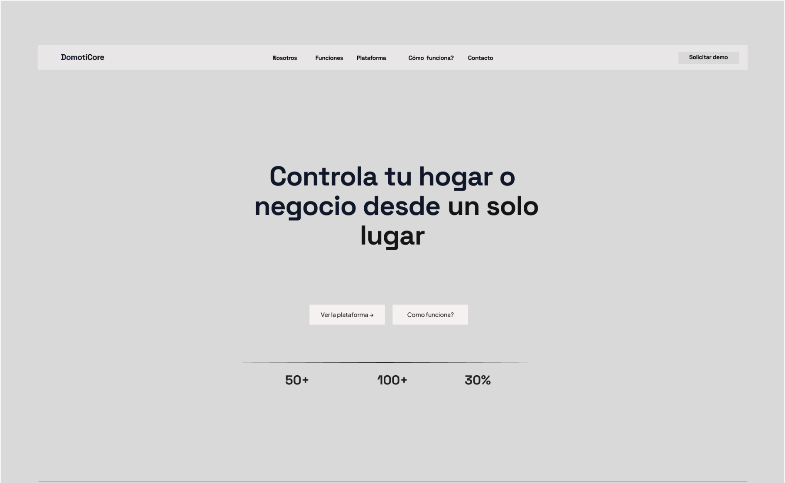
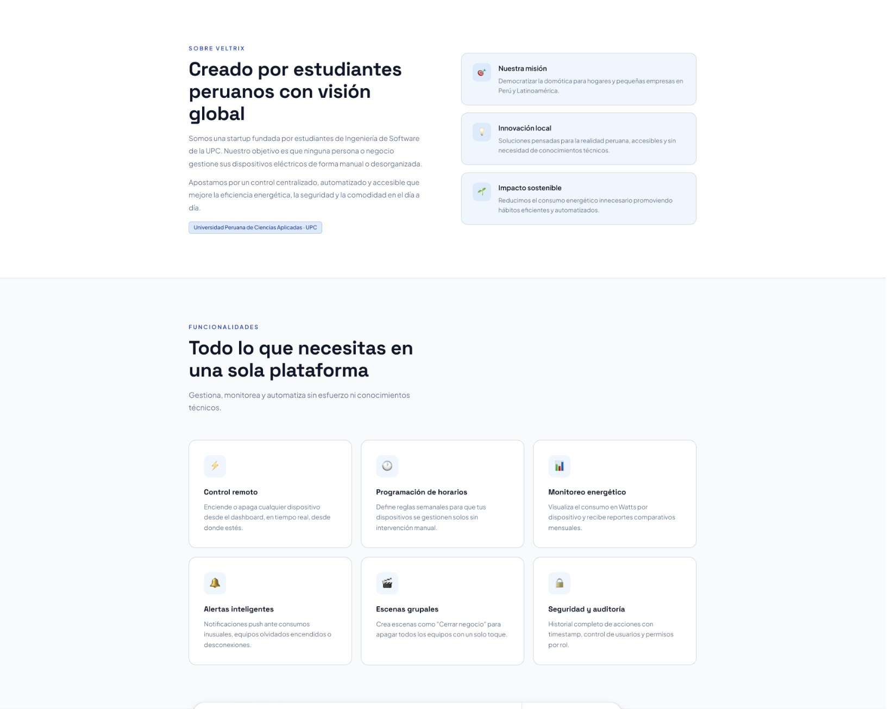

## 4.1. Style Guidelines.

El diseño de la plataforma se enfoca en ofrecer una interfaz intuitiva que facilite la exploración, selección y contribución de manera visual en DomotiCore. Se busca garantizar una experiencia fluida para desarrolladores de distintos niveles.

La plataforma está pensada para manejar múltiples proyectos, usuarios y contribuciones de forma organizada, manteniendo un entorno accesible, escalable y centrado en la colaboración.

## 4.1.1. General Style Guidelines.

En este apartado se detallan las decisiones de estilo que definen la identidad visual de la plataforma, orientada a conectar desarrolladores con proyectos y facilitar su participación en tareas reales. Las decisiones relacionadas con branding, tipografía, colores, espaciado y lenguaje buscan transmitir accesibilidad, colaboración, claridad y dinamismo, elementos clave dentro de comunidades tecnológicas.

### Colores

  

La paleta de colores fue seleccionada con un enfoque en la claridad visual, dinamismo y jerarquía de información. Cada color cumple un rol específico dentro de la plataforma:

**Paleta de Colores**

- **Azul primario – #1E40AF:**  
  Representa tecnología, confianza y comunidad. Se utiliza en botones principales, enlaces y elementos interactivos clave como “Contribuir” o “Explorar proyectos”.

- **Gris oscuro – #475569:**  
  Transmite estabilidad y estructura. Se emplea en textos principales, fondos de navegación y componentes base del sistema.

- **Verde acento – #882D00:**  
  Representa éxito y progreso. Se utiliza en indicadores de contribución, confirmaciones y estados positivos dentro del sistema.

- **Gris claro – #64748B:**  
  Simboliza neutralidad. Se utiliza en textos secundarios, bordes y elementos de soporte para mantener equilibrio visual.

**Escalas de color:**  
Cada color cuenta con variaciones de intensidad que permiten diferenciar estados (hover, activo, deshabilitado), jerarquías y organización visual dentro de dashboards y listados de proyectos.

### Tipografía

  

Se selecciona una tipografía sans-serif moderna como **Inter o Roboto**, debido a su alta legibilidad en entornos digitales.

Esta tipografía permite una lectura clara en interfaces con alta densidad de información, como listados de proyectos, issues y dashboards de contribución.

En cuanto al tamaño:

- Títulos: mayor tamaño y peso (negrita)  
- Subtítulos: tamaño intermedio  
- Texto: tamaño estándar para facilitar la lectura  

Esto permite resaltar información clave y mejorar la comprensión del usuario.

### Branding

  

El branding de la plataforma está orientado a reflejar **colaboración, accesibilidad y comunidad tecnológica**.

Se adopta un enfoque minimalista con:

- Íconos simples relacionados al desarrollo (código, repositorios, bugs)
- Uso moderado de colores
- Diseño limpio y ordenado

Esto permite transmitir una imagen moderna y alineada con el ecosistema Open Source.

### Espaciado

El diseño se centra en el uso estratégico de espacios en blanco para mejorar la legibilidad y organización.

El contenido se organiza en:

- Tarjetas (cards) para proyectos  
- Listas estructuradas para issues  
- Secciones bien separadas  

Los márgenes y rellenos permiten evitar la saturación visual y facilitan la navegación, especialmente en pantallas con mucha información.

### Dimensiones para el tono de comunicación y lenguaje aplicado

El tono de comunicación de la plataforma es **claro, directo y accesible**, orientado a desarrolladores de distintos niveles, incluyendo principiantes.

Se busca:

- Evitar lenguaje excesivamente técnico  
- Facilitar la comprensión rápida  
- Motivar la participación  

El sistema utiliza mensajes como:

- “Empieza a contribuir”  
- “Encuentra tu primer issue”  
- “Explora proyectos”  

Esto genera una experiencia amigable y fomenta la interacción.

### Aspectos clave del diseño

**Consistencia:**  
Todos los elementos mantienen una línea gráfica uniforme, permitiendo que el usuario se familiarice rápidamente con la plataforma.

**Navegación:**  
Se estructura de forma intuitiva, permitiendo acceder fácilmente a proyectos, issues y perfil de usuario.

**Accesibilidad:**  
Se prioriza una interfaz clara, con buen contraste, adaptable a distintos dispositivos.

### Elementos de Diseño

El diseño visual considera elementos fundamentales:

- **Línea:** separa secciones y organiza contenido  
- **Color:** comunica estados y acciones  
- **Tamaño:** establece jerarquía visual  
- **Espacio:** evita saturación y mejora la lectura  
- **Formas:** botones redondeados, tarjetas organizadas  

Estos elementos contribuyen a una experiencia clara y eficiente.

## 4.1.2. Web Style Guidelines.

La plataforma será desarrollada como una aplicación web adaptable (Responsive Web Design), permitiendo su uso en distintos dispositivos como laptops, tablets y smartphones.

Esto garantiza que los usuarios puedan explorar proyectos y contribuir desde cualquier entorno.

Se implementarán:

- Layouts basados en grid  
- Componentes reutilizables  
- Diseño adaptable  

Además, se prioriza el uso de dashboards y vistas estructuradas para mostrar:

- Proyectos recomendados  
- Issues disponibles  
- Actividad del usuario  

El diseño dirige la atención del usuario hacia acciones clave como explorar, seleccionar y contribuir.

## 4.2. Information Architecture.

La arquitectura de la información de la plataforma se centra en facilitar la exploración eficiente de proyectos y identificar las oportunidades de contribución. Se prioriza que el usuario pueda comprender el ecosistema de proyectos, evaluar su nivel de dificultad y acceder a tareas concretas sin fricción.

El diseño de la información está orientado a guiar al usuario desde la exploración inicial hasta la contribución, manteniendo una estructura clara, escalable y alineada con las dinámicas reales del desarrollo colaborativo.

## 4.2.1. Organization Systems.

En la plataforma se emplea principalmente una **organización jerárquica**, en la cual los elementos más relevantes para el usuario, como proyectos recomendados, issues destacados y oportunidades de contribución inmediata, se presentan con mayor prioridad visual dentro de la interfaz. Esta jerarquía permite que los desarrolladores identifiquen rápidamente dónde pueden participar, especialmente en el caso de usuarios principiantes que buscan su primera experiencia en Open Source.

Asimismo, se aplica una **organización por categorización temática**, estructurando los proyectos según criterios como lenguaje de programación, tipo de tecnología, nivel de dificultad y tipo de contribución (bug, feature, documentación). Esta clasificación facilita la navegación y permite que los usuarios filtren contenido de acuerdo con sus intereses, habilidades y objetivos de aprendizaje.

De igual manera, se incorpora una **organización secuencial** en ciertos flujos clave del sistema, como el proceso de contribución. Este proceso guía al usuario paso a paso desde la selección de un proyecto, revisión de issues, comprensión de la tarea, hasta la ejecución de la contribución. Esta estructura reduce la complejidad del proceso y mejora la experiencia, especialmente para desarrolladores con poca experiencia en entornos colaborativos.

En cuanto a la organización temporal, la plataforma utiliza un enfoque **cronológico** para mostrar la actividad reciente, incluyendo nuevas issues, contribuciones recientes y actualizaciones de proyectos. Esto permite a los usuarios mantenerse informados sobre la evolución del ecosistema y detectar oportunidades activas de participación.

Finalmente, la información también se organiza considerando el **perfil del usuario**, adaptando recomendaciones y contenido según su nivel (principiante, intermedio o avanzado), historial de contribuciones e intereses tecnológicos. Esto permite una experiencia más personalizada y eficiente.

## 4.2.2. Labeling Systems.

Se prioriza el uso de etiquetas cortas, precisas y comprensibles, con el objetivo de reducir la carga cognitiva del usuario y facilitar la navegación dentro del sistema.

### Landing Page

- **Inicio:** Sección principal que presenta la plataforma y su propuesta de valor, orientada a motivar la participación en proyectos Open Source.
- **Explorar Proyectos:** Acceso directo al catálogo de proyectos disponibles para contribuir.
- **Cómo Contribuir:** Guía paso a paso para nuevos usuarios que desean iniciarse en el mundo Open Source.
- **Beneficios:** Explicación de las ventajas de participar en proyectos colaborativos (aprendizaje, experiencia, networking).
- **Contacto:** Canal de comunicación para soporte o consultas.

### Aplicación Web – Desarrolladores

- **Dashboard:** Vista general con recomendaciones personalizadas, actividad reciente y progreso del usuario.
- **Proyectos:** Listado de proyectos disponibles, con filtros por tecnología, dificultad y tipo de contribución.
- **Issues:** Visualización de tareas disponibles dentro de los proyectos, clasificadas por tipo y nivel.
- **Mis Contribuciones:** Historial de participación del usuario en proyectos Open Source.
- **Perfil:** Información personal, habilidades y estadísticas de contribución.
- **Configuración:** Ajustes de cuenta y preferencias.

### Etiquetas comunes dentro del sistema

- **Beginner-friendly:** Issues adecuados para principiantes  
- **Bug:** Problemas o errores a resolver  
- **Feature:** Nuevas funcionalidades  
- **Documentation:** Tareas relacionadas con documentación  
- **High Priority:** Issues prioritarios  

Estas etiquetas permiten clasificar la información de manera eficiente y facilitar la toma de decisiones del usuario.

## 4.2.3. SEO Tags and Meta Tags.

Para asegurar que la plataforma *DomotiCore*, sea funcional, se han configurado los siguientes meta tags técnicos. Estos permiten posicionar la solución como una plataforma de domótica orientada al control inteligente de dispositivos electrónicos en hogares y pequeñas empresas.

* **Title Tag:** en html:  
    `<title>DomotiCore | Plataforma de Domótica para Control Inteligente de Dispositivos IoT</title>`

* **Description:** en html:  
    `<meta name="description" content="Gestiona, monitorea y automatiza tus dispositivos electrónicos con DomotiCore. Plataforma web IoT que permite control en tiempo real, ahorro energético y mayor seguridad para hogares y pequeñas empresas.">`

* **Keywords:** en html:  
    `<meta name="keywords" content="Domótica, IoT, Control de dispositivos, Automatización del hogar, Smart Home, Veltrix, Plataforma web, Energía inteligente, Seguridad doméstica">`

* **Open Graph (Optimización para redes sociales):**
    * `<meta property="og:title" content="DomotiCore: Control inteligente y automatización de tu hogar o negocio">`

    * `<meta property="og:description" content="Centraliza y automatiza tus dispositivos electrónicos con tecnología IoT. Mejora la eficiencia energética, seguridad y comodidad con DomotiCore.">`

    * `<meta property="og:image" content="https://veltrix.com/assets/domoticore-preview.png">`

    * `<meta property="og:url" content="https://veltrix.com/domoticore">`

* **Robots:** en html:  
    `<meta name="robots" content="index, follow">`

## 4.2.4. Searching Systems.

Dado que la plataforma puede manejar múltiples dispositivos electrónicos, sensores y reglas automatizadas, se han implementado mecanismos de búsqueda y filtrado que permiten acceder de manera directa a la información crítica.

**Barra de Búsqueda Global:**  
Ubicada en la parte superior del dashboard, permite realizar búsquedas rápidas por:

- Nombre del dispositivo (“Luz Sala”, “Sensor Puerta”)  
- Tipo de dispositivo (luces, cámaras, enchufes inteligentes, sensores)  
- Ubicación (sala, cocina, oficina, etc.)  
- Nombre de automatizaciones configuradas  

Esto permite al usuario ubicar rápidamente cualquier elemento dentro de su red de dispositivos.

**Filtros Inteligentes:**  
En los módulos de dispositivos y automatización, los usuarios pueden segmentar la información mediante:
- Estado del dispositivo (Encendido, Apagado, Desconectado)  
- Tipo de dispositivo (sensor, actuador, cámara, etc.)  
- Nivel de consumo energético  
- Estado de automatización (activa o inactiva)  

Estos filtros permiten visualizar únicamente la información relevante según el contexto del usuario.

**Búsqueda por eventos y actividad:**  
El sistema permite consultar registros históricos como:
- Activaciones de dispositivos  
- Ejecución de automatizaciones  
- Alertas generadas por sensores  

Esto facilita el monitoreo y análisis del comportamiento del sistema.

**Búsqueda contextual:**  
Dentro de cada módulo (dispositivos, automatización, historial), el usuario puede realizar búsquedas específicas relacionadas únicamente con ese entorno, mejorando la precisión y reduciendo la complejidad.

## 4.2.5. Navigation Systems.

Se busca que el usuario nunca esté a más de tres interacciones de realizar una acción clave, como encender un dispositivo, configurar una automatización o revisar una alerta.

**Navegación Global (Menú principal):**  
Se implementa mediante un menú lateral o superior persistente que permite acceso directo a los módulos principales del sistema:

- Dashboard: Vista general del estado de los dispositivos, consumo energético y alertas  
- Dispositivos: Gestión y control de todos los dispositivos conectados  
- Automatización: Configuración de reglas, horarios y acciones automáticas  
- Historial: Registro de eventos y actividad del sistema  
- Perfil / Configuración: Gestión de usuario, preferencias y seguridad  

Esta estructura permite una navegación clara y consistente en toda la plataforma.

**Navegación de Contexto:**  
Permite al usuario ubicarse dentro de la plataforma mediante rutas como:

Dispositivos > Sala > Luz Principal  

Automatización > Rutina Nocturna > Configuración  

Esto facilita la orientación y comprensión de la ubicación actual dentro del sistema.

**Navegación Local:**  
Dentro de cada módulo se utilizan pestañas o secciones para acceder a funcionalidades específicas, por ejemplo:

- Información del dispositivo  
- Estado en tiempo real  
- Configuración  
- Consumo energético  

Esto permite organizar la información sin sobrecargar la interfaz.

**Acciones Rápidas:**  
Se incorporan botones visibles y accesos directos para acciones frecuentes como:

- Encender / apagar dispositivos  
- Activar automatizaciones  
- Crear nueva regla  
- Configurar horarios  

Estas acciones están diseñadas para minimizar el número de pasos y mejorar la experiencia del usuario.

**Navegación adaptativa (Responsive):**  
La interfaz se adapta a distintos dispositivos (desktop, tablet, móvil), reorganizando los elementos de navegación para mantener la usabilidad en cualquier entorno, permitiendo el control remoto en tiempo real desde cualquier lugar.

## 4.3. Landing Page UI Design.

## 4.3.1 Landing Page Wireframe.

La landing page de DomotiCore presenta una estructura clara y orientada a la conversión, iniciando con una sección principal que introduce la solución como una plataforma IoT capaz de centralizar y automatizar el control de dispositivos eléctricos, resaltando beneficios como el monitoreo en tiempo real, el ahorro energético y la facilidad de uso sin conocimientos técnicos. A continuación, la sección “Nosotros” contextualiza el proyecto, destacando su origen como iniciativa de estudiantes peruanos y su enfoque en brindar soluciones accesibles y sostenibles para hogares y pequeñas empresas.

Seguidamente, la sección de “Funciones” describe las capacidades clave del sistema, incluyendo el control remoto de dispositivos, la programación automatizada, el monitoreo del consumo energético, las alertas inteligentes y la gestión de usuarios, evidenciando un enfoque integral en eficiencia y seguridad. Posteriormente, en “Plataforma”, se muestra una representación del dashboard, donde se visualiza la organización de dispositivos, métricas de consumo y estados en tiempo real, reforzando la idea de una interfaz intuitiva y fácil de utilizar.

Más adelante, la sección “¿Cómo funciona?” explica de manera secuencial el proceso de uso del sistema, desde la conexión inicial del gateway hasta la automatización completa del entorno, simplificando la adopción tecnológica para el usuario. Asimismo, se incluyen testimonios que respaldan la propuesta de valor mediante experiencias reales enfocadas en el ahorro energético y la practicidad del sistema.

Finalmente, la landing concluye con una sección de contacto que integra un formulario y canales directos de comunicación, permitiendo a los usuarios solicitar información o una demostración del producto, reforzando el enfoque comercial y de acompañamiento al cliente.

## 4.3.2 Landing Page Mock-up.

El wireframe de la landing page en su versión de escritorio ha permitido organizar de forma clara y jerárquica los elementos principales de DomotiCore, facilitando la presentación de la propuesta de valor centrada en el control y automatización de dispositivos eléctricos. A partir de esta estructura inicial, se desarrolló el mockup de la interfaz, manteniendo coherencia con las funcionalidades definidas, como el monitoreo en tiempo real, la gestión remota, las alertas inteligentes y la visualización del consumo energético.

En la implementación final se puede apreciar el uso consistente de la paleta de colores basada en tonos azules y neutros, así como la tipografía moderna seleccionada, lo que contribuye a una estética limpia y tecnológica. Además, la distribución de secciones como el dashboard de vista previa, las funcionalidades y el flujo de uso refuerzan la claridad y usabilidad del producto. En conjunto, el diseño refleja una identidad visual alineada con los valores de accesibilidad, eficiencia e innovación, transmitiendo confianza y facilidad de uso tanto para hogares como para pequeñas empresas.

