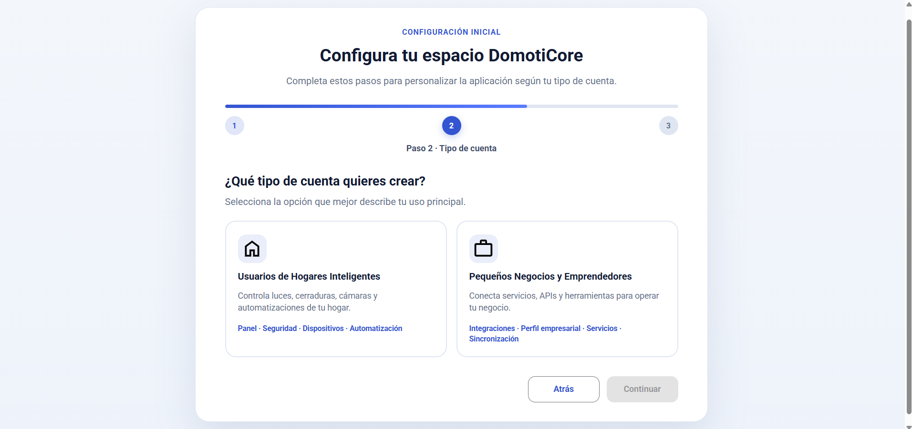
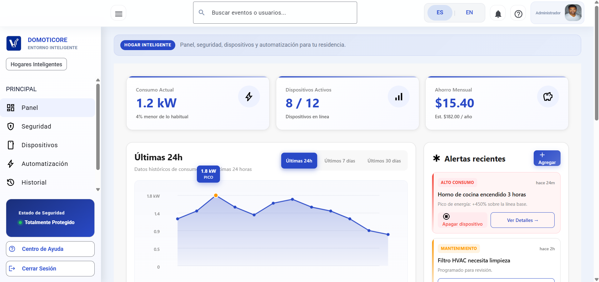
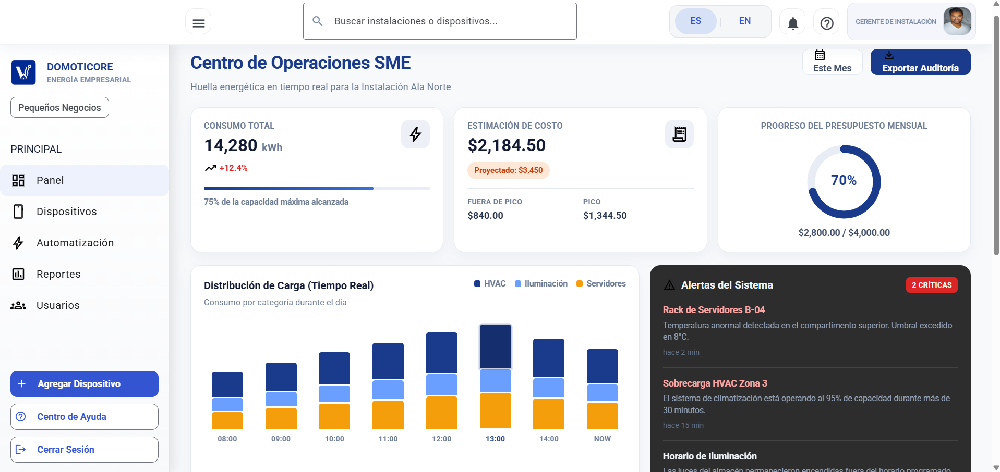
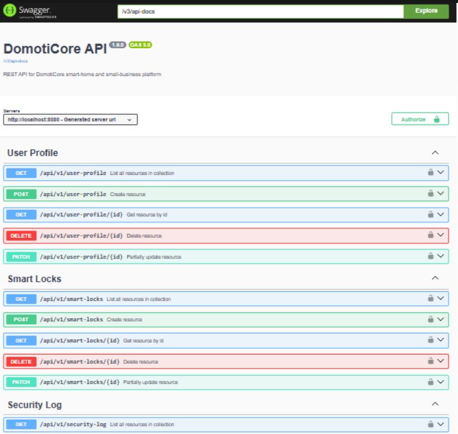
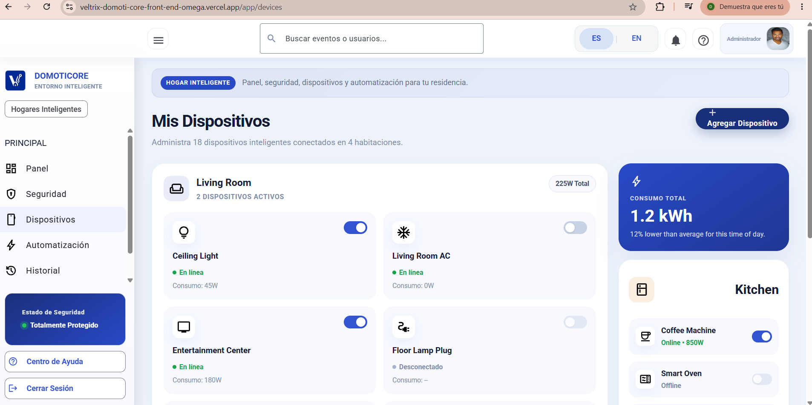
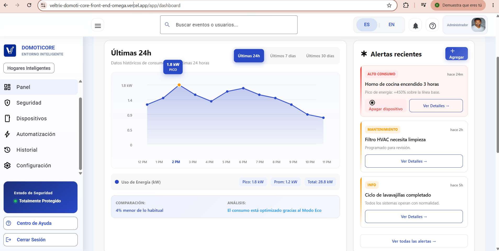
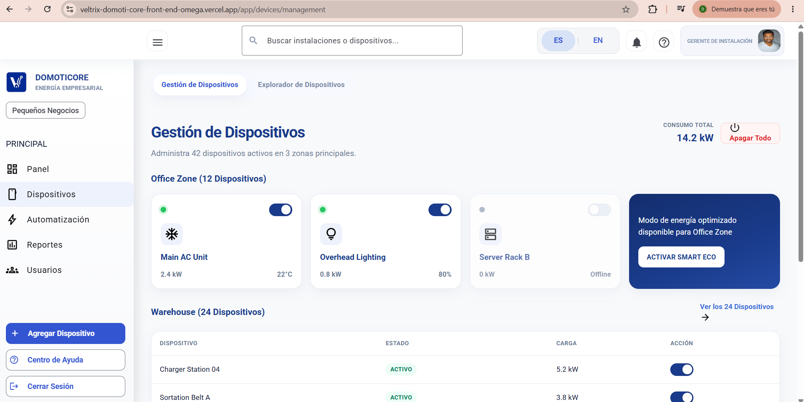
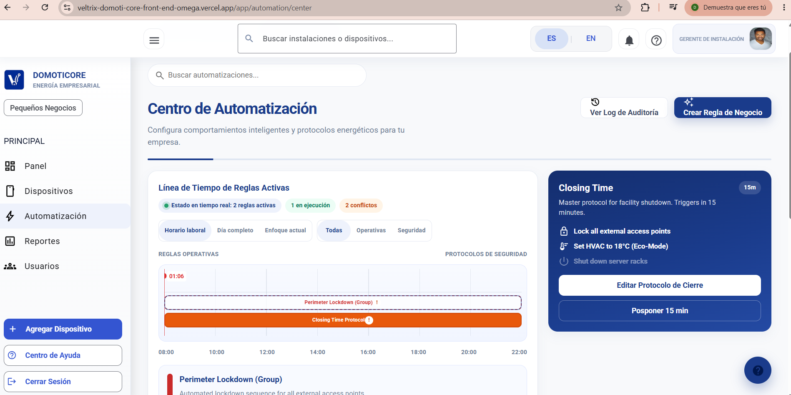
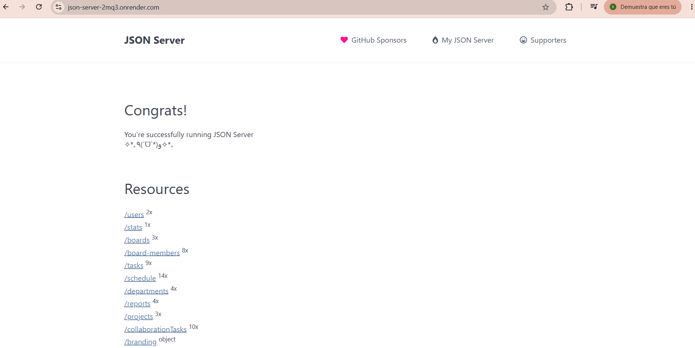
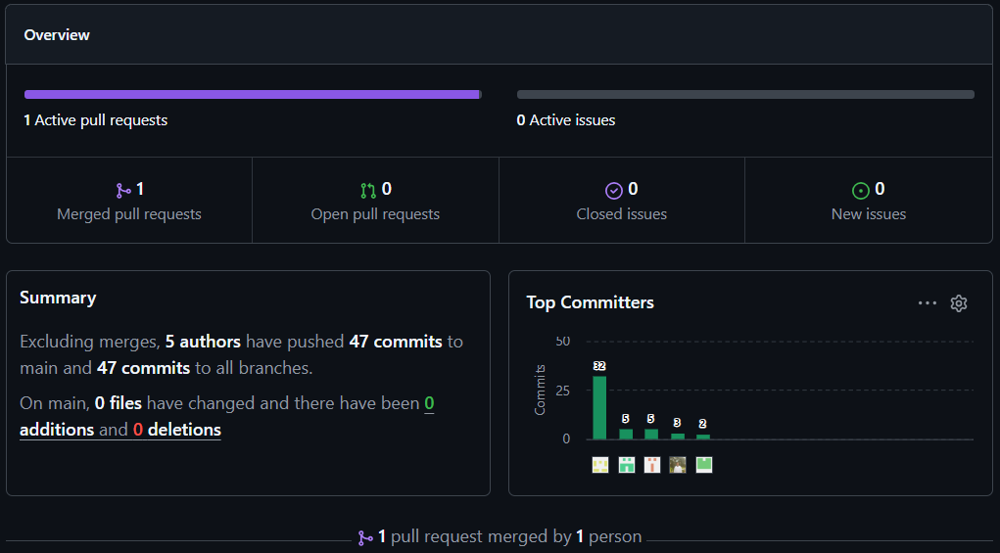

## 5.1 Software Configuration Management

La gestión en DomotiCore incluye el código fuente, documentación, prototipos y configuraciones del entorno. El proyecto contempla distintos productos digitales, incluyendo una Landing Page, aplicaciones web y servicios backend orientados a la automatización y monitoreo de dispositivos IoT. El equipo adopta prácticas basadas en GitFlow, Conventional Commits y Semantic Versioning, asegurando un flujo de trabajo colaborativo y organizado.

### 5.1.1 Software Development Environment Configuration
En esta sección se describen las herramientas, tecnologías y plataformas utilizadas por el equipo para el desarrollo colaborativo del proyecto DomotiCore.

| Category | Software / Tool | Purpose in the Project | Access / Download | Preview |
| :--- | :--- | :--- | :--- | :--- |
| **Project Management** | Trello | Gestión de tareas, seguimiento de Sprint Backlog y control del avance del proyecto. | [Trello](https://trello.com) [https://trello.com] |  |
| **Team Communication** | Microsoft Teams | Plataforma principal de comunicación para reuniones y coordinación del equipo. | [Teams](https://www.microsoft.com/microsoft-teams) [https://www.microsoft.com/microsoft-teams] |  |
| **Requirements Management** | Miro | Estructuración de ideas, flujos del sistema y análisis de negocio (Event Storming). | [Miro](https://miro.com) [https://miro.com] |  |
| **Software Architecture** | Structurizr | Modelado de la arquitectura bajo el modelo C4 (dashboard, gateway, nodos). | [Structurizr](https://structurizr.com) [https://structurizr.com] |  |
| **UX/UI Design** | Figma | Diseño de la interfaz, dashboard y visualización de consumo energético. | [Figma](https://www.figma.com) [https://www.figma.com] |  |
| **Diagram Modeling** | Lucidchart | Elaboración de diagramas de flujo, arquitectura y diseño de procesos. | [Lucidchart](https://www.lucidchart.com) [https://www.lucidchart.com] |  |
| **Frontend Development** | HTML5 | Estructura base para el desarrollo de la Landing Page y la plataforma web. | [HTML](https://developer.mozilla.org) [https://developer.mozilla.org] |  |
| **Frontend Development** | CSS3 | Definición de estilos visuales, diseño responsive y estética. |[CSS](https://developer.mozilla.org) [https://developer.mozilla.org] |  |
| **Frontend Development** | JavaScript | Funcionalidad interactiva y lógica del sistema web. | [JavaScript](https://developer.mozilla.org) [https://developer.mozilla.org] |  |
| **IDE** | WebStorm | IDE utilizado para el desarrollo y edición del código fuente frontend. | [WebStorm](https://www.jetbrains.com/webstorm) [https://www.jetbrains.com/webstorm] |  |
| **Version Control** | Git & GitHub | Repositorio central para control de versiones, commits y documentación. | [GitHub](https://github.com) [https://github.com] |  |
| **Software Testing** | Gherkin | Escenarios de prueba (control remoto, automatización, alertas) por historias de usuario. | [Gherkin](https://cucumber.io/docs/gherkin) [https://cucumber.io/docs/gherkin] |   |
| **Deployment** | GitHub Pages | Despliegue de la Landing Page para mostrar la propuesta de valor. | [GH Pages](https://pages.github.com) [https://pages.github.com] |  |

### 5.1.2 Source Code Management

La gestión de código fuente del proyecto **DomotiCore** se realiza mediante la plataforma **GitHub**, permitiendo un control de versiones en entorno de trabajo colaborativo. Se han definido repositorios independientes para cada producto digital.

#### 5.1.2.1 Repositories

| Product | Repository URL | Description |
| :--- | :--- | :--- |
| **Organization** | [BL-App-Open-Source-1ASI0729-2610-12029](https://github.com/BL-App-Open-Source-1ASI0729-2610-12029) --- [https://github.com/BL-App-Open-Source-1ASI0729-2610-12029] ---| Organizacion donde se ubican todos los repositorios del proyecto. |
| **Landing Page** | [Veltrix-DomotiCore-Business-Web-Page](https://github.com/BL-App-Open-Source-1ASI0729-2610-12029/Veltrix-DomotiCore-Business-Web-Page) --- [https://github.com/BL-App-Open-Source-1ASI0729-2610-12029/Veltrix-DomotiCore-Business-Web-Page] --- | Repositorio de la Landing Page institucional del proyecto. |
| **Frontend Web Application** | [Veltrix-DomotiCore-Front-End](https://github.com/BL-App-Open-Source-1ASI0729-2610-12029/Veltrix-DomotiCore-Front-End) --- [https://github.com/BL-App-Open-Source-1ASI0729-2610-12029/Veltrix-DomotiCore-Front-End] --- | Aplicación web para monitoreo y control de dispositivos. |
| **Backend Web Services** | [Veltrix-DomotiCore-Back-end](https://github.com/BL-App-Open-Source-1ASI0729-2610-12029/Veltrix-DomotiCore-Back-end) --- [https://github.com/BL-App-Open-Source-1ASI0729-2610-12029/Veltrix-DomotiCore-Back-end] --- | API REST y lógica de automatización IoT. |
| **Documentation Repository** | [Veltrix-DomotiCore-Report](https://github.com/BL-App-Open-Source-1ASI0729-2610-12029/Veltrix-DomotiCore-Report) --- [https://github.com/BL-App-Open-Source-1ASI0729-2610-12029/Veltrix-DomotiCore-Report] --- | Documentación técnica, reportes y entregables del proyecto. |
---
<div style="text-align:center;"></div>

#### 5.1.2.2 GitFlow Workflow

El equipo adopta **GitFlow** como estrategia de branching para mantener la estabilidad.

* **Main Branch**: Contiene únicamente versiones estables y aprobadas del proyecto listas para producción.
    * `main`
* **Develop Branch**: Rama principal de integración donde se consolidan las funcionalidades desarrolladas antes de integrarse en producción.
    * `develop`
* **Feature Branches**: Cada nueva funcionalidad se desarrolla en una rama independiente para evitar conflictos en el código base.
    * **Naming Convention**: `feature/<feature-name>`
    * **Examples**: `feature/landing-page-navbar`, `feature/device-monitoring`
* **Hotfix Branches**: Ramas de emergencia para corregir errores críticos detectados directamente en producción.
    * **Naming Convention**: `hotfix/<issue-description>`

#### 5.1.2.3 Semantic Versioning

El proyecto utiliza **Semantic Versioning 2.0.0** para controlar las versiones de los productos digitales de Veltrix.

| Version | Description |
| :--- | :--- |
| **v1.0.0** | Primera versión estable y funcional del producto. |
| **v1.1.0** | Incorporación de nuevas funcionalidades menores. |
| **v1.1.1** | Corrección de errores menores. |
| **v2.0.0** | Cambios mayores que incluyen modificaciones estructurales incompatibles. |

#### 5.1.2.4 Conventional Commits

Se adopta el estándar de **Conventional Commits** para mantener un historial de cambios limpio y fácil de verificar por el equipo.

| Prefix | Purpose |
| :--- | :--- |
| **feat** | Implementación de nuevas funcionalidades. |
| **fix** | Corrección de errores o bugs. |
| **docs** | Actualizaciones en la documentación del repositorio. |
| **style** | Cambios que no afectan la lógica (espaciados, formatos, CSS). |
| **refactor** | Reestructuración del código existente sin cambiar su funcionalidad. |
| **test** | Corrección de pruebas unitarias o de integración. |

**Examples:**
* `feat: implement responsive landing page`
* `docs: update sprint 1 documentation`
* `fix: correct mobile navigation behavior`
* `style: improve hero section spacing`

### 5.1.3. Source Code Style Guide & Conventions

El equipo adopta convenciones estandarizadas para garantizar legibilidad del código fuente. Como norma general, todos los nombres de variables, clases, funciones y componentes deben ser redactados en idioma **inglés**. 

#### 5.1.3.1 HTML Conventions

* **Use Lowercase Element Names**: Todos los elementos y atributos HTML deben escribirse en minúsculas.
    ```html
    <section class="hero-section">
        <input type="email" id="user-email" />
    </section>
    ```
* **Close All HTML Elements**: Todos los elementos deben cerrarse correctamente para evitar errores de renderizado.
    ```html
    <p>DomotiCore centralizes your devices.</p>
    ```
* **Use Semantic HTML Elements**: Se prioriza el uso de etiquetas semánticas para mejorar el SEO y la accesibilidad.
    ```html
    <nav></nav>
    <main></main>
    <footer></footer>
    ```
* **Use Descriptive IDs and Classes**: Los nombres deben ser claros y representar su función.
    ```html
    <div class="contact-form-container">
    ```

#### 5.1.3.2 CSS Conventions

* **Use Kebab-Case for Class Names**: Las clases deben escribirse en minúsculas separadas por guiones.
    ```css
    .device-control-panel {
        display: grid;
    }
    ```
* **Use CSS Variables**: Se definen colores y valores reutilizables en el `:root` para facilitar cambios globales.
    ```css
    :root {
        --primary-blue: #1E40AF;
        --dark-navy: #0F172A;
    }
    ```
* **Group Styles by Sections**: El código CSS se organiza mediante bloques de comentarios para identificar claramente las secciones del sistema.
    ```css
    .main-nav { ... }
    .hero-container { ... }
    .control-panel { ... }
    ```
* **Responsive Design**: Uso obligatorio de Media Queries para garantizar una interfaz adaptable.
    ```css
    @media (max-width: 768px) {
        .hero { padding: 2rem; }
    }
    ```

#### 5.1.3.3 JavaScript Conventions

* **Use CamelCase**: Las variables y funciones deben seguir la convención camelCase.
    ```javascript
    const deviceStatus = document.getElementById("deviceStatus");
    function updateDeviceStatus() { ... }
    ```
* **Use Meaningful Names**: Los nombres deben representar claramente el propósito del dato o acción.
    ```javascript
    const loginButton = document.querySelector(".btn-login");
    ```
* **Keep Functions Simple**: Las funciones deben realizar una única tarea y ser fáciles de leer.
    ```javascript
    function validateEmail(email) {
        return email.includes("@");
    }
    ```
* **Avoid Inline JavaScript**: La lógica debe estar separada del marcado HTML para mejorar la seguridad y el orden.
    * **Incorrecto**: `<button onclick="sendData()">`
    * **Correcto**: `button.addEventListener("click", sendData);`

### 5.1.4. Software Deployment Configuration

Esta sección describe la configuración, el flujo de trabajo y el proceso de los productos digitales del proyecto.

#### 5.1.4.1 Landing Page Deployment

La Landing Page institucional se despliega mediante **GitHub Pages**, utilizando el flujo de integración automática desde la rama `develop`.

**Proceso de Despliegue y Configuración:**

1.  **Configuración del Repositorio:** Se crea el repositorio remoto y se habilitan los permisos para los integrantes del equipo.
    <div style="text-align:center;"></div>
    <div style="text-align:center;"></div>

2.  **Estructura de Ramas:** Se organiza el repositorio siguiendo la estrategia de branching definida anteriormente.
    <div style="text-align:center;"></div>

3.  **Commits Automático:** Cada commit realizado en la rama `develop` dispara un proceso de integración que actualiza la versión pública del sitio.
    <div style="text-align:center;"></div>

4.  **Habilitación de GitHub Pages:** Se configura el entorno de despliegue para apuntar a la rama de desarrollo.
    <div style="text-align:center;"></div>

5.  **Validación:** Se verifica la correcta visualización y funcionamiento responsivo en múltiples navegadores (Chrome, Edge, Safari).
    <div style="text-align:center;"></div>

**Deployment URL:** **[DomotiCore – Landing Page Veltrix](https://bl-app-open-source-1asi0729-2610-12029.github.io/Veltrix-DomotiCore-Business-Web-Page/)**  --- [https://oscarcheca.github.io/domoticore-landing/] ---


#### 5.1.4.2 Frontend Web Application Deployment

La aplicación web principal (desarrollada con **Vue.js**) será desplegada utilizando **Vercel** para facilitar la integración continua (CI/CD) y previsualizaciones automáticas por cada Pull Request.

* **Repository**: **[Veltrix-DomotiCore-Front-End](https://github.com/BL-App-Open-Source-1ASI0729-2610-12029/Veltrix-DomotiCore-Front-End)**  --- [https://github.com/BL-App-Open-Source-1ASI0729-2610-12029/Veltrix-DomotiCore-Front-End] ---
* **Platform**: Vercel
* **Deployment URL**: **[https://veltrix-domoti-core-front-end-lvgz-n6f72byus-veltrix-domoticore.vercel.app](https://veltrix-domoti-core-front-end-lvgz-87cyqr01w-veltrix-domoticore.vercel.app?_vercel_share=uGaQ5qGSn5If8soXXkFjvSSgRKEdXWmq)** --- [https://veltrix-domoti-core-front-end-lvgz-87cyqr01w-veltrix-domoticore.vercel.app?_vercel_share=uGaQ5qGSn5If8soXXkFjvSSgRKEdXWmq] ---

#### 5.1.4.3 Backend Web Services Deployment

Los servicios de lógica de negocio y conectividad se despliegan en **Render**, permitiendo la exposición de endpoints seguros bajo el protocolo HTTPS para la comunicación con los dispositivos. Por ahora no se usa el sistema del backend, pero se desplego la carpeta del proyecto para que sea visual de manera global.

* **Repository**: **[Veltrix-DomotiCore-Back-end](https://github.com/BL-App-Open-Source-1ASI0729-2610-12029/Veltrix-DomotiCore-Back-end)** --- [https://github.com/BL-App-Open-Source-1ASI0729-2610-12029/Veltrix-DomotiCore-Back-end] ---
* **Platform**: Render
* **Deployment URL**: **[veltrix-domoticore](https://veltrix-domoticore-backend.onrender.com)** --- [https://veltrix-domoticore-backend.onrender.com] ---


## 5.2. Landing Page, Services & Applications Implementation

La implementación de los productos digitales de **DomotiCore** se inició con el desarrollo de la **Landing Page**, orientada a comunicar la propuesta de valor del sistema y presentar una vista preliminar del dashboard.

Durante este Sprint también se definieron las estructuras iniciales para futuras funcionalidades relacionadas con:

* **Monitoreo energético**: Seguimiento del consumo en tiempo real.
* **Gestión de dispositivos inteligentes**: Registro y control de nodos IoT.
* **Automatización del hogar**: Configuración de reglas y escenarios inteligentes.

Estas implementaciones permitieron transformar los requisitos obtenidos mediante **User Stories**, entrevistas de validación y sesiones de **Event Storming** en componentes funcionales de software.

El desarrollo inicial fue realizado utilizando tecnologías frontend como **HTML**, **CSS** y **JavaScript**, siguiendo lineamientos de diseño responsive y buenas prácticas de desarrollo web para garantizar una experiencia de usuario en diversos dispositivos.

### 5.2.1. Sprint 1

El Sprint 1 representa el primer ciclo de desarrollo ágil del proyecto DomotiCore. Durante esta iteración, el equipo se enfocó en la construcción inicial de la Landing Page, organización de repositorios y definición de lineamientos técnicos del proyecto.

#### 5.2.1.1. Sprint Planning 1

****Sprint Information****

| Campo | Detalle |
| :--- | :--- |
| **Sprint #** | Sprint 1 |
| **Date** | 2026-04-25 |
| **Time** | 11:00 PM |
| **Location** | Microsoft Teams (Reunión virtual) |
| **Prepared By** | Equipo Veltrix |

****Attendees (Planning Meeting)****

| Participantes |
| :--- |
| Cesar Quispe |
| Oscar Checa |
| Diego Esquicha |
| Fabrizio Rafael |
| Alvaro Rocha |

*****Sprint 1 – Review Summary****

| Descripción |
| :--- |
| Durante el Sprint 1 se lograron avances importantes como la implementación completa de la Landing Page de DomotiCore, incluyendo secciones como Hero, Features, About y Contacto. Además, se organizó el repositorio en GitHub, se realizaron commits relacionados a wireframes, mockups y documentación, y se implementó una vista simulada del dashboard. Sin embargo, quedaron pendientes aspectos como la integración con backend, automatización real de dispositivos y despliegue final en producción. |

****Sprint 1 – Retrospective Summary****

| Descripción |
| :--- |
| El Sprint 1 evidenció problemas en la organización del equipo, como falta de comunicación, distribución ineficiente de tareas y dependencia de entregas de último momento. Como mejoras, se propuso realizar reuniones más frecuentes, utilizar herramientas como Trello para seguimiento, definir responsabilidades claras y mejorar la gestión del tiempo. |

****Sprint Goal & User Stories****

| Campo | Detalle |
| :--- | :--- |
| **Sprint 1 Goal** | Desarrollar y desplegar la Landing Page funcional de DomotiCore, estructurar el repositorio en GitHub y reflejar el avance en el tablero de tareas. |
| **Sprint 1 Velocity** | 5 User Stories |
| **Story Points por historia** | 5 puntos |
| **Sum of Story Points** | 25 |

#### 5.2.1.2 Aspect Leaders and Collaborators

| Team Member (Last Name, First Name) | GitHub Username | Infrastructure & Repository | Landing Page Development | Documentation (Chapters 1-5) |
| :--- | :--- | :---: | :---: | :---: |
| Checa, Oscar | OscarCheca | **C** | **C** | **C** |
| Quispe, Cesar | user20-bit | **C** | **L** | **L** |
| Esquich, Diego | DiegoEsquich | **L** | **C** | **C** |
| Tello, Fabrizio | F4bris | **C** | **C** | **C** |
| Rocha , Alvaro | alvarorc24 | **C** | **C** | **C** |

#### 5.2.1.3 Sprint Backlog 1

Las User Stories del proyecto fueron reorganizadas durante las actividades de Sprint Planning con el objetivo de mejorar la consistencia, trazabilidad y organización funcional del Product Backlog.

Las historias de usuario definidas previamente en la Sección 3.1 fueron estandarizadas siguiendo convenciones Scrum y criterios de aceptación basados en la estructura **Gherkin**, permitiendo una mejor comprensión y validación de funcionalidades durante el desarrollo del proyecto.

Durante el proceso de refinamiento del backlog se realizaron las siguientes mejoras:

* **Estandarización** de la nomenclatura de User Stories y Epics.
* **Consolidación** de funcionalidades duplicadas.
* **Reorganización** de Epics según dominios funcionales.
* **Mejora** en la redacción de criterios de aceptación.
* **Relación** entre Sprint Goals y funcionalidad.

La siguiente tabla resume las principales User Stories consideradas durante las actividades de planificación de Sprint:

| User Story ID | Título | Epic |
| :--- | :--- | :--- |
| **US-01** | Vinculación de Gateway | Gateway Management |
| **US-03** | Control remoto de dispositivos | Device Control |
| **US-06** | Monitoreo energético en tiempo real | Energy Monitoring |
| **US-09** | Notificación de dispositivos desconectados | Notifications |
| **US-17** | Información del producto en la Landing Page | Website |
| **US-19** | Autenticación básica de API | RESTful API |
| **US-21** | Encendido general de dispositivos | Advanced Device Control |
| **US-35** | Optimización automática de consumo | Energy Optimization |
| **US-41** | Previsualización de funciones de la aplicación | Website |


#### 5.2.1.4 Development Evidence for Sprint Review 

La gestión del código fuente para el proyecto **DomotiCore** se realiza utilizando Git como sistema de control de versiones, permitiendo un flujo de trabajo colaborativo y un historial detallado de cambios realizados durante el Sprint.

La siguiente tabla resume los commits más relevantes realizados durante la implementación de los productos digitales:

| Repository | Branch | Commit ID | Commit Message | Date |
| :--- | :--- | :--- | :--- | :--- |
| **domoticore-Business-Web-Page** | main | `53487ee` | feat: implement landing page structure | 2026-04-07 |
| **domoticore-Business-Web-Page** | main | `36702da` | feat: add responsive design support | 2026-04-15 |
| **domoticore-docs** | develop | `94d4937` | docs: update sprint 1 documentation | 2026-04-21 |

#### 5.2.1.5 Execution Evidence for Sprint Review

Durante el **Sprint 1** se logró implementar correctamente la estructura visual de la **Landing Page** de DomotiCore, incluyendo navegación interactiva, diseño responsive y un formulario de contacto funcional. Esta entrega presenta las secciones clave que brindan información detallada sobre la propuesta de valor del producto.

****Capturas de Pantalla de la Implementación****

A continuación, se presentan las evidencias visuales de los componentes desarrollados:

* **Hero Section**: Primera impresión y propuesta de valor.

<div style="text-align:center;">
</div>

* **Features Section**: Detalle de las funcionalidades IoT.
<div style="text-align:center;">
</div>

* **Dashboard Preview**: Vista preliminar de la interfaz de control.

<div style="text-align:center;">
</div>

<div style="text-align:center;">
</div>

<div style="text-align:center;">
</div>

<div style="text-align:center;">
</div>

* **Contact Form**: Formulario funcional para leads y soporte.
<div style="text-align:center;">
</div>

****Demostración en Video****

Asimismo, se adjunta un video demostrativo que recorre la navegación y las funcionalidades implementadas, validando la experiencia de usuario (UX) en diferentes resoluciones.

**Enlace del Video**: [ Demostración de DomotiCore - Sprint 1](https://upcedupe-my.sharepoint.com/:v:/g/personal/u202417405_upc_edu_pe/IQCPng9giTbzT7yPR6RganePARwt5TeTRUKmAmmGUib8n3E?nav=eyJyZWZlcnJhbEluZm8iOnsicmVmZXJyYWxBcHAiOiJTdHJlYW1XZWJBcHAiLCJyZWZlcnJhbFZpZXciOiJTaGFyZURpYWxvZy1MaW5rIiwicmVmZXJyYWxBcHBQbGF0Zm9ybSI6IldlYiIsInJlZmVycmFsTW9kZSI6InZpZXcifX0%3D&e=ZW7H6O) --- [https://upcedupe-my.sharepoint.com/:v:/g/personal/u202417405_upc_edu_pe/IQCPng9giTbzT7yPR6RganePARwt5TeTRUKmAmmGUib8n3E?nav=eyJyZWZlcnJhbEluZm8iOnsicmVmZXJyYWxBcHAiOiJTdHJlYW1XZWJBcHAiLCJyZWZlcnJhbFZpZXciOiJTaGFyZURpYWxvZy1MaW5rIiwicmVmZXJyYWxBcHBQbGF0Zm9ybSI6IldlYiIsInJlZmVycmFsTW9kZSI6InZpZXcifX0%3D&e=ZW7H6O] ---

#### 5.2.1.6 Services Documentation Evidence for Sprint Review

En este Sprint aún no se desarrollaron servicios backend completos. Sin embargo, se definieron preliminarmente los endpoints relacionados con monitoreo de dispositivos y automatización IoT.

La documentación OpenAPI será incorporada en los siguientes Sprints.
#### 5.2.1.7 Software Deployment Evidence for Sprint Review

Durante este Sprint se realizaron las siguientes actividades clave relacionadas con el despliegue y  disponibilidad del producto:

* **Configuración de GitHub Pages**: Establecimiento del entorno de despliegue automatizado para la rama principal.
* **Publicación inicial de la Landing Page**: Lanzamiento de la primera versión funcional accesible vía web.
* **Validación de despliegue en distintos navegadores**: Pruebas de compatibilidad en Chrome, Firefox y Safari para asegurar una visualización consistente.
* **Verificación de accesibilidad responsive**: Pruebas de usabilidad y diseño adaptable en dispositivos móviles y tablets.


#### 5.2.1.8 Team Collaboration Insights during Sprint

El equipo utilizó las herramientas analíticas de **GitHub Insights** para monitorear la participación activa de cada integrante durante el **Sprint 1**. Estos datos permitieron realizar un seguimiento detallado de los commits, pull requests y merges realizados.

La colaboración basada en estas métricas permitió mantener un flujo continuo de integración y control de versiones, fortaleciendo el trabajo colaborativo del equipo y asegurando la integridad del código fuente.

****Evidencia de Colaboración en GitHub****

A continuación, se presenta la captura de los analíticos proporcionados por GitHub sobre la actividad del equipo:

<div style="text-align:center;">
</div>

En estas métricas facilitó la identificación de cada apoyo de los colaboradores y ayudó a mejorar la distribución de tareas para los siguientes ciclos de desarrollo.

### 5.2.2 Sprint 2

#### 5.2.2.1 Sprint Planning 2
En esta sección, se presentará la planificación de nuestro Sprint 2.

| **Sprint #** |                 **Sprint 2**              |
|--------------|-------------------------------------------|
|**Sprint Planning Background**                            |
| Date         | 2026/05/09                                |
| Time         | 07:00 pm                                  |
| Location     | Reunión virtual mediante Microsoft Teams       |
| Prepared By  | Esquicha Alcántara, Diego Alonso          |
| Attendees    |Rocha Cotrina, Alvaro / Esquicha Alcántara, Diego Alonso / Quispe llacsahuanga, César Agusto / Tello Palacios, Fabrizio Rafael / Checa Burga, Oscar |
| Sprint n-2 Review Summary |  Durante el Sprint 2 se avanzó en el desarrollo y despliegue del Front-End de la Web App de DomotiCore. Se implementaron las principales vistas del sistema, incluyendo autenticación de usuarios, dashboard interactivo y módulos de monitoreo de dispositivos. Además, se configuró el entorno de despliegue para publicar la aplicación en un servicio cloud, se optimizó la estructura de componentes y se realizaron pruebas funcionales para validar la navegación y experiencia de usuario. Sin embargo, quedaron pendientes algunas integraciones avanzadas con backend y mejoras relacionadas con rendimiento y seguridad.           |
| Sprint n-2 Retrospective Summary |  En el Sprint 2 el equipo mejoró la coordinación respecto al sprint anterior, logrando una distribución más equilibrada de tareas y mayor seguimiento del avance. No obstante, surgieron retrasos por conflictos en merges y cambios de último momento en algunas interfaces. Como acciones de mejora, se acordó fortalecer la revisión de código mediante pull requests, mantener reuniones breves de seguimiento y definir estándares visuales y de desarrollo desde el inicio del sprint.|
| **Sprint Goal & User Stories**                           |
|**Sprint 2**  |Desarrollar y desplegar el Front-End funcional de la Web App de DomotiCore, asegurando navegación operativa, vistas principales implementadas y publicación en un entorno cloud.|
| Sprint 2 Velocity   | 10  Story Points                   |
| Sum of Story Points | 50  Story Points                   |

#### 5.2.2.2 Aspect Leaders and Collaborators

En el marco del Sprint Backlog 2, el equipo de desarrollo de DomotiCore ha enfocado sus esfuerzos en el inicio y consolidación parcial del Front-End de la plataforma, estableciendo la base visual, estructural y funcional necesaria para la interacción inicial del usuario con el sistema. Este sprint prioriza la implementación de los primeros flujos de navegación, la visualización centralizada de dispositivos IoT, el control básico desde el dashboard, y el monitoreo visual de estados, permitiendo una experiencia de uso operativa inicial a través de la interfaz web.

Para asegurar una ejecución organizada, colaborativa y trazable, se continuó utilizando la Matriz de Liderazgo y Colaboración (LACX), mediante la cual se asignaron roles de liderazgo (L) y colaboración (C) a los integrantes del equipo según los componentes frontend abordados durante el sprint.

| Team Member (Last Name, First Name) | GitHub Username    | Front-End Structure | Navigation & Routing | Device Dashboard  | Device Control (UI) | Status Visualization | UI Feedback (Success/Error) | Authentication UI | Responsive UX |
| :---------------------------------- | :----------------- | :------------- | :--------------- | :------------------ | :-------------- | :----- | :----------- | :-------------- | :--------------- 
| Rocha Cotrina, Alvaro               | alvarorc24 | C | C | C | C | C | L | C | C |
| Esquicha Alcántara, Diego Alonso    | DiegoEsquich | C  | L | C | C | L | L | C | L  |
| Quispe Llacsahuanga, César Agusto   | user20-bit | L | C | L | C | C | C | L | C |       
| Tello Palacios, Fabrizio Rafael     | F4bris | C | C | C | L | C | C | C | C |
| Checa Burga, Oscar Diego            | OscarCheca | C | C | C | C | C | C | C | C |
---------------
*Leyenda: L = Lead (Líder), C = Collaborator (Colaborador)*

#### 5.2.2.3 Sprint Backlog 2

El Sprint Backlog 2 tiene el objetivo de enfocar el desarrollo en la implementación y despliegue del Front-End funcional de la Web App de DomotiCore.
Las historias de usuario definidas previamente en la Sección 3.1 fueron refinadas y alineadas con las necesidades funcionales de la interfaz web, considerando aspectos de navegación, visualización de dispositivos, autenticación y experiencia de usuario. Asimismo, se mantuvo la estructura de criterios de aceptación basada en Gherkin, facilitando la validación de funcionalidades implementadas durante el sprint.

Durante el proceso de refinamiento del backlog del Sprint 2 se realizaron las siguientes mejoras:
*	**Priorización** de funcionalidades relacionadas al Front-End y experiencia de usuario.
*	**Integración** de componentes visuales reutilizables para la Web App.
*	**Organización** de User Stories según módulos funcionales del sistema.
*	**Optimización** de flujos de navegación y control de dispositivos.
*	**Relación** entre Sprint Goal, despliegue cloud y funcionalidades implementadas.


### Screenshot del Board

<div style="text-align:center;">
  
</div>

**Trello:** [Trello Sprint 2](https://trello.com/b/y2sNWzhi/domoticore-sprint-backlog-2) [https://trello.com/b/y2sNWzhi/domoticore-sprint-backlog-2]

### Sprint Backlog #02

| User Story Id | Title | Task Id | Task Title | Description | Est. (h) | Assigned To | Status |
| :--- | :--- | :--- | :--- | :--- | :---: | :--- | :---: |
| **US-01** | Vinculación de inicio | T001 | Flujo inicial de vinculación de gateway | Permite al usuario iniciar el proceso de vinculación del gateway desde la interfaz web. | 3h | Diego Esquicha | Done |
| | | T002 | Validación visual de vinculación | Permite mostrar mensajes visuales de éxito o error durante el proceso de vinculación. | 2h | Cesar Quispe | Done |
| **US-02** | Registro y sincronización de nodos | T001 | Registro visual de nodos | Permite mostrar los nodos detectados durante el proceso de registro inicial. | 2h | Fabrizio Tello | Done |
| | | T002 | Sincronización inicial de dispositivos | Permite cargar y visualizar los dispositivos sincronizados en el dashboard. | 3h | Diego Esquicha | Done |
| **US-03** | Control remoto de dispositivos | T001 | Controles ON/OFF en dashboard | Permite encender y apagar dispositivos desde el dashboard (capa visual). | 3h | Alvaro Rocha | Done |
| | | T002 | Actualización visual de estados | Permite reflejar cambios de estado en tiempo real en la interfaz. | 2h | Diego Esquicha | Done |
| **US-10** | Cierre de sesión seguro | T001 | Implementación de logout | Permite al usuario cerrar sesión de manera segura desde la interfaz. | 2h | Cesar Quispe | Done |
| | | T002 | Redirección post logout | Permite redirigir al usuario a la pantalla inicial tras cerrar sesión. | 1h | Cesar Quispe | Done |
| **US-12** | Visualización de cantidad total de dispositivos | T001 | Contador de dispositivos | Permite mostrar el número total de dispositivos registrados en el dashboard. | 1h | Alvaro Rocha | Done |
| **US-24** | Visualización de dispositivos desconectados | T001 | Identificación visual de desconexión | Permite diferenciar dispositivos desconectados mediante indicadores visuales. | 2h | Fabrizio Tello | Done |
| | | T002 | Renderizado de dispositivos inactivos | Permite mostrar dispositivos desconectados en el dashboard. | 1h | Diego Esquicha | In-Progress |
| **US-28** | Mensajes de éxito y error | T001 | Mensajes de éxito | Permite mostrar confirmaciones visuales al ejecutar acciones correctamente. | 1h | Cesar Quispe | Done |
| | | T002 | Mensajes de error | Permite mostrar errores ante fallos de interacción o conexión simulada. | 2h | Oscar Checa | To-Fix |
| **US-30** | Edición de nombre de dispositivos | T001 | Edición dinámica de nombre | Permite modificar el nombre de un dispositivo desde la interfaz. | 2h | Alvaro Rocha | In-Progress |
| | | T002 | Ajustes visuales de edición | Permite mejorar la experiencia visual del formulario de edición. | 1h | Oscar Checa | To-Review |
| **US-42** | Navegación por secciones | T001 | Navegación entre secciones | Permite al usuario desplazarse entre los módulos principales de la Web App. | 3h | Fabrizio Tello | To-Fix |
| | | T002 | Configuración de rutas | Permite definir rutas principales de navegación en el frontend. | 2h | Diego Esquicha | To-Review |
| **US-45** | Footer informativo | T001 | Diseño de footer | Permite mostrar un footer con información general de DomotiCore. | 1h | Cesar Quispe | Done |
| | | T002 | Información institucional en footer | Permite visualizar información básica del sistema en el footer. | 1h | Alvaro Rocha | To-Review |

#### 5.2.2.4 Development Evidence for Sprint Review

En esta sección se presentan los avances obtenidos durante la fase de implementación correspondientes al Sprint Backlog 02, el cual estuvo orientado principalmente al inicio y desarrollo parcial del Front-End de la plataforma DomotiCore, sentando las bases visuales, estructurales y de navegación necesarias para las siguientes etapas del proyecto.

Durante este sprint, el equipo se enfocó en la configuración inicial del entorno Front-End, la definición de la arquitectura de carpetas y componentes, la implementación de vistas base y layouts principales, así como en el desarrollo de los primeros flujos de interacción del usuario, incluyendo pantallas iniciales, estructura de autenticación visual y navegación entre módulos. Asimismo, se realizaron mejoras de diseño, ajustes de estilos CSS, validaciones básicas de formularios y pruebas preliminares de experiencia de usuario en distintos dispositivos.

<table border="1" cellspacing="0" cellpadding="5">
  <tr>
    <th>Repository</th>
    <th>Branch</th>
    <th>Commit Id</th>
    <th>Commit Message</th>
    <th>Commit Message Body</th>
    <th>Commited on (Date)</th>
  </tr>

<tr>
  <td>user20-bit/Veltrix-DomotiCore-Front-End</td>
  <td>main</td>
  <td>f33f173</td>
  <td>docs: add css styles frontend</td>
  <td>Se documentan y agregan estilos CSS base para el frontend.</td>
  <td>10/05/2026</td>
</tr>

<tr>
  <td>F4bri/Veltrix-DomotiCore-Front-End</td>
  <td>main</td>
  <td>15bc5c9</td>
  <td>docs: add components vue</td>
  <td>Se documentan componentes Vue utilizados en la interfaz.</td>
  <td>10/05/2026</td>
</tr>

<tr>
  <td>user20-bit/Veltrix-DomotiCore-Front-End</td>
  <td>main</td>
  <td>743c3ba</td>
  <td>docs: add value</td>
  <td>Se añade contenido de valor descriptivo al proyecto frontend.</td>
  <td>10/05/2026</td>
</tr>

<tr>
  <td>user20-bit/Veltrix-DomotiCore-Front-End</td>
  <td>main</td>
  <td>ebd42be</td>
  <td>style: versel solution</td>
  <td>Se aplica solución de estilos para despliegue en Vercel.</td>
  <td>12/05/2026</td>
</tr>

<tr>
  <td>alvarorc24/Veltrix-DomotiCore-Front-End</td>
  <td>main</td>
  <td>8885888</td>
  <td>Revert "style: versel solution"</td>
  <td>Se revierte la solución de estilos aplicada previamente.</td>
  <td>12/05/2026</td>
</tr>

<tr>
  <td>user20-bit/Veltrix-DomotiCore-Front-End</td>
  <td>main</td>
  <td>1a3cba0</td>
  <td>script: validation</td>
  <td>Se implementan validaciones básicas en el frontend.</td>
  <td>12/05/2026</td>
</tr>

<tr>
  <td>user20-bit/Veltrix-DomotiCore-Front-End</td>
  <td>main</td>
  <td>c30cc42</td>
  <td>script: delete vercel</td>
  <td>Se eliminan configuraciones relacionadas a Vercel.</td>
  <td>12/05/2026</td>
</tr>

<tr>
  <td>user20-bit/Veltrix-DomotiCore-Front-End</td>
  <td>main</td>
  <td>acd448f</td>
  <td>script: deploy</td>
  <td>Se ejecuta configuración de despliegue inicial del frontend.</td>
  <td>12/05/2026</td>
</tr>

<tr>
  <td>alvarorc24/Veltrix-DomotiCore-Front-End</td>
  <td>main</td>
  <td>fcc288d</td>
  <td>script: add layout and folders</td>
  <td>Se agrega estructura de layouts y carpetas del frontend.</td>
  <td>13/05/2026</td>
</tr>

<tr>
  <td>user20-bit/Veltrix-DomotiCore-Front-End</td>
  <td>main</td>
  <td>6c6a690</td>
  <td>script: IAM structure and smart-integrations</td>
  <td>Se define estructura IAM y base de integraciones inteligentes.</td>
  <td>13/05/2026</td>
</tr>

<tr>
  <td>user20-bit/Veltrix-DomotiCore-Front-End</td>
  <td>main</td>
  <td>fa5da51</td>
  <td>script: login system</td>
  <td>Se implementa sistema de login a nivel de interfaz.</td>
  <td>13/05/2026</td>
</tr>

<tr>
  <td>user20-bit/Veltrix-DomotiCore-Front-End</td>
  <td>main</td>
  <td>73df345</td>
  <td>Fix Angular frontend</td>
  <td>Se corrigen errores en la implementación del frontend Angular.</td>
  <td>13/05/2026</td>
</tr>

<tr>
  <td>OscarCheca/Veltrix-DomotiCore-Front-End</td>
  <td>main</td>
  <td>c3f64fe</td>
  <td>script: component array</td>
  <td>Se reorganiza la gestión de componentes mediante arreglos.</td>
  <td>13/05/2026</td>
</tr>

<tr>
  <td>OscarCheca/Veltrix-DomotiCore-Front-End</td>
  <td>main</td>
  <td>6fb7958</td>
  <td>script: design improvement</td>
  <td>Se realizan mejoras visuales en el diseño del frontend.</td>
  <td>13/05/2026</td>
</tr>

<tr>
  <td>user20-bit/Veltrix-DomotiCore-Front-End</td>
  <td>main</td>
  <td>a432333</td>
  <td>script: image addition</td>
  <td>Se agregan recursos gráficos e imágenes a la interfaz.</td>
  <td>13/05/2026</td>
</tr>

<tr>
  <td>user20-bit/Veltrix-DomotiCore-Front-End</td>
  <td>main</td>
  <td>2e21bdf</td>
  <td>feat: add dashboard bounded context</td>
  <td>Se incorpora el contexto acotado del dashboard principal.</td>
  <td>13/05/2026</td>
</tr>

<tr>
  <td>user20-bit/Veltrix-DomotiCore-Front-End</td>
  <td>main</td>
  <td>4aaf464</td>
  <td>feat(device-control): create bounded context structure and device model</td>
  <td>Se define estructura DDD y modelo de dispositivos para control.</td>
  <td>13/05/2026</td>
</tr>

<tr>
  <td>DiegoEsquich/Veltrix-DomotiCore-Front-End</td>
  <td>main</td>
  <td>eb918e1</td>
  <td>refactor(app): migrate to standalone architecture and update routing structure</td>
  <td>Se migra la aplicación a arquitectura standalone y se ajustan rutas.</td>
  <td>13/05/2026</td>
</tr>

<tr>
  <td>user20-bit/Veltrix-DomotiCore-Front-End</td>
  <td>main</td>
  <td>88194d8</td>
  <td>feat(device-control): add mock device dataset</td>
  <td>Se agregan datos simulados de dispositivos para pruebas de UI.</td>
  <td>13/05/2026</td>
</tr>

<tr>
  <td>DiegoEsquich/Veltrix-DomotiCore-Front-End</td>
  <td>main</td>
  <td>4f09bce</td>
  <td>chore: add IDE configuration and code formatting settings</td>
  <td>Se añaden configuraciones del IDE y formato de código.</td>
  <td>13/05/2026</td>
</tr>

<tr>
  <td>user20-bit/Veltrix-DomotiCore-Front-End</td>
  <td>main</td>
  <td>ac4a405</td>
  <td>feat(device-control): migrate features to ddd architecture structure</td>
  <td>Se migran funcionalidades de control de dispositivos a DDD.</td>
  <td>13/05/2026</td>
</tr>

<tr>
  <td>user20-bit/Veltrix-DomotiCore-Front-End</td>
  <td>main</td>
  <td>a2a151d</td>
  <td>feat(device-management): add domain, infrastructure and routing setup</td>
  <td>Se agrega estructura base para gestión de dispositivos.</td>
  <td>13/05/2026</td>
</tr>

<tr>
  <td>DiegoEsquich/Veltrix-DomotiCore-Front-End</td>
  <td>main</td>
  <td>51ac095</td>
  <td>feat(device-management): add presentation components for device crud</td>
  <td>Se implementan componentes visuales para CRUD de dispositivos.</td>
  <td>13/05/2026</td>
</tr>

<tr>
  <td>user20-bit/Veltrix-DomotiCore-Front-End</td>
  <td>main</td>
  <td>d8513ff</td>
  <td>feat(ui): add device management link to sidebar navigation</td>
  <td>Se añade acceso a gestión de dispositivos desde el sidebar.</td>
  <td>13/05/2026</td>
</tr>

<tr>
  <td>user20-bit/Veltrix-DomotiCore-Front-End</td>
  <td>main</td>
  <td>a537a2d</td>
  <td>script: remove components</td>
  <td>Se eliminan componentes innecesarios del frontend.</td>
  <td>13/05/2026</td>
</tr>

<tr>
  <td>user20-bit/Veltrix-DomotiCore-Front-End</td>
  <td>main</td>
  <td>290efc4</td>
  <td>script: functional part</td>
  <td>Se consolida parte funcional del frontend.</td>
  <td>13/05/2026</td>
</tr>

<tr>
  <td>user20-bit/Veltrix-DomotiCore-Front-End</td>
  <td>main</td>
  <td>7b3060d</td>
  <td>Merge branch 'feature/dashboard' into develop-final</td>
  <td>Se integran cambios del dashboard al branch final.</td>
  <td>13/05/2026</td>
</tr>

<tr>
  <td>user20-bit/Veltrix-DomotiCore-Front-End</td>
  <td>main</td>
  <td>af45850</td>
  <td>script: merge member folders</td>
  <td>Se unifican carpetas de trabajo de los miembros del equipo.</td>
  <td>13/05/2026</td>
</tr>

<tr>
  <td>user20-bit/Veltrix-DomotiCore-Front-End</td>
  <td>main</td>
  <td>b63bab3</td>
  <td>feat(automation): add automation center component and related infrastructure</td>
  <td>Se implementa componente central de automatización.</td>
  <td>13/05/2026</td>
</tr>

<tr>
  <td>alvarorc24/Veltrix-DomotiCore-Front-End</td>
  <td>main</td>
  <td>abcad73</td>
  <td>Merge branch 'feature/automation-gateway' into develop-final</td>
  <td>Se integran cambios del gateway de automatización.</td>
  <td>13/05/2026</td>
</tr>

<tr>
  <td>user20-bit/Veltrix-DomotiCore-Front-End</td>
  <td>main</td>
  <td>e16d5be</td>
  <td>script: correction code</td>
  <td>Se realizan correcciones generales de código.</td>
  <td>13/05/2026</td>
</tr>

<tr>
  <td>user20-bit/Veltrix-DomotiCore-Front-End</td>
  <td>main</td>
  <td>192b96f</td>
  <td>script: corrections final</td>
  <td>Se aplican correcciones finales del frontend.</td>
  <td>13/05/2026</td>
</tr>

<tr>
  <td>user20-bit/Veltrix-DomotiCore-Front-End</td>
  <td>main</td>
  <td>cd1a10a</td>
  <td>feat(automation): add route for automation center component</td>
  <td>Se agrega ruta de navegación para el centro de automatización.</td>
  <td>13/05/2026</td>
</tr>

<tr>
  <td>user20-bit/Veltrix-DomotiCore-Front-End</td>
  <td>main</td>
  <td>d6a7f93</td>
  <td>script: add translate front-end boundend context</td>
  <td>Se agrega soporte de traducción al frontend.</td>
  <td>13/05/2026</td>
</tr>

<tr>
  <td>user20-bit/Veltrix-DomotiCore-Front-End</td>
  <td>main</td>
  <td>3a8153b</td>
  <td>script: add fakeapi</td>
  <td>Se incorpora API simulada para pruebas de frontend.</td>
  <td>13/05/2026</td>
</tr>

<tr>
  <td>user20-bit/Veltrix-DomotiCore-Front-End</td>
  <td>main</td>
  <td>b42be5e</td>
  <td>script: add dependencies</td>
  <td>Se agregan dependencias necesarias para la configuración inicial del frontend.</td>
  <td>14/05/2026</td>
</tr>

<tr>
  <td>user20-bit/Veltrix-DomotiCore-Front-End</td>
  <td>main</td>
  <td>877a6ae</td>
  <td>docs: add install animation</td>
  <td>Se añade animación ilustrativa al proceso de instalación del frontend.</td>
  <td>14/05/2026</td>
</tr>

<tr>
  <td>alvarorc24/Veltrix-DomotiCore-Front-End</td>
  <td>main</td>
  <td>944cb72</td>
  <td>docs: add corrections fronted</td>
  <td>Se realizan correcciones documentales relacionadas al frontend.</td>
  <td>14/05/2026</td>
</tr>

</table>

#### 5.2.2.5 Execution Evidence for Sprint Review
Durante el Sprint 2 se logró implementar y desplegar el Front-End funcional de la Web App de DomotiCore, incluyendo navegación principal, dashboard interactivo y módulos relacionados con la administración de dispositivos inteligentes y monitoreo energético.
Capturas de Pantalla de la Implementación
A continuación, se presentan las evidencias visuales de los componentes desarrollados:
#### 5.2.2.6 Services Documentation Evidence for Sprint Review
Durante el Sprint 2 se avanzó en la definición preliminar de los servicios REST relacionados con autenticación de usuarios, gestión de dispositivos y monitoreo energético. Asimismo, se establecieron las estructuras base para futuras integraciones entre el Front-End y Backend.
La documentación OpenAPI será complementada e integrada en los siguientes Sprints conforme se desarrollen los servicios backend definitivos.
#### 5.2.2.7 Software Deployment Evidence for Sprint Review
Durante este Sprint se realizaron las siguientes actividades clave relacionadas con el despliegue de la Web App de DomotiCore:
•	Configuración del entorno cloud para despliegue del Front-End.
•	Publicación funcional de la Web App accesible mediante navegador web.
•	Integración continua básica con GitHub para automatizar despliegues.
•	Validación de compatibilidad multiplataforma en Chrome, Firefox y Safari.
•	Pruebas responsive para garantizar adaptabilidad en dispositivos móviles y tablets.
•	Optimización inicial de rendimiento Front-End mediante carga modular de componentes.

#### 5.2.2.8 Team Collaboration Insights during Sprint
El equipo utilizó las herramientas analíticas de GitHub Insights para monitorear la participación activa de cada integrante durante el Sprint 2, permitiendo realizar seguimiento de commits, merges, issues y pull requests asociados al desarrollo del Front-End.
Estas métricas ayudaron a fortalecer la colaboración entre los integrantes, mejorar la distribución de tareas y mantener una integración continua más estable durante el Sprint.

****Evidencia de Colaboración en GitHub****
A continuación, se presenta la captura de los analíticos proporcionados por GitHub sobre la actividad del equipo:

### 5.2.3 Sprint 3

#### 5.2.3.1 Sprint Planning 3
En esta sección, se presentará la planificación de nuestro Sprint 3.

| **Sprint #** |                 **Sprint 3**              |
|--------------|-------------------------------------------|
|**Sprint Planning Background**                            |
| Date         | 2026/06/13                                |
| Time         | 17:00 pm                                  |
| Location     | Reunión virtual mediante discord          |
| Prepared By  | Esquicha Alcántara, Diego Alonso          |
| Attendees    |Rocha Cotrina, Alvaro / Esquicha Alcántara, Diego Alonso / Quispe llacsahuanga, César Agusto / Tello Palacios, Fabrizio Rafael / Checa Burga, Oscar  / Véliz Martínez, Diego Alonso|
| Sprint n-3 Review Summary |  No aplica                   |
| Sprint n-3 Retrospective Summary |  No aplica            |
| **Sprint Goal & User Stories**                           |
|**Sprint 3**  |Nos enfocamos en consolidar la estructura funcional e integrar las principales capacidades operativas de la plataforma DomotiCore, priorizando el acceso seguro, la comunicación con los dispositivos y la visualización de su estado en tiempo real. Consideramos que este avance fortalece la percepción de madurez del producto y permite demostrar de manera tangible el valor de una solución centralizada para la gestión inteligente del consumo energético y el control remoto de dispositivos en entornos residenciales y empresariales.|
| Sprint 3 Velocity   | 18  Story Points                   |
| Sum of Story Points | 18  Story Points                   |

#### 5.2.3.2 Aspect Leaders and Collaborators

En el marco del Sprint 3, el equipo de desarrollo de Domoticore ha enfocado sus esfuerzos en la consolidación de la estructura operativa del sistema y en la implementación de funcionalidades clave orientadas a la interacción inicial del usuario con la plataforma. Este sprint prioriza la correcta integración de los flujos principales de acceso, la estabilidad de la navegación entre módulos y el fortalecimiento de la experiencia de uso en distintos dispositivos.

Para asegurar una ejecución organizada y trazable, se continúa utilizando la Matriz de Liderazgo y Colaboración (LACX), mediante la cual se han asignado roles de liderazgo (L) y colaboración (C) a los integrantes del equipo según cada componente técnico abordado en el sprint.

| Team Member (Last Name, First Name) | GitHub Username    | Device Control | Automation Rules | Sensors Monitoring  | IoT Integration | Alerts | Energy Usage | Security | Mobile UX |
| :---------------------------------- | :----------------- | :------------- | :--------------- | :------------------ | :-------------- | :----- | :----------- | :-------------- | :--------------- 
| Rocha Cotrina, Alvaro               | alvarorc24 | C | L | C | C | C | L | C | C | C
| Esquicha Alcántara, Diego Alonso    | DiegoEsquich | C  | L | C | C | L | L | C | C | C
| Quispe Llacsahuanga, César Agusto   | user20-bit | L | C | L | C | C | C | L | C | C        
| Tello Palacios, Fabrizio Rafael     | F4bris | C | C | C | L | C | C | C | L | C  
| Véñiz Martínez, Diego Alonso | Veliz-0912 | C | C | C | C | C | C | C | C | L
| Checa Burga, Oscar Diego            | OscarCheca | C | C | C | C | C | C | C | C | L
---------
*Leyenda: L = Lead (Líder), C = Collaborator (Colaborador)*

#### 5.2.3.3 Sprint Backlog 3

En el Sprint Backlog 3 se consolidan las funcionalidades avanzadas del sistema DomotiCore mediante la implementación de mecanismos de control, automatización y monitoreo en tiempo real. El equipo trabajó en la integración del control remoto de dispositivos, la definición de reglas inteligentes de automatización, la visualización del estado de sensores, el registro del consumo energético y la gestión de alertas ante eventos críticos. Estas funcionalidades permiten transformar la plataforma en un entorno interactivo e inteligente, orientado a la supervisión eficiente del hogar y a la toma de decisiones informadas por parte del usuario.

### Screenshot del Board

<div style="text-align:center;">
  
</div>

**Trello:** [Trello Sprint 3](https://trello.com/b/roZW5Prd/domoticore-sprint-backlog-3) [https://trello.com/b/roZW5Prd/domoticore-sprint-backlog-3]

### Sprint Backlog #03

| User Story Id | Title | Task Id | Task Title | Description | Est. (h) | Assigned To | Status |
| :--- | :--- | :--- | :--- | :--- | :---: | :--- | :---: |
| **US-19** | Autenticación básica de API | T001 | Validación de token API | Permite validar credenciales básicas para el acceso a los endpoints de DomotiCore. | 3h | Diego Esquicha | Done |
| | | T002 | Manejo de errores de autenticación | Permite mostrar mensajes de error cuando las credenciales son inválidas. | 1h | Cesar Quispe | Done |
| **US-20** | Consulta de estado de dispositivos vía API | T001 | Endpoint de consulta de estado | Permite obtener el estado actual de los dispositivos desde el backend. | 3h | Diego Esquicha | Done |
| | | T002 | Consumo de endpoint desde frontend | Permite mostrar el estado recibido desde la API en la interfaz. | 2h | Alvaro Rocha | Done |
| **US-23** | Visualización de dispositivos conectados | T001 | Filtrado de dispositivos activos | Permite identificar y listar únicamente los dispositivos conectados. | 2h | Fabrizio Tello | Done |
| | | T002 | Renderizado visual de dispositivos activos | Permite mostrar visualmente los dispositivos conectados en el dashboard. | 3h | Diego Véliz | Done |
| **US-24** | Visualización de dispositivos desconectados | T001 | Detección de dispositivos inactivos | Permite identificar dispositivos que no responden o están desconectados. | 2h | Cesar Quispe | Done |
| | | T002 | Indicador visual de desconexión | Permite mostrar visualmente el estado de desconexión en la interfaz. | 1h | Alvaro Rocha | Done |
| **US-25** | Actualización manual del estado de dispositivos | T001 | Acción manual de actualización | Permite actualizar manualmente el estado de un dispositivo desde la UI. | 2h | Fabrizio Tello | Done |
| | | T002 | Sincronización con backend | Permite reflejar el nuevo estado actualizado desde la API. | 1h | Diego Esquicha | Done |
| **US-26** | Visualización básica de consumo total | T001 | Cálculo de consumo total | Permite calcular el consumo energético total de los dispositivos. | 2h | Alvaro Rocha | Done |
| | | T002 | Visualización del consumo | Permite mostrar el consumo total en el dashboard. | 1h | Fabrizio Tello | Done |
| **US-28** | Mensajes de éxito o error | T001 | Mensajes de éxito | Permite mostrar confirmaciones visuales cuando una acción se ejecuta correctamente. | 1h | Cesar Quispe | Done |
| | | T002 | Mensajes de error | Permite mostrar errores cuando ocurre una falla de conexión o lógica. | 3h | Oscar Checa | Done |
| **US-43** | Visualización de estado por iconos | T001 | Diseño de iconografía de estados | Permite representar estados de dispositivos mediante iconos visuales. | 1h | Cesar Quispe | Done |
| | | T002 | Asociación de iconos a estados | Permite enlazar iconos según el estado del dispositivo. | 1h | Alvaro Rocha | Done |
| **US-47** | Búsqueda de dispositivos vinculados | T001 | Campo de búsqueda de dispositivos | Permite buscar dispositivos vinculados por nombre o identificador. | 2h | Cesar Quispe | Done |
| | | T002 | Filtrado dinámico de resultados | Permite filtrar dispositivos en tiempo real según la búsqueda. | 1h | Diego Véliz | Done |
| **US-50** | Registro de último estado del dispositivo | T001 | Persistencia del último estado | Permite guardar el último estado reportado del dispositivo en el backend. | 2h | Diego Esquicha | Done |
| | | T002 | Visualización del último estado | Permite mostrar el último estado registrado en la interfaz. | 1h | Alvaro Rocha | Done |

#### 5.2.3.4 Development Evidence for Sprint Review

En esta sección se presentan los avances obtenidos durante la fase de implementación correspondientes al Sprint Backlog 03, el cual estuvo orientado a la integración funcional entre el Front-End desarrollado y los servicios del Back-End en implementación, con el objetivo de consolidar una versión operativa, estable y demostrable de la plataforma DomotiCore.

Durante este sprint se implementaron funcionalidades relacionadas con la autenticación básica de la API, el consumo de endpoints para la consulta y actualización del estado de dispositivos IoT, la visualización de dispositivos conectados y desconectados, el registro y presentación del último estado de los dispositivos, la visualización básica del consumo energético total, así como la gestión de mensajes de éxito y error.

<table border="1" cellspacing="0" cellpadding="5">
  <tr>
    <th>Repository</th>
    <th>Branch</th>
    <th>Commit Id</th>
    <th>Commit Message</th>
    <th>Commit Message Body</th>
    <th>Commited on (Date)</th>
  </tr>

<tr>
  <td>user20-bit/Veltrix-DomotiCore-Back-End</td>
  <td>main</td>
  <td>22c2b70</td>
  <td>release: v1.0.0 stable DomotiCore backend</td>
  <td>Publica la versión estable inicial del backend DomotiCore.</td>
  <td>12/06/2026</td>
</tr>

<tr>
  <td>user20-bit/Veltrix-DomotiCore-Back-End</td>
  <td>main</td>
  <td>562d759</td>
  <td>feat: scope SME resources and operations hub to authenticated users</td>
  <td>Restringe recursos SME al contexto del usuario autenticado.</td>
  <td>12/06/2026</td>
</tr>

<tr>
  <td>user20-bit/Veltrix-DomotiCore-Back-End</td>
  <td>main</td>
  <td>6328374</td>
  <td>feat: add business profile service and integration tests</td>
  <td>Agrega servicio de perfil empresarial y pruebas de integración.</td>
  <td>12/06/2026</td>
</tr>

<tr>
  <td>user20-bit/Veltrix-DomotiCore-Back-End</td>
  <td>main</td>
  <td>9a72b85</td>
  <td>refactor: align IAM bounded context with DDD and CQRS architecture</td>
  <td>Alinea IAM con patrones DDD y CQRS.</td>
  <td>12/06/2026</td>
</tr>

<tr>
  <td>user20-bit/Veltrix-DomotiCore-Back-End</td>
  <td>main</td>
  <td>8ace4db</td>
  <td>fix: align datasource defaults for local development profiles</td>
  <td>Corrige configuración por defecto del datasource local.</td>
  <td>12/06/2026</td>
</tr>

<tr>
  <td>user20-bit/Veltrix-DomotiCore-Back-End</td>
  <td>main</td>
  <td>ea4a391</td>
  <td>feat: add authenticated user profile and self-scoped user endpoints</td>
  <td>Agrega endpoints de perfil auto-gestionados.</td>
  <td>12/06/2026</td>
</tr>

<tr>
  <td>user20-bit/Veltrix-DomotiCore-Back-End</td>
  <td>main</td>
  <td>d9f16ce</td>
  <td>feat: add PostgreSQL profile, Flyway migrations and phase 3 modules</td>
  <td>Incorpora soporte PostgreSQL y módulos de fase 3.</td>
  <td>12/06/2026</td>
</tr>

<tr>
  <td>user20-bit/Veltrix-DomotiCore-Back-End</td>
  <td>main</td>
  <td>a61c744</td>
  <td>feat: add SME automation operations and phase 2 demo data</td>
  <td>Agrega operaciones automatizadas SME y datos demo.</td>
  <td>12/06/2026</td>
</tr>

<tr>
  <td>user20-bit/Veltrix-DomotiCore-Back-End</td>
  <td>main</td>
  <td>af8862c</td>
  <td>feat: add Spring Boot backend scaffold with IAM and phase 1 resources</td>
  <td>Inicializa backend Spring Boot con IAM y recursos base.</td>
  <td>12/06/2026</td>
</tr>

<tr>
  <td>user20-bit/Veltrix-DomotiCore-Back-End</td>
  <td>main</td>
  <td>31492a9</td>
  <td>docs: expand README with architecture, endpoints and deployment guide</td>
  <td>Amplía documentación de arquitectura, endpoints y despliegue.</td>
  <td>12/06/2026</td>
</tr>

<tr>
  <td>user20-bit/Veltrix-DomotiCore-Front-End</td>
  <td>develop</td>
  <td>8fbab98</td>
  <td>merge: integrate i18n assets and mock data</td>
  <td>Integra recursos de internacionalización y datos simulados para pruebas locales.</td>
  <td>13/06/2026</td>
</tr>

<tr>
  <td>user20-bit/Veltrix-DomotiCore-Front-End</td>
  <td>main</td>
  <td>774c02e</td>
  <td>release: v1.0.0 stable DomotiCore frontend baseline</td>
  <td>Publica la versión estable inicial del frontend de DomotiCore.</td>
  <td>13/06/2026</td>
</tr>

<tr>
  <td>DiegoEsquich/Veltrix-DomotiCore-Front-End</td>
  <td>main</td>
  <td>0f4e7fe</td>
  <td>feat: enable local mock authentication flow</td>
  <td>Habilita un flujo de autenticación simulada para desarrollo local.</td>
  <td>13/06/2026</td>
</tr>

<tr>
  <td>DiegoEsquich/Veltrix-DomotiCore-Front-End</td>
  <td>main</td>
  <td>9e62c27</td>
  <td>refactor: dark theme styles and update Google icon paths</td>
  <td>Optimiza estilos del tema oscuro y corrige rutas de iconos.</td>
  <td>13/06/2026</td>
</tr>

<tr>
  <td>DiegoEsquich/Veltrix-DomotiCore-Front-End</td>
  <td>main</td>
  <td>f0445bb</td>
  <td>refactor: report animations and dynamic footer year</td>
  <td>Mejora animaciones de reportes y actualiza el año dinámico del footer.</td>
  <td>13/06/2026</td>
</tr>

<tr>
  <td>user20-bit/Veltrix-DomotiCore-Front-End</td>
  <td>main</td>
  <td>38e6877</td>
  <td>merge: integrate smart integrations</td>
  <td>Integra el módulo de integraciones inteligentes al sistema.</td>
  <td>13/06/2026</td>
</tr>

<tr>
  <td>user20-bit/Veltrix-DomotiCore-Front-End</td>
  <td>main</td>
  <td>8de32bc</td>
  <td>feat(smart-integrations): add integration pages</td>
  <td>Agrega vistas de integraciones inteligentes para hogar y negocio.</td>
  <td>13/06/2026</td>
</tr>

<tr>
  <td>user20-bit/Veltrix-DomotiCore-Front-End</td>
  <td>main</td>
  <td>0cd9208</td>
  <td>feat: add smart home and business visual assets</td>
  <td>Incorpora recursos visuales para escenarios de hogar y negocio.</td>
  <td>13/06/2026</td>
</tr>

<tr>
  <td>user20-bit/Veltrix-DomotiCore-Front-End</td>
  <td>main</td>
  <td>1383f8c</td>
  <td>feat(smart-integrations): add integration domain and api</td>
  <td>Implementa dominio y capa API para integraciones inteligentes.</td>
  <td>13/06/2026</td>
</tr>

<tr>
  <td>user20-bit/Veltrix-DomotiCore-Front-End</td>
  <td>main</td>
  <td>1af04e1</td>
  <td>feat: add i18n translations</td>
  <td>Agrega traducciones multilenguaje a la plataforma.</td>
  <td>13/06/2026</td>
</tr>

<tr>
  <td>user20-bit/Veltrix-DomotiCore-Front-End</td>
  <td>main</td>
  <td>bf5ce48</td>
  <td>merge: integrate sme operations hub</td>
  <td>Integra el módulo de operaciones para pequeñas y medianas empresas.</td>
  <td>13/06/2026</td>
</tr>

<tr>
  <td>user20-bit/Veltrix-DomotiCore-Front-End</td>
  <td>main</td>
  <td>df97ef3</td>
  <td>merge: integrate team management</td>
  <td>Integra el módulo de gestión de equipos.</td>
  <td>13/06/2026</td>
</tr>

<tr>
  <td>user20-bit/Veltrix-DomotiCore-Front-End</td>
  <td>main</td>
  <td>bbd2166</td>
  <td>feat(sme-operations-hub): add operations hub page</td>
  <td>Agrega la vista principal del centro de operaciones.</td>
  <td>13/06/2026</td>
</tr>

<tr>
  <td>user20-bit/Veltrix-DomotiCore-Front-End</td>
  <td>main</td>
  <td>0830da7</td>
  <td>merge: integrate settings profile</td>
  <td>Integra el módulo de configuración de perfil.</td>
  <td>13/06/2026</td>
</tr>

<tr>
  <td>user20-bit/Veltrix-DomotiCore-Front-End</td>
  <td>main</td>
  <td>a82e7fd</td>
  <td>feat(team-management): add team management views</td>
  <td>Agrega vistas para la administración de equipos.</td>
  <td>13/06/2026</td>
</tr>

<tr>
  <td>user20-bit/Veltrix-DomotiCore-Front-End</td>
  <td>main</td>
  <td>3f606c8</td>
  <td>feat(sme-operations-hub): add operations hub store and api</td>
  <td>Implementa store y API del centro de operaciones.</td>
  <td>13/06/2026</td>
</tr>

<tr>
  <td>user20-bit/Veltrix-DomotiCore-Front-End</td>
  <td>main</td>
  <td>56a56f9</td>
  <td>feat(team-management): add team store and api</td>
  <td>Agrega store y endpoints para gestión de equipos.</td>
  <td>13/06/2026</td>
</tr>

<tr>
  <td>user20-bit/Veltrix-DomotiCore-Front-End</td>
  <td>main</td>
  <td>ec29785</td>
  <td>merge: integrate security access</td>
  <td>Integra el módulo de control de acceso y seguridad.</td>
  <td>13/06/2026</td>
</tr>

<tr>
  <td>user20-bit/Veltrix-DomotiCore-Front-End</td>
  <td>main</td>
  <td>b1e9509</td>
  <td>feat(settings): add settings profile view</td>
  <td>Agrega la vista de configuración del perfil de usuario.</td>
  <td>13/06/2026</td>
</tr>

<tr>
  <td>user20-bit/Veltrix-DomotiCore-Front-End</td>
  <td>main</td>
  <td>bd55ecd</td>
  <td>merge: integrate history reports</td>
  <td>Integra el módulo de historial y reportes.</td>
  <td>13/06/2026</td>
</tr>

<tr>
  <td>user20-bit/Veltrix-DomotiCore-Front-End</td>
  <td>main</td>
  <td>91614f9</td>
  <td>feat(security): add security access page</td>
  <td>Agrega la vista de control de accesos de seguridad.</td>
  <td>13/06/2026</td>
</tr>

<tr>
  <td>user20-bit/Veltrix-DomotiCore-Front-End</td>
  <td>main</td>
  <td>0424504</td>
  <td>feat(settings): add settings state and api</td>
  <td>Implementa estado y API para configuraciones del sistema.</td>
  <td>13/06/2026</td>
</tr>

<tr>
  <td>user20-bit/Veltrix-DomotiCore-Front-End</td>
  <td>main</td>
  <td>b8361f5</td>
  <td>feat(security): add security store and api</td>
  <td>Agrega store y API para gestión de seguridad.</td>
  <td>13/06/2026</td>
</tr>

<tr>
  <td>user20-bit/Veltrix-DomotiCore-Front-End</td>
  <td>main</td>
  <td>a8c4239</td>
  <td>feat(security): add security domain models</td>
  <td>Define modelos de dominio para el módulo de seguridad.</td>
  <td>13/06/2026</td>
</tr>

<tr>
  <td>user20-bit/Veltrix-DomotiCore-Front-End</td>
  <td>main</td>
  <td>ac4347a</td>
  <td>merge: integrate automation module</td>
  <td>Integra el módulo de automatización inteligente.</td>
  <td>13/06/2026</td>
</tr>

<tr>
  <td>user20-bit/Veltrix-DomotiCore-Front-End</td>
  <td>main</td>
  <td>b06b0eb</td>
  <td>feat(history): add business reports and cost analysis</td>
  <td>Agrega reportes empresariales y análisis de costos.</td>
  <td>13/06/2026</td>
</tr>

<tr>
  <td>user20-bit/Veltrix-DomotiCore-Front-End</td>
  <td>main</td>
  <td>cff84a3</td>
  <td>feat(history): add activity and notifications pages</td>
  <td>Agrega vistas de actividad y notificaciones.</td>
  <td>13/06/2026</td>
</tr>

<tr>
  <td>user20-bit/Veltrix-DomotiCore-Front-End</td>
  <td>main</td>
  <td>cb7fa89</td>
  <td>feat(history): add history api infrastructure</td>
  <td>Implementa infraestructura API para historial.</td>
  <td>13/06/2026</td>
</tr>

<tr>
  <td>user20-bit/Veltrix-DomotiCore-Front-End</td>
  <td>main</td>
  <td>a650e4a</td>
  <td>feat(history): add history stores</td>
  <td>Agrega stores para gestión de historial.</td>
  <td>13/06/2026</td>
</tr>

<tr>
  <td>F4bris/Veltrix-DomotiCore-Front-End</td>
  <td>main</td>
  <td>59be3f5</td>
  <td>feat(history): add history domain models</td>
  <td>Define modelos de dominio para historial.</td>
  <td>13/06/2026</td>
</tr>

<tr>
  <td>F4bris/Veltrix-DomotiCore-Front-End</td>
  <td>main</td>
  <td>473903f</td>
  <td>feat(automation): add builder and zone configuration</td>
  <td>Agrega constructor y configuración de zonas automatizadas.</td>
  <td>13/06/2026</td>
</tr>

<tr>
  <td>user20-bit/Veltrix-DomotiCore-Front-End</td>
  <td>main</td>
  <td>5b9ce8c</td>
  <td>feat(automation): add automation center pages</td>
  <td>Agrega vistas del centro de automatización.</td>
  <td>13/06/2026</td>
</tr>

<tr>
  <td>F4bris/Veltrix-DomotiCore-Front-End</td>
  <td>main</td>
  <td>43f4c6b</td>
  <td>feat(automation): add automation api infrastructure</td>
  <td>Implementa infraestructura API del módulo de automatización.</td>
  <td>13/06/2026</td>
</tr>

<tr>
  <td>F4bris/Veltrix-DomotiCore-Front-End</td>
  <td>main</td>
  <td>89e8371</td>
  <td>feat(automation): add automation stores</td>
  <td>Agrega stores para automatización.</td>
  <td>13/06/2026</td>
</tr>

<tr>
  <td>F4bris/Veltrix-DomotiCore-Front-End</td>
  <td>main</td>
  <td>7bc3864</td>
  <td>feat(automation): add automation domain models</td>
  <td>Define modelos de dominio para automatización.</td>
  <td>13/06/2026</td>
</tr>

<tr>
  <td>user20-bit/Veltrix-DomotiCore-Front-End</td>
  <td>main</td>
  <td>201ef15</td>
  <td>merge: integrate device-control module</td>
  <td>Integra el módulo de control de dispositivos.</td>
  <td>13/06/2026</td>
</tr>

<tr>
  <td>user20-bit/Veltrix-DomotiCore-Front-End</td>
  <td>main</td>
  <td>05434a5</td>
  <td>merge: integrate dashboard module</td>
  <td>Integra el módulo principal de dashboard.</td>
  <td>13/06/2026</td>
</tr>

<tr>
  <td>alvarorc24/Veltrix-DomotiCore-Front-End</td>
  <td>main</td>
  <td>3fdad4f</td>
  <td>feat(device-control): add business device management</td>
  <td>Agrega gestión de dispositivos para entorno empresarial.</td>
  <td>13/06/2026</td>
</tr>

<tr>
  <td>alvarorc24/Veltrix-DomotiCore-Front-End</td>
  <td>main</td>
  <td>f026616</td>
  <td>feat(device-control): add smart home device pages</td>
  <td>Agrega vistas de dispositivos para hogares inteligentes.</td>
  <td>13/06/2026</td>
</tr>

<tr>
  <td>alvarorc24/Veltrix-DomotiCore-Front-End</td>
  <td>main</td>
  <td>1ce7ee2</td>
  <td>feat(device-control): add device api infrastructure</td>
  <td>Implementa infraestructura API para dispositivos.</td>
  <td>13/06/2026</td>
</tr>

<tr>
  <td>alvarorc24/Veltrix-DomotiCore-Front-End</td>
  <td>main</td>
  <td>3f66ee9</td>
  <td>feat(device-control): add device stores</td>
  <td>Agrega stores para gestión de dispositivos.</td>
  <td>13/06/2026</td>
</tr>

<tr>
  <td>alvarorc24/Veltrix-DomotiCore-Front-End</td>
  <td>main</td>
  <td>19bf3e7</td>
  <td>feat(device-control): add device domain models</td>
  <td>Define modelos de dominio para dispositivos.</td>
  <td>13/06/2026</td>
</tr>

<tr>
  <td>user20-bit/Veltrix-DomotiCore-Front-End</td>
  <td>main</td>
  <td>ce5ef98</td>
  <td>merge: integrate iam onboarding</td>
  <td>Integra el módulo de autenticación y onboarding.</td>
  <td>13/06/2026</td>
</tr>

<tr>
  <td>OscarCheca/Veltrix-DomotiCore-Front-End</td>
  <td>main</td>
  <td>989e50d</td>
  <td>feat(dashboard): add dashboard view and routes</td>
  <td>Agrega vistas y rutas del dashboard principal.</td>
  <td>13/06/2026</td>
</tr>

<tr>
  <td>user20-bit/Veltrix-DomotiCore-Front-End</td>
  <td>main</td>
  <td>5dd8374</td>
  <td>feat(shared): add shared layouts and navigation components</td>
  <td>Agrega layouts compartidos y navegación global.</td>
  <td>13/06/2026</td>
</tr>

<tr>
  <td>OscarCheca/Veltrix-DomotiCore-Front-End</td>
  <td>main</td>
  <td>5dc6cb8</td>
  <td>feat(dashboard): add dashboard application store</td>
  <td>Implementa store de estado para dashboard.</td>
  <td>13/06/2026</td>
</tr>

<tr>
  <td>user20-bit/Veltrix-DomotiCore-Front-End</td>
  <td>main</td>
  <td>2a071dc</td>
  <td>feat(iam): add onboarding wizard and account shells</td>
  <td>Agrega asistente de onboarding y estructura de cuentas.</td>
  <td>13/06/2026</td>
</tr>

<tr>
  <td>OscarCheca/Veltrix-DomotiCore-Front-End</td>
  <td>main</td>
  <td>a100d64</td>
  <td>feat(dashboard): add dashboard domain models</td>
  <td>Define modelos de dominio del dashboard.</td>
  <td>13/06/2026</td>
</tr>

<tr>
  <td>user20-bit/Veltrix-DomotiCore-Front-End</td>
  <td>main</td>
  <td>70e83d8</td>
  <td>feat(iam): add login and register pages</td>
  <td>Agrega vistas de inicio de sesión y registro.</td>
  <td>13/06/2026</td>
</tr>

<tr>
  <td>user20-bit/Veltrix-DomotiCore-Front-End</td>
  <td>main</td>
  <td>eeaebd3</td>
  <td>merge: integrate project foundation</td>
  <td>Integra la base estructural del proyecto frontend.</td>
  <td>13/06/2026</td>
</tr>

<tr>
  <td>user20-bit/Veltrix-DomotiCore-Front-End</td>
  <td>main</td>
  <td>961d0cf</td>
  <td>feat(iam): add auth guards and onboarding state</td>
  <td>Implementa guards de autenticación y estado de onboarding.</td>
  <td>13/06/2026</td>
</tr>

<tr>
  <td>user20-bit/Veltrix-DomotiCore-Front-End</td>
  <td>main</td>
  <td>f99ebaa</td>
  <td>feat: add environment configuration for api client</td>
  <td>Agrega configuración de entorno para el cliente API.</td>
  <td>13/06/2026</td>
</tr>

<tr>
  <td>user20-bit/Veltrix-DomotiCore-Front-End</td>
  <td>main</td>
  <td>723c6c2</td>
  <td>feat(iam): add auth repository and endpoints</td>
  <td>Implementa repositorio y endpoints de autenticación.</td>
  <td>13/06/2026</td>
</tr>

<tr>
  <td>user20-bit/Veltrix-DomotiCore-Front-End</td>
  <td>main</td>
  <td>fbaa847</td>
  <td>style: add global styles and material theme</td>
  <td>Agrega estilos globales y tema visual base.</td>
  <td>13/06/2026</td>
</tr>

<tr>
  <td>user20-bit/Veltrix-DomotiCore-Front-End</td>
  <td>main</td>
  <td>47defec</td>
  <td>feat(iam): add account and auth domain models</td>
  <td>Define modelos de dominio para cuentas y autenticación.</td>
  <td>13/06/2026</td>
</tr>

<tr>
  <td>user20-bit/Veltrix-DomotiCore-Front-End</td>
  <td>main</td>
  <td>d654550</td>
  <td>feat: add application bootstrap and routing shell</td>
  <td>Inicializa el arranque de la aplicación y el enrutamiento.</td>
  <td>13/06/2026</td>
</tr>

<tr>
  <td>user20-bit/Veltrix-DomotiCore-Front-End</td>
  <td>main</td>
  <td>04283cb</td>
  <td>docs: initialize front_end repository</td>
  <td>Inicializa la documentación base del repositorio frontend.</td>
  <td>13/06/2026</td>
</tr>

<tr>
  <td>user20-bit/Veltrix-DomotiCore-Front-End</td>
  <td>main</td>
  <td>8f90c54</td>
  <td>feat: add build and deployment scripts</td>
  <td>Agrega scripts de construcción y despliegue.</td>
  <td>13/06/2026</td>
</tr>

<tr>
  <td>user20-bit/Veltrix-DomotiCore-Front-End</td>
  <td>main</td>
  <td>23f07c3</td>
  <td>feat: add angular project configuration</td>
  <td>Configura la estructura base del proyecto Angular.</td>
  <td>13/06/2026</td>
</tr>

<tr>
  <td>user20-bit/Veltrix-DomotiCore-Front-End</td>
  <td>main</td>
  <td>75fad06</td>
  <td>Merge pull request #1 from DiegoEsquich/update-develop</td>
  <td>Fusiona cambios del branch develop al main.</td>
  <td>14/06/2026</td>
</tr>
</table>

#### 5.2.3.5 Execution Evidence for Sprint Review

Durante el Sprint 3 se consolidó la plataforma DomotiCore como un sistema funcional e integrado de gestión domótica, completando la interoperabilidad entre frontend y backend, y habilitando capacidades avanzadas de automatización, control de dispositivos y gestión segura de usuarios.

### Resumen de Logros:

* **Gestión y Control de Dispositivos:** Se implementaron vistas y servicios para la visualización y administración de dispositivos domóticos en entornos de hogar y negocio, permitiendo identificar su estado operativo, conexión y disponibilidad en tiempo real.

* **Automatización Inteligente:** Se desarrolló el centro de automatización, incorporando configuraciones por zonas, reglas automatizadas y flujos de control, habilitando la ejecución de acciones inteligentes sobre dispositivos registrados.

* **Integraciones y Perfil Empresarial:** Se integró el módulo de integraciones inteligentes junto con el perfil de negocio, permitiendo asociar servicios externos y centralizar operaciones para pequeñas y medianas empresas dentro de un mismo entorno.

* **Historial, Reportes y Monitoreo:** Se incorporaron módulos de historial de actividades, notificaciones y reportes empresariales, incluyendo análisis de costos y trazabilidad de eventos para una supervisión integral del sistema.

### Video de Demostración y Navegación
Puedes acceder al video de la demostración funcional en el siguiente enlace:

 https://upcedupe-my.sharepoint.com/:v:/g/personal/u202411799_upc_edu_pe/IQCfFdiePZ2WSYDP5NAx09aaAU-75hAPHn83pfSqqKyIi3k?nav=eyJyZWZlcnJhbEluZm8iOnsicmVmZXJyYWxBcHAiOiJPbmVEcml2ZUZvckJ1c2luZXNzIiwicmVmZXJyYWxBcHBQbGF0Zm9ybSI6IldlYiIsInJlZmVycmFsTW9kZSI6InZpZXciLCJyZWZlcnJhbFZpZXciOiJNeUZpbGVzTGlua0NvcHkifX0&e=eawEVz

### Screenshots de la Implementación

<div style="text-align:center;">
  
</div>
<div style="text-align:center;">
  
</div>
<div style="text-align:center;">
  
</div>

#### 5.2.3.6 Services Documentation Evidence for Sprint Review

Durante el Sprint 3 se ejecutaron actividades clave de configuración, integración y estabilización de servicios, orientadas a asegurar el correcto funcionamiento de DomotiCore en entornos de desarrollo y despliegue, así como la comunicación efectiva entre frontend y backend.

**Las actividades realizadas incluyen:**
* **Frontend Deployment:** Se consolidó el despliegue del frontend de DomotiCore como aplicación web, integrando módulos funcionales como dashboard, control de dispositivos, automatización, seguridad, historial y gestión de usuarios, garantizando una navegación fluida y coherente.

* **Backend Services Configuration:** Se implementaron y documentaron servicios backend basados en Spring Boot, incluyendo módulos de automatización, control de dispositivos, historial y perfil empresarial, asegurando su correcta exposición mediante endpoints REST.

* **Environment Configuration:** Se configuraron variables de entorno para la correcta conexión entre frontend y backend, incluyendo parámetros de cliente API, perfiles de ejecución y configuración de bases de datos PostgreSQL con migraciones Flyway.

* **Security and Authentication Services:** Se documentó y validó el uso de mecanismos de autenticación y autorización, asegurando el acceso controlado a recursos mediante guards, perfiles de usuario y control de sesiones.

### Detalle de Entornos de Despliegue

| Componente | Plataforma / Herramienta | Estado | URL / Acceso |
| :--- | :--- | :---: | :--- |
| **Frontend Web** | Vercel / Netlify | `Live` | [https://veltrix-domoti-core-front-end-omega.vercel.app/] |
| **Fake API**.    | Render | `Live` | [https://json-server-2mq3.onrender.com]
| **Documentación** | Swagger UI | `Public` | `/api/docs` |
----

#### 5.2.3.7 Software Deployment Evidence for Sprint Review

- Evidencia del despliegue en Swagger
<div style="text-align:center;">
  
</div>

- Evidencia del despliegue de simulación de Backend
<div style="text-align:center;">
  
</div>
<div style="text-align:center;">
  
</div>
<div style="text-align:center;">
  
</div>
<div style="text-align:center;">
  
</div>

- Evidencia del despliegue de la Fake API
<div style="text-align:center;">
  
</div>

#### 5.2.3.8 Team Collaboration Insights during Sprint

La ejecución del Sprint 3 se centró en la consolidación del frontend y su alineación con los servicios ya desplegados, fortaleciendo la estabilidad, mantenibilidad y experiencia de usuario del sistema. La colaboración del equipo se evidenció en los siguientes aspectos clave:

* **Coordinación Técnica Continua:** El equipo trabajó de forma sincronizada para integrar mejoras visuales, ajustes funcionales y correcciones derivadas del Sprint anterior, asegurando una correcta interacción entre componentes frontend y servicios de autenticación.

* **Gestión Eficiente del Control de Versiones:** Se mantuvo un flujo ordenado de trabajo mediante el uso de ramas de desarrollo, Pull Requests y revisiones de código, lo que permitió integrar cambios de manera segura y reducir errores en el entorno productivo.

* **Refinamiento de la Experiencia de Usuario:** La colaboración grupal facilitó la estandarización de componentes UI, mejoras en la navegación y ajustes visuales en dashboards, formularios y vistas clave, garantizando coherencia visual y funcional.

* **Enfoque en Calidad y Estabilidad:**
Durante el sprint se priorizaron pruebas funcionales, validaciones manuales y corrección de incidencias, promoviendo una cultura orientada a la calidad del producto final.

* **Comunicación y Resolución Ágil de Incidencias:** El equipo mantuvo una comunicación constante a través de herramientas colaborativas, permitiendo resolver rápidamente bloqueos técnicos, coordinar tareas y asegurar el cumplimiento de los objetivos del sprint.

### Analíticos de GitHub — Sprint 3
**Analíticos de GitHub — Plataforma Interna**

<p align="center">
  
</p>

| Integrante | Usuario GitHub | Commits |
| :--- | :--- | :---: |
| Guillen Giraldo, Fabrizio Tello | F4bris | 5 |
| Quispe Llacsahuanga, César Agusto | user20-bit | 32 |
| Esquicha Alcántara, Diego Alonso | DiegoEsquich | 2 |
| Rocha Cotrina, Alvaro | alvarorc24 | 5 |
| Véliz Martínez, Diego Alonso | Veliz-0912 | 0 |
| Checa Burga, Oscar Diego | OscarCheca | 3 |

Se evidencia una participación activa y equilibrada de todos los integrantes del equipo durante el Sprint 3, reflejando un trabajo colaborativo de la plataforma DomotiCore.
