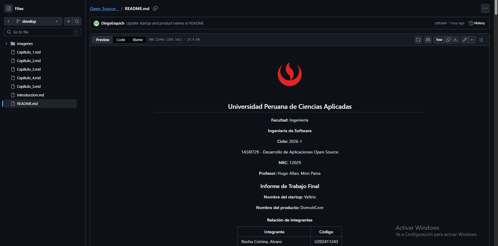

## 5.1. Software Configuration Management

La gestión en DomotiCore es fundamental para asegurar el control de todos los componentes del sistema, incluyendo el código fuente, documentación, prototipos y configuraciones del entorno IoT. Dado que el proyecto involucra múltiples elementos como interfaz web, simulación de dispositivos y lógica de automatización, es necesario mantener un control riguroso que permita el trabajo colaborativo.

## 5.1.1. Software Development Environment Configuration

**Project Management**

- **Trello**: Se utiliza para gestionar las tareas del proyecto, permitiendo visualizar el progreso del desarrollo mediante tableros organizados por estados (To-do, In progress, Done). Esto fue clave durante el Sprint 1, donde se gestionó la finalización del reporte y la landing page.

- **Microsoft Teams**: Se emplea como plataforma principal de comunicación para reuniones, planificación de sprints y coordinación del equipo, facilitando la colaboración remota.

**Requirement Management**

- **Miro**: Se utiliza para estructurar ideas, flujos del sistema y análisis del negocio, incluyendo el Event Storming del sistema IoT.

- **Structurizr**: Permite modelar la arquitectura del sistema DomotiCore bajo el modelo C4, representando componentes como:
dashboard, gateway, nodos IoT, servicios de monitoreo y product UX/UI design.

- **Figma**: Herramienta utilizada para diseñar la interfaz del sistema, incluyendo: dashboard centralizado, control de dispositivos, visualización de consumo energético.

- **Lucidchart**: Se emplea para diagramas de flujo, arquitectura y diseño de procesos del sistema.

**Software Development**: Tecnologías utilizadas para el desarrollo de la Landing Page y la base del sistema web.

- **HTML**

- **CSS**

- **JavaScript**

**WebStorm**: IDE utilizado para el desarrollo del frontend del sistema.

**Software Testing**: Gherkin se utiliza para definir escenarios de prueba basados en historias de usuario: Para el control remoto de dispositivos, automatización por horarios, alertas de consumo energético.

**Software Documentation**

- **GitHub**: Se utiliza como repositorio central del proyecto, permitiendo el control de versiones, trabajo colaborativo, registro de commits, documentación del sistema, software Deployment.

**GitHub Pages**: Se emplea para desplegar la Landing Page del producto, permitiendo mostrar la propuesta de valor de DomotiCore a los usuarios.

      <h1>Controla tu hogar</h1>
    </section>

**Close All HTML Elements**: Todos los elementos deben cerrarse correctamente para evitar errores de renderizado.

 < p >DomotiCore centraliza tus dispositivos.</ p >

< a href="#contacto">Solicitar demo</a >

**Use Lowercase Attribute Names**: Los atributos deben escribirse en minúsculas.

< input type="email" placeholder="tu@correo.com" id="fe" />

**Use Semantic HTML Elements**: Se deben utilizar etiquetas semánticas para mejorar la estructura y accesibilidad.

< nav>...</ nav>
< section id="funciones">...</ section>
< footer>...</ footer>

**Use Descriptive IDs and Classes**: Los nombres deben ser claros y representar su función.

< section id="contacto">
  < div class="contact-form">

## **CSS**

**Use Kebab-Case for Class Names**: Las clases deben escribirse en minúsculas separadas por guiones.

.contact-form {
  display: flex;
}

**Use CSS Variables for Colors**: Se deben definir colores reutilizables en :root.

:root {
  --blue: #1E40AF;
  --navy: #0F172A;
}

**Group Styles by Sections**: El código CSS debe organizarse por secciones del sitio.

/* NAV */
nav { ... }

/* HERO */
.hero { ... }

/* FOOTER */
footer { ... }

**Use Consistent Spacing**: Se debe mantener consistencia en márgenes, padding y alineación.

.section {
  padding: 6rem 2rem;
}

**Responsive Design with Media Queries**: Se deben usar breakpoints para adaptar la interfaz.

@media (max-width: 600px) {
  .hero {
    padding: 4rem 1rem;
  }
}

## **JavaScript**

**Use CamelCase for Variables and Functions**: Las variables y funciones deben usar camelCase.

function sendForm() {
  const userName = document.getElementById('fn').value;
}

**Keep Functions Simple and Clear**: Las funciones deben ser cortas y fáciles de entender.

if (!n || !e) {
  alert('Por favor completa tu nombre y correo.');
  return;
}

**Use Meaningful Variable Names**: Los nombres deben representar su propósito.

const navLinks = document.getElementById('navLinks');
const hamburger = document.getElementById('hamburger');

**Avoid Inline JavaScript**: Se recomienda mantener la lógica separada del HTML.

< button onclick="sendForm()">Enviar</ button>

## 5.1.4. Software Deployment Configuration

Este apartado describe la configuración y el proceso de despliegue del sistema DomotiCore.

**Configuracion del proyecto**
Se crea un repositorio remoto en GitHub para la Landing Page del proyecto DomotiCore.

<img src="imagenes/images_Cap5/5.2.1.8. Team Collaboration.png"

##