## 5.1. Software Configuration Management

La gestión en DomotiCore incluye el código fuente, documentación, prototipos y configuraciones del entorno. El proyecto contempla distintos productos digitales, incluyendo una Landing Page, aplicaciones web y servicios backend orientados a la automatización y monitoreo de dispositivos IoT. El equipo adopta prácticas basadas en GitFlow, Conventional Commits y Semantic Versioning, asegurando un flujo de trabajo colaborativo y organizado.

## 5.1.1. Software Development Environment Configuration
En esta sección se describen las herramientas, tecnologías y plataformas utilizadas por el equipo para el desarrollo colaborativo del proyecto DomotiCore.

| Category | Software / Tool | Purpose in the Project | Access / Download | Preview |
| :--- | :--- | :--- | :--- | :--- |
| **Project Management** | Trello | Gestión de tareas, seguimiento de Sprint Backlog y control del avance del proyecto. | [Trello](https://trello.com) |  |
| **Team Communication** | Microsoft Teams | Plataforma principal de comunicación para reuniones y coordinación del equipo. | [Teams](https://www.microsoft.com/microsoft-teams) |  |
| **Requirements Management** | Miro | Estructuración de ideas, flujos del sistema y análisis de negocio (Event Storming). | [Miro](https://miro.com) | 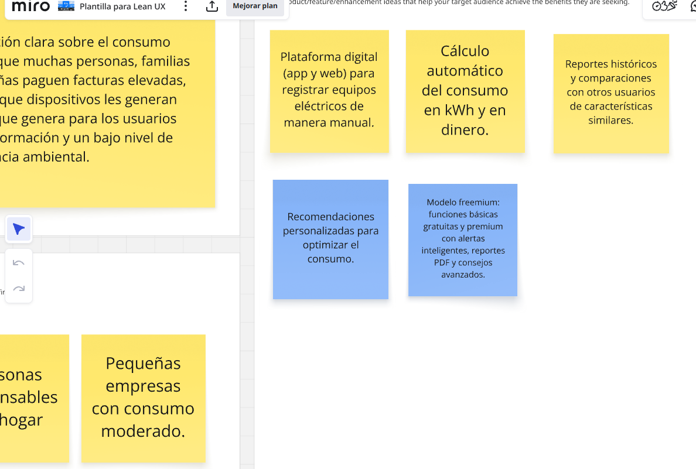 |
| **Software Architecture** | Structurizr | Modelado de la arquitectura bajo el modelo C4 (dashboard, gateway, nodos). | [Structurizr](https://structurizr.com) | 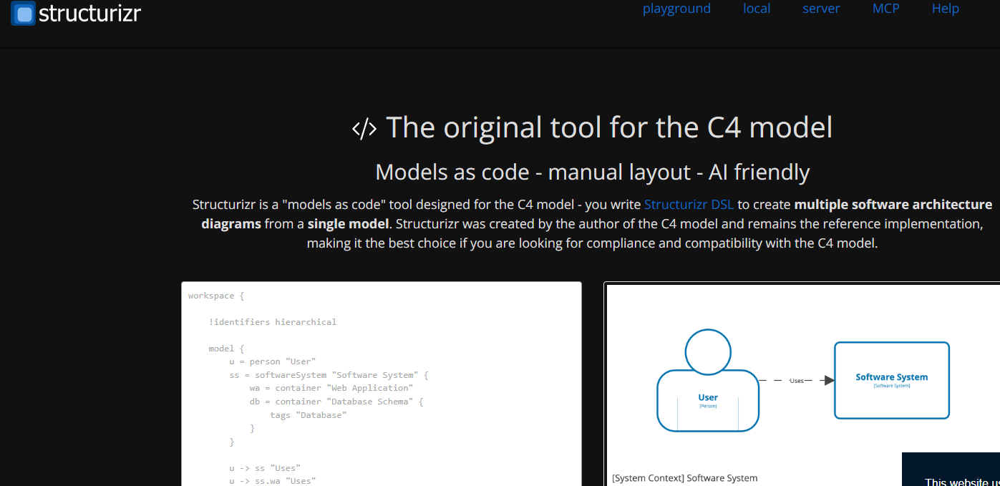 |
| **UX/UI Design** | Figma | Diseño de la interfaz, dashboard y visualización de consumo energético. | [Figma](https://www.figma.com) | 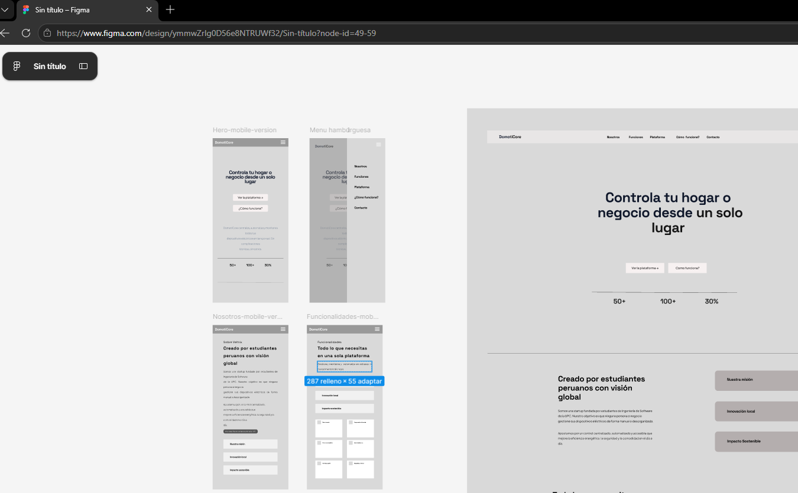 |
| **Diagram Modeling** | Lucidchart | Elaboración de diagramas de flujo, arquitectura y diseño de procesos. | [Lucidchart](https://www.lucidchart.com) | 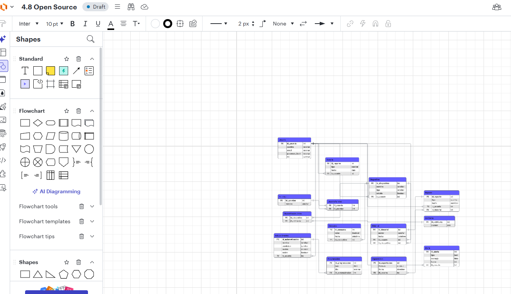 |
| **Frontend Development** | HTML5 | Estructura base para el desarrollo de la Landing Page y la plataforma web. | [MDN](https://developer.mozilla.org) | 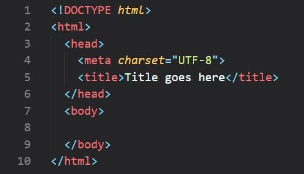 |
| **Frontend Development** | CSS3 | Definición de estilos visuales, diseño responsive y estética. | [MDN](https://developer.mozilla.org) | 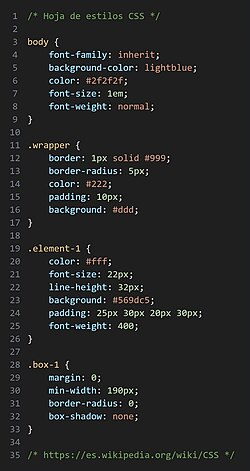 |
| **Frontend Development** | JavaScript | Funcionalidad interactiva y lógica del sistema web. | [MDN](https://developer.mozilla.org) | 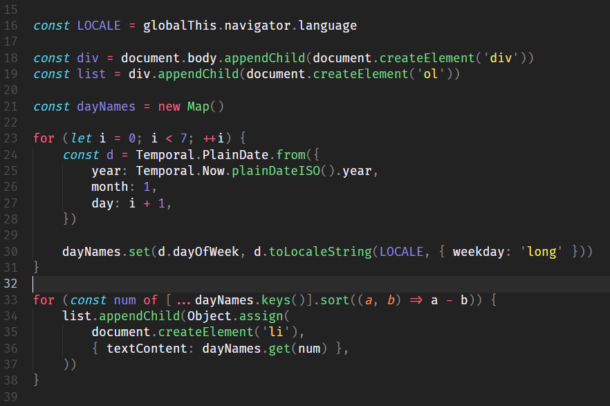 |
| **IDE** | WebStorm | IDE utilizado para el desarrollo y edición del código fuente frontend. | [WebStorm](https://www.jetbrains.com/webstorm) | 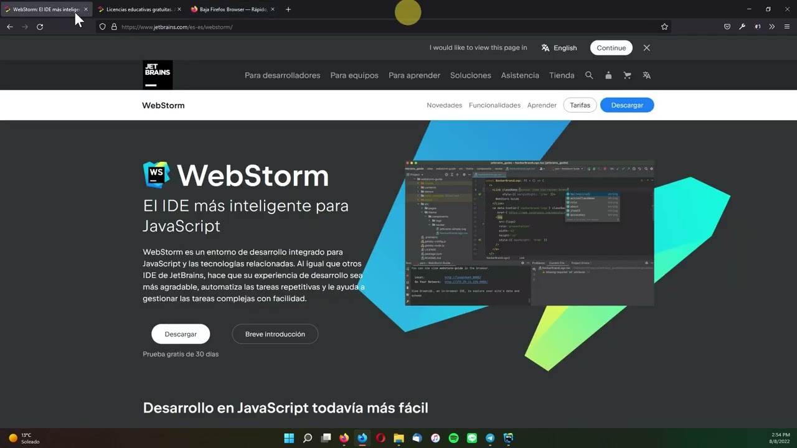 |
| **Version Control** | Git & GitHub | Repositorio central para control de versiones, commits y documentación. | [GitHub](https://github.com) | 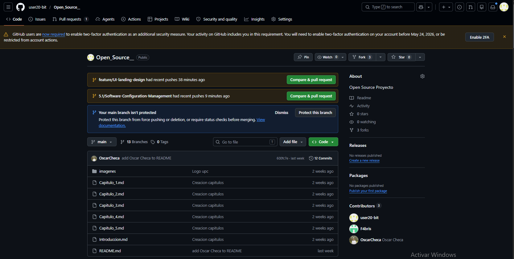 |
| **Software Testing** | Gherkin | Escenarios de prueba (control remoto, automatización, alertas) por historias de usuario. | [Gherkin](https://cucumber.io/docs/gherkin) | 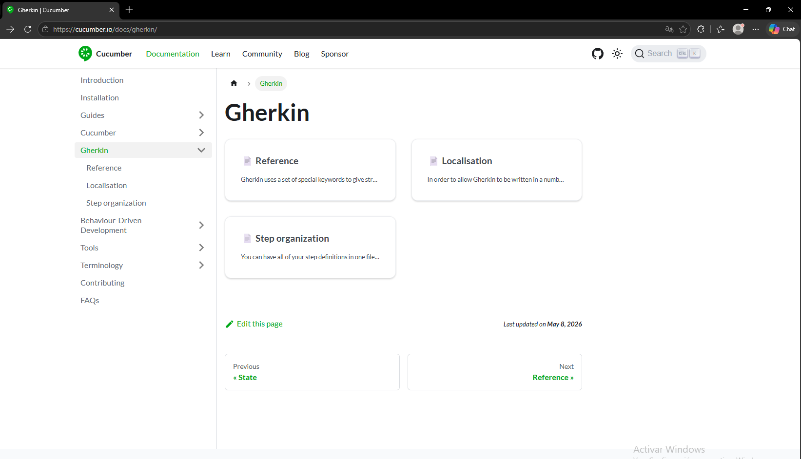  |
| **Deployment** | GitHub Pages | Despliegue de la Landing Page para mostrar la propuesta de valor. | [GH Pages](https://pages.github.com) |  |

## 5.1.2. Source Code Management

La gestión de código fuente del proyecto **DomotiCore** se realiza mediante la plataforma **GitHub**, permitiendo un control de versiones en entorno de trabajo colaborativo. Se han definido repositorios independientes para cada producto digital.

### 5.1.2.1 Repositories

| Product | Repository URL | Description |
| :--- | :--- | :--- |
| **Organization** | [BL-App-Open-Source-1ASI0729-2610-12029](https://github.com/BL-App-Open-Source-1ASI0729-2610-12029) | Organizacion donde se ubican todos los repositorios del proyecto. |
| **Landing Page** | [Veltrix-DomotiCore-Business-Web-Page](https://github.com/BL-App-Open-Source-1ASI0729-2610-12029/Veltrix-DomotiCore-Business-Web-Page) | Repositorio de la Landing Page institucional del proyecto. |
| **Frontend Web Application** | [Veltrix-DomotiCore-Front-End](https://github.com/BL-App-Open-Source-1ASI0729-2610-12029/Veltrix-DomotiCore-Front-End) | Aplicación web para monitoreo y control de dispositivos. |
| **Backend Web Services** | [Veltrix-DomotiCore-Back-end](https://github.com/BL-App-Open-Source-1ASI0729-2610-12029/Veltrix-DomotiCore-Back-end) | API REST y lógica de automatización IoT. |
| **Documentation Repository** | [Veltrix-DomotiCore-Report](https://github.com/BL-App-Open-Source-1ASI0729-2610-12029/Veltrix-DomotiCore-Report) | Documentación técnica, reportes y entregables del proyecto. |
###
<div style="text-align:center;">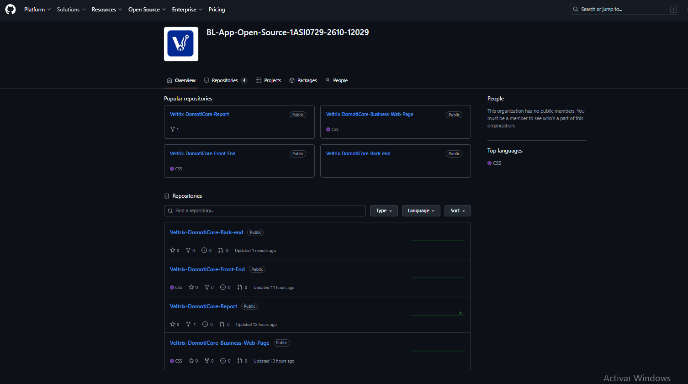</div>

### 5.1.2.2 GitFlow Workflow

El equipo adopta **GitFlow** como estrategia de branching para mantener la estabilidad.

* **Main Branch**: Contiene únicamente versiones estables y aprobadas del proyecto listas para producción.
    * `main`
* **Develop Branch**: Rama principal de integración donde se consolidan las funcionalidades desarrolladas antes de integrarse en producción.
    * `develop`
* **Feature Branches**: Cada nueva funcionalidad se desarrolla en una rama independiente para evitar conflictos en el código base.
    * **Naming Convention**: `feature/<feature-name>`
    * **Examples**: `feature/landing-page-navbar`, `feature/device-monitoring`
* **Hotfix Branches**: Ramas de emergencia para corregir errores críticos detectados directamente en producción.
    * **Naming Convention**: `hotfix/<issue-description>`

### 5.1.2.3 Semantic Versioning

El proyecto utiliza **Semantic Versioning 2.0.0** para controlar las versiones de los productos digitales de Veltrix.

| Version | Description |
| :--- | :--- |
| **v1.0.0** | Primera versión estable y funcional del producto. |
| **v1.1.0** | Incorporación de nuevas funcionalidades menores. |
| **v1.1.1** | Corrección de errores menores. |
| **v2.0.0** | Cambios mayores que incluyen modificaciones estructurales incompatibles. |

### 5.1.2.4 Conventional Commits

Se adopta el estándar de **Conventional Commits** para mantener un historial de cambios limpio y fácil de verificar por el equipo.

| Prefix | Purpose |
| :--- | :--- |
| **feat** | Implementación de nuevas funcionalidades. |
| **fix** | Corrección de errores o bugs. |
| **docs** | Actualizaciones en la documentación del repositorio. |
| **style** | Cambios que no afectan la lógica (espaciados, formatos, CSS). |
| **refactor** | Reestructuración del código existente sin cambiar su funcionalidad. |
| **test** | Corrección de pruebas unitarias o de integración. |

**Examples:**
* `feat: implement responsive landing page`
* `docs: update sprint 1 documentation`
* `fix: correct mobile navigation behavior`
* `style: improve hero section spacing`

## 5.1.3. Source Code Style Guide & Conventions

El equipo adopta convenciones estandarizadas para garantizar legibilidad del código fuente. Como norma general, todos los nombres de variables, clases, funciones y componentes deben ser redactados en idioma **inglés**. 

### 5.1.3.1 HTML Conventions

* **Use Lowercase Element Names**: Todos los elementos y atributos HTML deben escribirse en minúsculas.
    ```html
    <section class="hero-section">
        <input type="email" id="user-email" />
    </section>
    ```
* **Close All HTML Elements**: Todos los elementos deben cerrarse correctamente para evitar errores de renderizado.
    ```html
    <p>DomotiCore centralizes your devices.</p>
    ```
* **Use Semantic HTML Elements**: Se prioriza el uso de etiquetas semánticas para mejorar el SEO y la accesibilidad.
    ```html
    <nav></nav>
    <main></main>
    <footer></footer>
    ```
* **Use Descriptive IDs and Classes**: Los nombres deben ser claros y representar su función.
    ```html
    <div class="contact-form-container">
    ```

### 5.1.3.2 CSS Conventions

* **Use Kebab-Case for Class Names**: Las clases deben escribirse en minúsculas separadas por guiones.
    ```css
    .device-control-panel {
        display: grid;
    }
    ```
* **Use CSS Variables**: Se definen colores y valores reutilizables en el `:root` para facilitar cambios globales.
    ```css
    :root {
        --primary-blue: #1E40AF;
        --dark-navy: #0F172A;
    }
    ```
* **Group Styles by Sections**: El código CSS se organiza mediante bloques de comentarios para identificar claramente las secciones del sistema.
    ```css
    .main-nav { ... }
    .hero-container { ... }
    .control-panel { ... }
    ```
* **Responsive Design**: Uso obligatorio de Media Queries para garantizar una interfaz adaptable.
    ```css
    @media (max-width: 768px) {
        .hero { padding: 2rem; }
    }
    ```

### 5.1.3.3 JavaScript Conventions

* **Use CamelCase**: Las variables y funciones deben seguir la convención camelCase.
    ```javascript
    const deviceStatus = document.getElementById("deviceStatus");
    function updateDeviceStatus() { ... }
    ```
* **Use Meaningful Names**: Los nombres deben representar claramente el propósito del dato o acción.
    ```javascript
    const loginButton = document.querySelector(".btn-login");
    ```
* **Keep Functions Simple**: Las funciones deben realizar una única tarea y ser fáciles de leer.
    ```javascript
    function validateEmail(email) {
        return email.includes("@");
    }
    ```
* **Avoid Inline JavaScript**: La lógica debe estar separada del marcado HTML para mejorar la seguridad y el orden.
    * **Incorrecto**: `<button onclick="sendData()">`
    * **Correcto**: `button.addEventListener("click", sendData);`

## 5.1.4. Software Deployment Configuration

Esta sección describe la configuración, el flujo de trabajo y el proceso de los productos digitales del proyecto.

### 5.1.4.1 Landing Page Deployment

La Landing Page institucional se despliega mediante **GitHub Pages**, utilizando el flujo de integración automática desde la rama `develop`.

**Proceso de Despliegue y Configuración:**

1.  **Configuración del Repositorio:** Se crea el repositorio remoto y se habilitan los permisos para los integrantes del equipo.
    <div style="text-align:center;"></div>
    <div style="text-align:center;">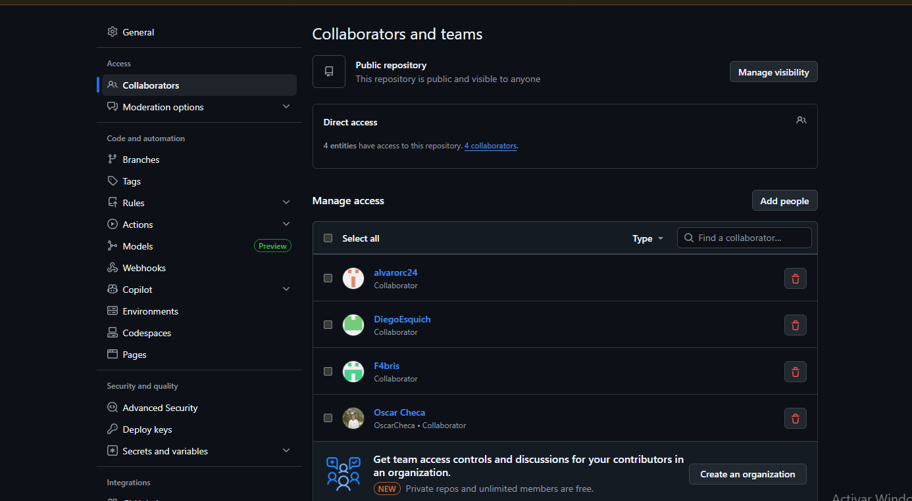</div>

2.  **Estructura de Ramas:** Se organiza el repositorio siguiendo la estrategia de branching definida anteriormente.
    <div style="text-align:center;">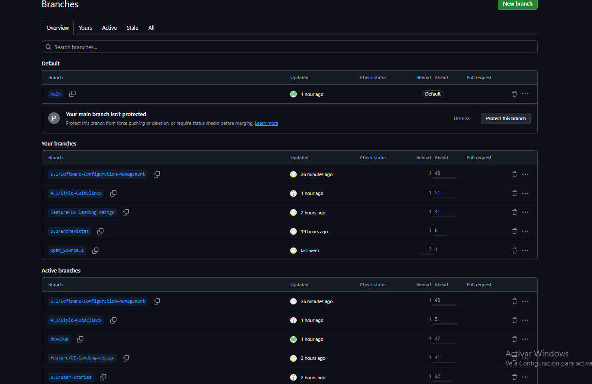</div>

3.  **Commits Automático:** Cada commit realizado en la rama `develop` dispara un proceso de integración que actualiza la versión pública del sitio.
    <div style="text-align:center;">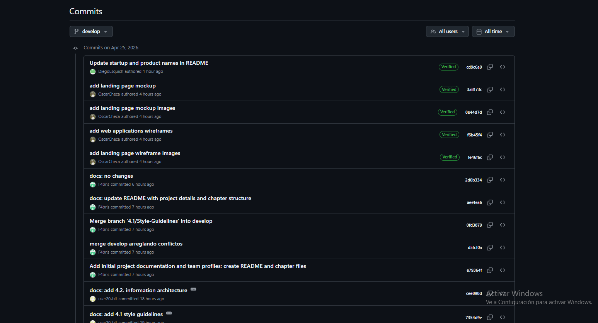</div>

4.  **Habilitación de GitHub Pages:** Se configura el entorno de despliegue para apuntar a la rama de desarrollo.
    <div style="text-align:center;">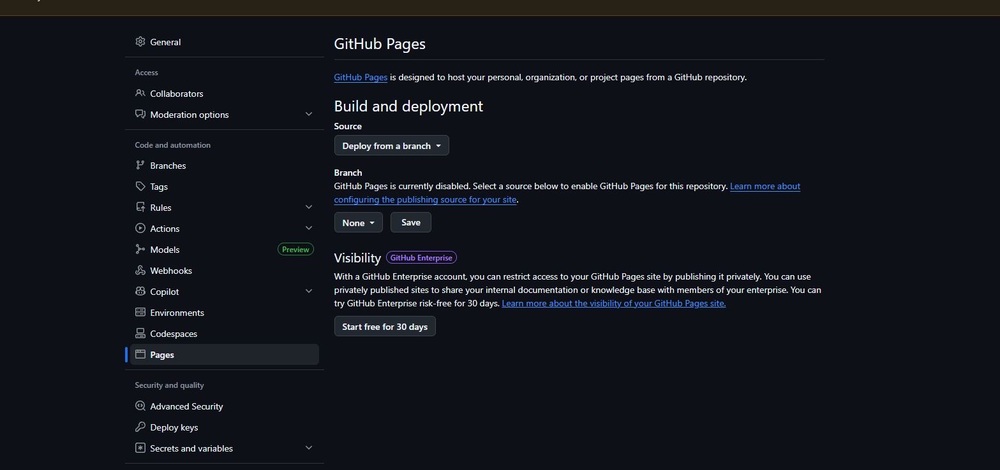</div>

5.  **Validación:** Se verifica la correcta visualización y funcionamiento responsivo en múltiples navegadores (Chrome, Edge, Safari).
    <div style="text-align:center;"></div>

**Deployment URL:** [DomotiCore – Landing Page Veltrix](https://oscarcheca.github.io/domoticore-landing/)

---

### 5.1.4.2 Frontend Web Application Deployment

La aplicación web principal (desarrollada con **Vue.js**) será desplegada utilizando **Vercel** para facilitar la integración continua (CI/CD) y previsualizaciones automáticas por cada Pull Request.

* **Repository**: [Veltrix-DomotiCore-Front-End](https://github.com/BL-App-Open-Source-1ASI0729-2610-12029/Veltrix-DomotiCore-Front-End)
* **Platform**: Vercel
* **Deployment URL**: [https://veltrix-domoticore-front-end.vercel.app/](https://veltrix-domoti-core-front-end-veltrix-domoticore.vercel.app?_vercel_share=bo1aDSBeyY4adfru2VY9Y9eZxjhJidiP)

### 5.1.4.3 Backend Web Services Deployment

Los servicios de lógica de negocio y conectividad IoT se despliegan en **Render**, permitiendo la exposición de endpoints seguros bajo el protocolo HTTPS para la comunicación con los dispositivos.

* **Repository**: [Veltrix-DomotiCore-Back-end](https://github.com/BL-App-Open-Source-1ASI0729-2610-12029/Veltrix-DomotiCore-Back-end)
* **Platform**: Render
* **Deployment URL**: [veltrix-domoticore](https://veltrix-domoticore-backend.onrender.com)

### 5.1.4.4 OpenAPI Documentation

Para facilitar la integración entre el frontend y el backend, la documentación de la API se publica automáticamente mediante **Swagger UI**, permitiendo la visualización y prueba interactiva de los endpoints REST.

* **Documentation URL**: [Veltrix-domoticore-back-end](https://raw.githubusercontent.com/BL-App-Open-Source-1ASI0729-2610-12029/Veltrix-DomotiCore-Back-end/refs/heads/main/openapi.yaml)

## 5.2. Landing Page, Services & Applications Implementation

La implementación de los productos digitales de **DomotiCore** se inició con el desarrollo de la **Landing Page**, orientada a comunicar la propuesta de valor del sistema y presentar una vista preliminar del dashboard.

Durante este Sprint también se definieron las estructuras iniciales para futuras funcionalidades relacionadas con:

* **Monitoreo energético**: Seguimiento del consumo en tiempo real.
* **Gestión de dispositivos inteligentes**: Registro y control de nodos IoT.
* **Automatización del hogar**: Configuración de reglas y escenarios inteligentes.

Estas implementaciones permitieron transformar los requisitos obtenidos mediante **User Stories**, entrevistas de validación y sesiones de **Event Storming** en componentes funcionales de software.

El desarrollo inicial fue realizado utilizando tecnologías frontend como **HTML**, **CSS** y **JavaScript**, siguiendo lineamientos de diseño responsive y buenas prácticas de desarrollo web para garantizar una experiencia de usuario en diversos dispositivos.

## 5.2.1. Sprint 1

El Sprint 1 representa el primer ciclo de desarrollo ágil del proyecto DomotiCore. Durante esta iteración, el equipo se enfocó en la construcción inicial de la Landing Page, organización de repositorios y definición de lineamientos técnicos del proyecto.

## 5.2.1.1. Sprint Planning 1

### Sprint Information

| Campo | Detalle |
| :--- | :--- |
| **Sprint #** | Sprint 1 |
| **Date** | 2026-04-25 |
| **Time** | 11:00 PM |
| **Location** | Microsoft Teams (Reunión virtual) |
| **Prepared By** | Equipo Veltrix |

### Attendees (Planning Meeting)

| Participantes |
| :--- |
| Cesar Quispe |
| Oscar Checa |
| Diego Esquich |
| Fabrizio Rafael |
| Alvaro Rocha |

### Sprint 1 – Review Summary

| Descripción |
| :--- |
| Durante el Sprint 1 se lograron avances importantes como la implementación completa de la Landing Page de DomotiCore, incluyendo secciones como Hero, Features, About y Contacto. Además, se organizó el repositorio en GitHub, se realizaron commits relacionados a wireframes, mockups y documentación, y se implementó una vista simulada del dashboard. Sin embargo, quedaron pendientes aspectos como la integración con backend, automatización real de dispositivos y despliegue final en producción. |

### Sprint 1 – Retrospective Summary

| Descripción |
| :--- |
| El Sprint 1 evidenció problemas en la organización del equipo, como falta de comunicación, distribución ineficiente de tareas y dependencia de entregas de último momento. Como mejoras, se propuso realizar reuniones más frecuentes, utilizar herramientas como Trello para seguimiento, definir responsabilidades claras y mejorar la gestión del tiempo. |

### Sprint Goal & User Stories

| Campo | Detalle |
| :--- | :--- |
| **Sprint 1 Goal** | Desarrollar y desplegar la Landing Page funcional de DomotiCore, estructurar el repositorio en GitHub y reflejar el avance en el tablero de tareas. |
| **Sprint 1 Velocity** | 5 User Stories |
| **Story Points por historia** | 5 puntos |
| **Sum of Story Points** | 25 |

## 5.2.1.2. Aspect Leaders and Collaborators

| Team Member (Last Name, First Name) | GitHub Username | Infrastructure & Repository | Landing Page Development | Documentation (Chapters 1-5) |
| :--- | :--- | :---: | :---: | :---: |
| Checa, Oscar | OscarCheca | **C** | **C** | **C** |
| Quispe, Cesar | user20-bit | **C** | **L** | **L** |
| Esquich, Diego | DiegoEsquich | **L** | **C** | **C** |
| Tello, Fabrizio | F4bris | **C** | **C** | **C** |
| Rocha , Alvaro | alvarorc24 | **C** | **C** | **C** |

## 5.2.1.3. Sprint Backlog 1

Las User Stories del proyecto fueron reorganizadas durante las actividades de Sprint Planning con el objetivo de mejorar la consistencia, trazabilidad y organización funcional del Product Backlog.

Las historias de usuario definidas previamente en la Sección 3.1 fueron estandarizadas siguiendo convenciones Scrum y criterios de aceptación basados en la estructura **Gherkin**, permitiendo una mejor comprensión y validación de funcionalidades durante el desarrollo del proyecto.

Durante el proceso de refinamiento del backlog se realizaron las siguientes mejoras:

* **Estandarización** de la nomenclatura de User Stories y Epics.
* **Consolidación** de funcionalidades duplicadas.
* **Reorganización** de Epics según dominios funcionales.
* **Mejora** en la redacción de criterios de aceptación.
* **Relación** entre Sprint Goals y funcionalidad.

La siguiente tabla resume las principales User Stories consideradas durante las actividades de planificación de Sprint:

| User Story ID | Título | Epic |
| :--- | :--- | :--- |
| **US-01** | Vinculación de Gateway | Gateway Management |
| **US-03** | Control remoto de dispositivos | Device Control |
| **US-06** | Monitoreo energético en tiempo real | Energy Monitoring |
| **US-09** | Notificación de dispositivos desconectados | Notifications |
| **US-17** | Información del producto en la Landing Page | Website |
| **US-19** | Autenticación básica de API | RESTful API |
| **US-21** | Encendido general de dispositivos | Advanced Device Control |
| **US-35** | Optimización automática de consumo | Energy Optimization |
| **US-41** | Previsualización de funciones de la aplicación | Website |


## 5.2.1.4 Source Code Management

La gestión del código fuente para el proyecto **DomotiCore** se realiza utilizando Git como sistema de control de versiones, permitiendo un flujo de trabajo colaborativo y un historial detallado de cambios realizados durante el Sprint.

La siguiente tabla resume los commits más relevantes realizados durante la implementación de los productos digitales:

| Repository | Branch | Commit ID | Commit Message | Date |
| :--- | :--- | :--- | :--- | :--- |
| **domoticore-Business-Web-Page** | main | `53487ee` | feat: implement landing page structure | 2026-04-07 |
| **domoticore-Business-Web-Page** | main | `36702da` | feat: add responsive design support | 2026-04-15 |
| **domoticore-docs** | develop | `94d4937` | docs: update sprint 1 documentation | 2026-04-21 |

## 5.2.1.5. Execution Evidence for Sprint Review

Durante el **Sprint 1** se logró implementar correctamente la estructura visual de la **Landing Page** de DomotiCore, incluyendo navegación interactiva, diseño responsive y un formulario de contacto funcional. Esta entrega presenta las secciones clave que brindan información detallada sobre la propuesta de valor del producto.

### Capturas de Pantalla de la Implementación

A continuación, se presentan las evidencias visuales de los componentes desarrollados:

* **Hero Section**: Primera impresión y propuesta de valor.

<div style="text-align:center;">
</div>

* **Features Section**: Detalle de las funcionalidades IoT.
<div style="text-align:center;">
</div>

* **Dashboard Preview**: Vista preliminar de la interfaz de control.

<div style="text-align:center;">
</div>

<div style="text-align:center;">
</div>

<div style="text-align:center;">
</div>

<div style="text-align:center;">
</div>

* **Contact Form**: Formulario funcional para leads y soporte.
<div style="text-align:center;">
</div>

### Demostración en Video

Asimismo, se adjunta un video demostrativo que recorre la navegación y las funcionalidades implementadas, validando la experiencia de usuario (UX) en diferentes resoluciones.

**Enlace del Video**: [ Demostración de DomotiCore - Sprint 1](https://upcedupe-my.sharepoint.com/:v:/g/personal/u202417405_upc_edu_pe/IQCPng9giTbzT7yPR6RganePARwt5TeTRUKmAmmGUib8n3E?nav=eyJyZWZlcnJhbEluZm8iOnsicmVmZXJyYWxBcHAiOiJTdHJlYW1XZWJBcHAiLCJyZWZlcnJhbFZpZXciOiJTaGFyZURpYWxvZy1MaW5rIiwicmVmZXJyYWxBcHBQbGF0Zm9ybSI6IldlYiIsInJlZmVycmFsTW9kZSI6InZpZXcifX0%3D&e=ZW7H6O)

## 5.2.1.6. Services Documentation Evidence for Sprint Review

En este Sprint aún no se desarrollaron servicios backend completos. Sin embargo, se definieron preliminarmente los endpoints relacionados con monitoreo de dispositivos y automatización IoT.

La documentación OpenAPI será incorporada en los siguientes Sprints.
## 5.2.1.7. Software Deployment Evidence for Sprint Review

Durante este Sprint se realizaron las siguientes actividades clave relacionadas con el despliegue y  disponibilidad del producto:

* **Configuración de GitHub Pages**: Establecimiento del entorno de despliegue automatizado para la rama principal.
* **Publicación inicial de la Landing Page**: Lanzamiento de la primera versión funcional accesible vía web.
* **Validación de despliegue en distintos navegadores**: Pruebas de compatibilidad en Chrome, Firefox y Safari para asegurar una visualización consistente.
* **Verificación de accesibilidad responsive**: Pruebas de usabilidad y diseño adaptable en dispositivos móviles y tablets.


## 5.2.1.8. Team Collaboration Insights during Sprint

El equipo utilizó las herramientas analíticas de **GitHub Insights** para monitorear la participación activa de cada integrante durante el **Sprint 1**. Estos datos permitieron realizar un seguimiento detallado de los commits, pull requests y merges realizados.

La colaboración basada en estas métricas permitió mantener un flujo continuo de integración y control de versiones, fortaleciendo el trabajo colaborativo del equipo y asegurando la integridad del código fuente.

### Evidencia de Colaboración en GitHub

A continuación, se presenta la captura de los analíticos proporcionados por GitHub sobre la actividad del equipo:

<div style="text-align:center;">
</div>

En estas métricas facilitó la identificación de cada apoyo de los colaboradores y ayudó a mejorar la distribución de tareas para los siguientes ciclos de desarrollo.

## Bibliografía

- Samuel Greengard, S. (2015). The Internet of Things. MIT Press.
International Telecommunication Union. (2012). Overview of the Internet of Things (Recommendation ITU-T Y.2060). https://www.itu.int

- World Energy Council. (2020). Energy efficiency indicators. https://www.worldenergy.org

## Conclusiones

1. El desarrollo del proyecto permitió integrar de manera coherente herramientas como User Stories, wireframes y control de versiones con Git, logrando una base sólida tanto a nivel de análisis como de implementación.

2. Asimismo, se evidenció la importancia de una comunicación clara, tanto escrita como visual, para transmitir efectivamente las ideas del proyecto a distintos tipos de audiencia, facilitando la comprensión y el trabajo colaborativo.

## Anexos

**Video  de exposición**
(ACTUALIZAR)
https://upcedupe-my.sharepoint.com/:v:/g/personal/u202113310_upc_edu_pe/IQBB-A5V0F11So9iWE7DqDgoAcl3ZIcmUBVMwC_-fOgFkK0?e=bgWP1d&nav=eyJyZWZlcnJhbEluZm8iOnsicmVmZXJyYWxBcHAiOiJTdHJlYW1XZWJBcHAiLCJyZWZlcnJhbFZpZXciOiJTaGFyZURpYWxvZy1MaW5rIiwicmVmZXJyYWxBcHBQbGF0Zm9ybSI6IldlYiIsInJlZmVycmFsTW9kZSI6InZpZXcifX0%3D

