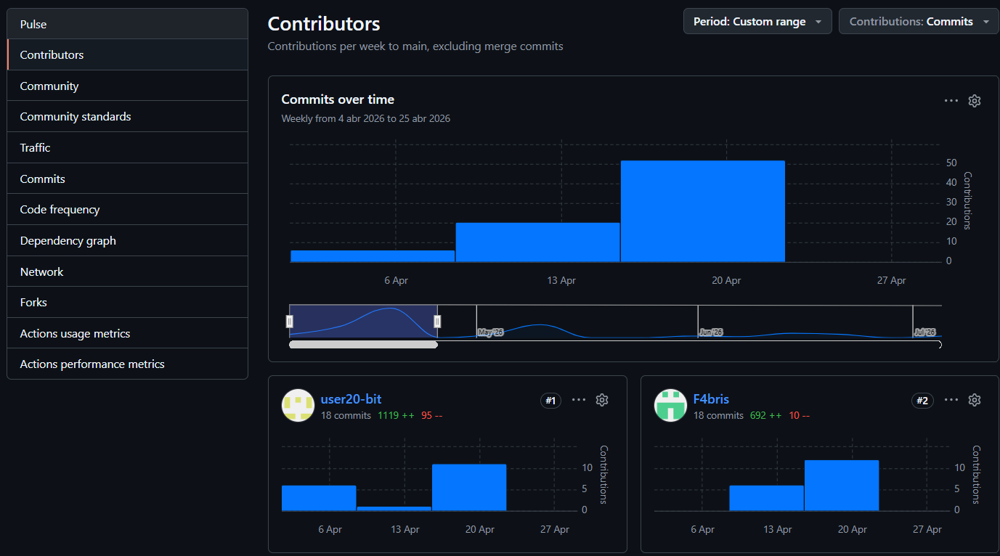
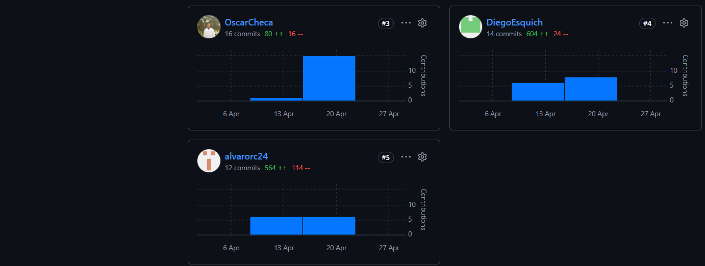
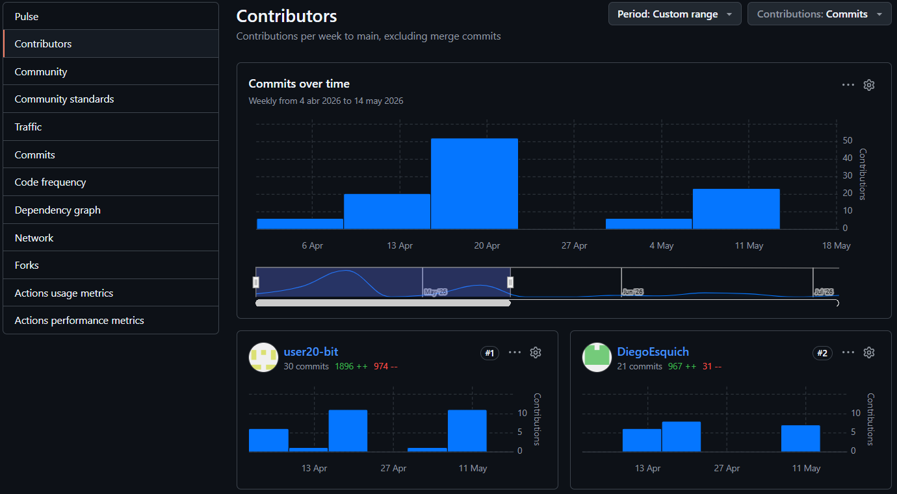
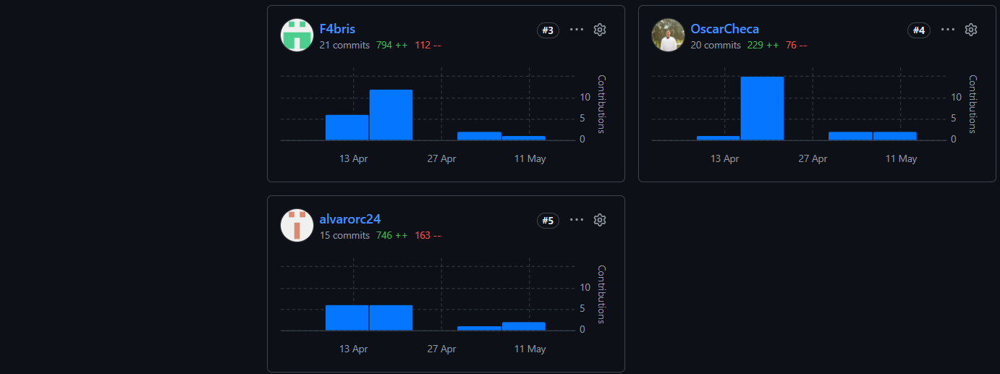
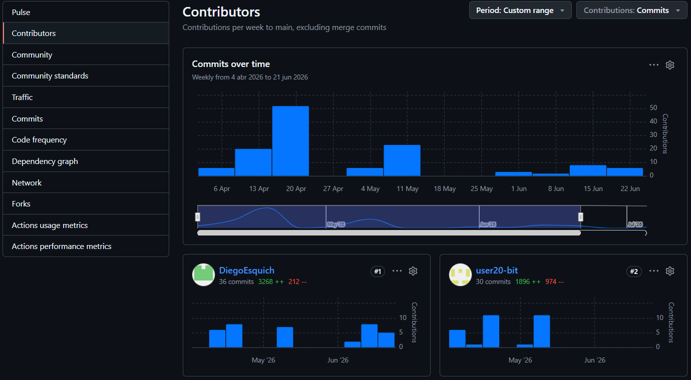
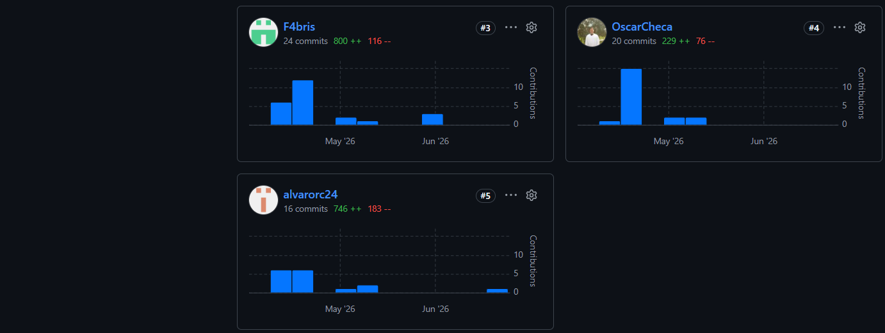

**Universidad Peruana de Ciencias Aplicadas** 
**Carrera de Ingeniería de Software**

**1ASI0729** 
**Desarrollo de Aplicaciones de Open Source** 
NRC 
**12029** 
**Informe del Trabajo Final** 
Docente 
**Mori Paiva, Hugo Allan** 
Equipo 
**Veltrix**

Proyecto 
**DomotiCore**

 **Integrantes**

| Código        |      Apellidos y Nombres          |
| ------------- | --------------------------------- |
| U202411243    | Rocha Cotrina, Alvaro             |
| U202411799    | Esquicha Alcántara, Diego Alonso  |
| U202417405    | Quispe llacsahuanga, César Agusto |
| U202113310    | Tello Palacios, Fabrizio Rafael   |
| U20231E492    | Checa Burga, Oscar Diego          |
| U20211B564    | Véliz Martínez, Diego Alonso      |

**Período 202610**  

**Julio 2026**

---

 

 

# Registro de Versiones del Informe

| Versión | Fecha | Autores | Descripción de modificación  |
| ----------- | --------- |----------- |--------------------|
| AV1 | 20/04/2026 | Tello Palacios, Fabrizio Rafael    Esquicha Alcántara, Diego Alonso    Rocha Cotrina, Alvaro    Quispe llacsahuanga, César Agusto    Checa Burga, Oscar Diego |  Creacion de estructura de informe en github y redacción de los 5 capítulos. Hicimos el despliegue de la primera versión de la Landing Page |
| TB1 | 14/05/2026 | Tello Palacios, Fabrizio Rafael    Esquicha Alcántara, Diego Alonso    Rocha Cotrina, Alvaro    Quispe llacsahuanga, César Agusto    Checa Burga, Oscar Diego |  Creación del Frontend y primera versión de la Frontend. En la aplicación de WebStorm |
| AV2 | 02/06/2026 | Tello Palacios, Fabrizio Rafael    Esquicha Alcántara, Diego Alonso    Rocha Cotrina, Alvaro    Quispe llacsahuanga, César Agusto    Checa Burga, Oscar Diego    Véliz Martínez, Diego Alonso |  Creación del Backend y culminación del Frontend. Asimismo, primera versión del Backend. |
| TB2 | 05/07/2026 | Tello Palacios, Fabrizio Rafael    Esquicha Alcántara, Diego Alonso    Rocha Cotrina, Alvaro    Quispe llacsahuanga, César Agusto    Checa Burga, Oscar Diego    Véliz Martínez, Diego Alonso | Culminación del Backend y Correción de errores anteriores versiones(reporte y Landing page) |

# Project Report Collaboration Insights

Para el desarrollo del **Project Report**, el equipo utiliza un repositorio dentro de la organización en GitHub. A continuación, se presenta la evidencia de colaboración de cada entregable, en coherencia con el **Registro de Versiones del Informe**.

**Repositorio del informe del proyecto:** https://github.com/BL-App-Open-Source-1ASI0729-2610-12029/Veltrix-DomotiCore-Report

- **Total de commits:** 145
- **Autores contribuyentes:**
  - Alvaro Rocha Cotrina ( `alvarorc24` )
  - Diego Alonso Esquicha Alcántara ( `DiegoEsquich` )
  - Cesar Augusto Quispe Llacsahuanga ( `user20-bit` )
  - Oscar Diego Checa Burga ( `OscarCheca` )
  - Fabrizio Rafael Tello Palacios ( `F4bris` )
  - Diego Alonso Véliz Martínez ( `Diego Véliz` )
- La actividad se distribuyó en ramas temáticas por secciones del informe, asegurando revisiones cruzadas mediante *pull requests*.

---

## AV1 — Semana 4

Durante esta fase, el equipo elaboró el **informe inicial**, que incluyó los siguientes aspectos:

- **Carátula** con información institucional y de la startup.
- **Registro de Versiones del Informe**, documentando los cambios realizados.
- **Capítulo I** con nuestra propuesta inicial de nuestro proyecto.
- **Capítulo II** con los primeros avances en Requirements Elicitation & Analysis.
- **Capítulo III** con la especificación de Requisitos, User Stories y Product Backlog.
- **Capítulo IV** con los avances en Product Design, incluyendo Style Guidelines, Wireframes y Mockups.
- **Capítulo V** con los avances del Product Implementation, Validation & Deployment.
- **Adicionalmente** conclusiones, bibliografía y anexos.

A continuación se presenta la captura de los analíticos de colaboración y commits en GitHub para este entregable:

| Integrante | Usuario GitHub | Commits | Adiciones | Eliminaciones |
|---|---|---|---|---|
| Cesar Augusto Quispe Llacsahuanga | `user20-bit` | 18 | 1119 | 95 |
| Fabrizio Rafael Tello Palacios | `F4bris` | 18 | 692 | 10 |
| Oscar Diego Checa Burga | `OscarCheca` | 16 | 80 | 16 |
| Diego Alonso Esquicha Alcántara | `DiegoEsquich` | 14 | 604 | 24 |
| Alvaro Rocha Cotrina | `alvarorc24` | 12 | 564 | 114 |

La colaboración fue activa y equitativa, con aportes sustanciales de todos los integrantes en la redacción y organización del informe.

## TB1 - Semana 7

Durante esta fase, el equipo elaboró el **informe para la entrega parcial**, que incluyó los siguientes aspectos:

- **Registro de Versiones del Informe**, documentando los cambios realizados.
- **Capítulo II** correcciones realizadas respecto a las entrevistas por cada segmento definido.
- **Capítulo III** mejora de las User Stories para la elaboración de la primera versión del Frontend.
- **Capítulo IV** agregado tanto de EventStorming y Class, Database Diagrams.
- **Capítulo V** sprint backlog número 2.
- **Adicionalmente** conclusiones, bibliografía y anexos.

A continuación se presenta la captura de los analíticos de colaboración y commits en GitHub para este entregable:

| Integrante | Usuario GitHub | Commits | Adiciones | Eliminaciones |
|---|---|---|---|---|
| Cesar Augusto Quispe Llacsahuanga | `user20-bit` | 30 | 1896 | 974 |
| Diego Alonso Esquicha Alcántara | `DiegoEsquich` | 21 | 967 | 31 |
| Fabrizio Rafael Tello Palacios | `F4bris` | 21 | 794 | 112 |
| Oscar Diego Checa Burga | `OscarCheca` | 20 | 229 | 76 |
| Alvaro Rocha Cotrina | `alvarorc24` | 15 | 746 | 163 |
| Diego Alonso Véliz Martínez | `Diego Véliz` | - | - | - |

La colaboración fue activa y equitativa, con aportes sustanciales de todos los integrantes en la redacción y organización del informe.

## AV2 - Semana 12

Durante esta fase, el equipo elaboró el **informe para la segunda entrega**, que incluyó los siguientes aspectos:

- **Registro de Versiones del Informe**, documentando los cambios realizados.
- **Capítulo III** refinación de las User Stories.
- **Capítulo V** sprint backlog número 3, evidencias del despliegue tanto Frontend como Backend y elaboración de las entrevistas de validación para las Heurísticas.
- **Adicionalmente** conclusiones, bibliografía y anexos.

A continuación se presenta la captura de los analíticos de colaboración y commits en GitHub para este entregable:

| Integrante | Usuario GitHub | Commits | Adiciones | Eliminaciones |
|---|---|---|---|---|
| Diego Alonso Esquicha Alcántara | `DiegoEsquich` | 36 | 3268 | 212 |
| Cesar Augusto Quispe Llacsahuanga | `user20-bit` | 30 | 1896 | 974 |
| Fabrizio Rafael Tello Palacios | `F4bris` | 24 | 800 | 116 |
| Oscar Diego Checa Burga | `OscarCheca` | 20 | 229 | 76 |
| Alvaro Rocha Cotrina | `alvarorc24` | 16 | 746 | 183 |

La colaboración fue parcialmente activa, con aportes sustanciales de algunos integrantes en la redacción y organización del informe.

## TB2 - Semana 12

Durante esta fase, el equipo elaboró el **informe para la entrega final**, que incluyó los siguientes aspectos:

- **Carátula** en la versión final.
- **Registro de Versiones del Informe**, documentando los cambios realizados.
- **Capítulo I** formato O'really para el apartado de Lean UX.
- **Capítulo III** User Stories con el formato O'really y cambio de nombres apropiado.
- **Capítulo IV** Wireframes, Wireflows, User Flows, todo lo relacionado a Mobile fue retirado.
- **Capítulo V** sprint backlog número 4, últimas correcciones tanto links como evidencias.
- **Adicionalmente** conclusiones, bibliografía y anexos.

| Integrante | Usuario GitHub | Commits | Adiciones | Eliminaciones |
|---|---|---|---|---|
| Diego Alonso Esquicha Alcántara | `DiegoEsquich` | - | - | - |
| Cesar Augusto Quispe Llacsahuanga | `user20-bit` | - | - | - |
| Fabrizio Rafael Tello Palacios | `F4bris` | - | - | - |
| Oscar Diego Checa Burga | `OscarCheca` | - | - | - |
| Alvaro Rocha Cotrina | `alvarorc24` | - | - | - |
| Diego Alonso Véliz Martínez | `Diego Véliz` | - | - | - |
La colaboración fue totalmene activa, con aportes sustanciales de algunos integrantes en la redacción y organización del informe.

# Tabla de Contenidos

## [Capítulo I: Introducción](Capitulo_1.md)

- [1.1. Startup Profile](Capitulo_1.md#11-startup-profile)
  - [1.1.1. Descripción de la Startup](Capitulo_1.md#111-descripción-de-la-startup)
  - [1.1.2. Perfiles de integrantes del equipo](Capitulo_1.md#112-perfiles-de-los-miembros-del-equipo)
- [1.2. Solution Profile](Capitulo_1.md#12-solution-profile)
  - [1.2.1. Antecedentes y problemática](Capitulo_1.md#121-antecedentes-y-problemática)
  - [1.2.2. Lean UX Process](Capitulo_1.md#122-lean-ux-process)
    - [1.2.2.1. Lean UX Problem Statements](Capitulo_1.md#1221-lean-ux-problem-statements)
    - [1.2.2.2. Lean UX Assumptions](Capitulo_1.md#1222-lean-ux-assumptions)
    - [1.2.2.3. Lean UX Hypothesis Statements](Capitulo_1.md#1223-lean-ux-hypothesis-statements)
    - [1.2.2.4. Lean UX Canvas](Capitulo_1.md#1224-lean-ux-canvas)
- [1.3. Segmentos objetivo](Capitulo_1.md#13-segmentos-objetivos)

---

## [Capítulo II: Requirements Elicitation & Analysis](Capitulo_2.md)

- [2.1. Competidores](Capitulo_2.md#21-competidores)
  - [2.1.1. Análisis competitivo](Capitulo_2.md#211-analisis-competitivo)
  - [2.1.2. Estrategias y tácticas frente a competidores](Capitulo_2.md#212-estrategias-y-tácticas-frente-a-competidores)
- [2.2. Entrevistas](Capitulo_2.md#22-entrevistas)
  - [2.2.1. Diseño de entrevistas](Capitulo_2.md#221-diseño-de-entrevistas)
  - [2.2.2. Registro de entrevistas](Capitulo_2.md#222-registro-de-entrevistas)
  - [2.2.3. Análisis de entrevistas](Capitulo_2.md#223-análisis-de-entrevistas)
- [2.3. Needfinding](Capitulo_2.md#23-needfinding)
  - [2.3.1. User Personas](Capitulo_2.md#231-user-personas)
  - [2.3.2. User Task Matrix](Capitulo_2.md#232-user-task-matrix)
  - [2.3.3. User Journey Mapping](Capitulo_2.md#233-user-journey-mapping)
  - [2.3.4. Empathy Mapping](Capitulo_2.md#234-empathy-mapping)
- [2.4. Big Picture Event Storming](Capitulo_2.md#24-big-picture-eventstorming)
- [2.5. Ubiquitous Language](Capitulo_2.md#25-ubiquitous-language)

---

## [Capítulo III: Requirements Specification](Capitulo_3.md)

- [3.1. User Stories](Capitulo_3.md#31-user-stories)
- [3.2. Impact Mapping](Capitulo_3.md#32-impact-mapping)
- [3.3. Product Backlog](Capitulo_3.md#33-product-backlog)

---

## [Capítulo IV: Product Design](Capitulo_4.md)

- [4.1. Style Guidelines](Capitulo_4.md#41-style-guidelines)
  - [4.1.1. General Style Guidelines](Capitulo_4.md#411-general-style-guidelines)
  - [4.1.2. Web Style Guidelines](Capitulo_4.md#412-web-style-guidelines)
- [4.2. Information Architecture](Capitulo_4.md#42-information-architecture)
  - [4.2.1. Organization Systems](Capitulo_4.md#421-organization-systems)
  - [4.2.2. Labeling Systems](Capitulo_4.md#422-labeling-systems)
  - [4.2.3. SEO Tags and Meta Tags](Capitulo_4.md#423-seo-tags-and-meta-tags)
  - [4.2.4. Searching Systems](Capitulo_4.md#424-searching-systems)
  - [4.2.5. Navigation Systems](Capitulo_4.md#425-navigation-systems)
- [4.3. Landing Page UI Design](Capitulo_4.md#43-landing-page-ui-design)
  - [4.3.1. Landing Page Wireframe](Capitulo_4.md#431-landing-page-wireframe)
  - [4.3.2. Landing Page Mock-up](Capitulo_4.md#432-landing-page-mock-up)
- [4.4. Web Applications UX/UI Design](Capitulo_4.md#44-web-applications-uxui-design)
  - [4.4.1. Web Applications Wireframes](Capitulo_4.md#441-web-applications-wireframes)
  - [4.4.2. Web Applications Wireflow Diagrams](Capitulo_4.md#442-web-applications-wireflow-diagrams)
  - [4.4.3. Web Applications Mock-ups](Capitulo_4.md#443-web-applications-mock-ups)
  - [4.4.4. Web Applications User Flow Diagrams](Capitulo_4.md#444-web-applications-user-flow-diagrams)
- [4.5. Web Applications Prototyping](Capitulo_4.md#45-web-applications-prototyping)
- [4.6. Domain-Driven Software Architecture](Capitulo_4.md#46-domain-driven-software-architecture)
  - [4.6.1. Design-Level Event Storming.](Capitulo_4.md#461-design-level-eventstorming)
  - [4.6.2. Software Architecture Context Diagram](Capitulo_4.md#462-software-architecture-context-diagram)
  - [4.6.3. Software Architecture Container Diagrams](Capitulo_4.md#463-software-architecture-container-diagrams)
  - [4.6.4. Software Architecture Components Diagrams](Capitulo_4.md#464-software-architecture-components-diagrams)
- [4.7. Software Object-Oriented Design](Capitulo_4.md#47-software-object-oriented-design)
  - [4.7.1. Class Diagrams](Capitulo_4.md#471-class-diagrams)
- [4.8. Database Design](Capitulo_4.md#48-database-design)
  - [4.8.1. Database Diagram](Capitulo_4.md#481-database-diagrams)

---

## [Capítulo V: Product Implementation, Validation & Deployment](Capitulo_5.md)

- [5.1. Software Configuration Management](Capitulo_5.md#51-software-configuration-management)
  - [5.1.1. Software Development Environment Configuration](Capitulo_5.md#511-software-development-environment-configuration)
  - [5.1.2. Source Code Management](Capitulo_5.md#512-source-code-management)
  - [5.1.3. Source Code Style Guide & Conventions](Capitulo_5.md#513-source-code-style-guide--conventions)
  - [5.1.4. Software Deployment Configuration](Capitulo_5.md#514-software-deployment-configuration)
- [5.2. Landing Page, Services & Applications Implementation](Capitulo_5.md#52-landing-page-services--applications-implementation)
  - [5.2.1. Sprint 1](Capitulo_5.md#521-sprint-1)
    - [5.2.1.1. Sprint Planning 1](Capitulo_5.md#5211-sprint-planning-1)
    - [5.2.1.2. Aspect Leaders and Collaborators](Capitulo_5.md#5212-aspect-leaders-and-collaborators)
    - [5.2.1.3. Sprint Backlog 1](Capitulo_5.md#5213-sprint-backlog-1)
    - [5.2.1.4. Development Evidence for Sprint Review](Capitulo_5.md#5214-development-evidence-for-sprint-review)
    - [5.2.1.5. Execution Evidence for Sprint Review](Capitulo_5.md#5215-execution-evidence-for-sprint-review)
    - [5.2.1.6. Services Documentation Evidence for Sprint Review](Capitulo_5.md#5216-services-documentation-evidence-for-sprint-review)
    - [5.2.1.7. Software Deployment Evidence for Sprint Review](Capitulo_5.md#5217-software-deployment-evidence-for-sprint-review)
    - [5.2.1.8. Team Collaboration Insights during Sprint](Capitulo_5.md#5218-team-collaboration-insights-during-sprint)
  - [5.2.2. Sprint 2](Capitulo_5.md#522-sprint-2)
    - [5.2.2.1. Sprint Planning 2](Capitulo_5.md#5221-sprint-planning-2)
    - [5.2.2.2. Aspect Leaders and Collaborators](Capitulo_5.md#5222-aspect-leaders-and-collaborators)
    - [5.2.2.3. Sprint Backlog 2](Capitulo_5.md#5223-sprint-backlog-2)
    - [5.2.2.4. Development Evidence for Sprint Review](Capitulo_5.md#5224-development-evidence-for-sprint-review)
    - [5.2.2.5. Execution Evidence for Sprint Review](Capitulo_5.md#5225-execution-evidence-for-sprint-review)
    - [5.2.2.6. Services Documentation Evidence for Sprint Review](Capitulo_5.md#5226-services-documentation-evidence-for-sprint-review)
    - [5.2.2.7. Software Deployment Evidence for Sprint Review](Capitulo_5.md#5227-software-deployment-evidence-for-sprint-review)
    - [5.2.2.8. Team Collaboration Insights during Sprint](Capitulo_5.md#5228-team-collaboration-insights-during-sprint)
    -----
    
  - [5.2.3. Sprint 3](#523-sprint-3)
    - [5.2.3.1. Sprint Planning 3](05-Chapter-5-Product-Implementation%2C-Validation-%26-Deployment.md#5231-sprint-planning-3)
    - [5.2.3.2. Aspect Leaders and Collaborators](05-Chapter-5-Product-Implementation%2C-Validation-%26-Deployment.md#5232-aspect-leaders-and-collaborators)
    - [5.2.3.3. Sprint Backlog 3](05-Chapter-5-Product-Implementation%2C-Validation-%26-Deployment.md#5233-sprint-backlog-3)
    - [5.2.3.4. Development Evidence for Sprint Review](05-Chapter-5-Product-Implementation%2C-Validation-%26-Deployment.md#5234-development-evidence-for-sprint-review)
    - [5.2.3.5. Execution Evidence for Sprint Review](#5235-execution-evidence-for-sprint-review)
    - [5.2.3.6. Services Documentation Evidence for Sprint Review](#5236-services-documentation-evidence-for-sprint-review)
    - [5.2.3.7. Software Deployment Evidence for Sprint Review](#5237-software-deployment-evidence-for-sprint-review)
    - [5.2.3.8. Team Collaboration Insights during Sprint](#5238-team-collaboration-insights-during-sprint)
  - [5.2.4. Sprint 4](#524-sprint-4)
    - [5.2.4.1. Sprint Planning 4](05-Chapter-5-Product-Implementation%2C-Validation-%26-Deployment.md#5241-sprint-planning-4)
    - [5.2.4.2. Aspect Leaders and Collaborators](#5242-aspect-leaders-and-collaborators)
    - [5.2.4.3. Sprint Backlog 4](05-Chapter-5-Product-Implementation%2C-Validation-%26-Deployment.md#5243-sprint-backlog-4)
    - [5.2.4.4. Development Evidence for Sprint Review](05-Chapter-5-Product-Implementation%2C-Validation-%26-Deployment.md#5244-development-evidence-for-sprint-review)
    - [5.2.4.5. Execution Evidence for Sprint Review](05-Chapter-5-Product-Implementation%2C-Validation-%26-Deployment.md#5245-execution-evidence-for-sprint-review)
    - [5.2.4.6. Services Documentation Evidence for Sprint Review](05-Chapter-5-Product-Implementation%2C-Validation-%26-Deployment.md#5246-services-documentation-evidence-for-sprint-review)
    - [5.2.4.7. Software Deployment Evidence for Sprint Review](#5247-software-deployment-evidence-for-sprint-review)
    - [5.2.4.8. Team Collaboration Insights during Sprint](05-Chapter-5-Product-Implementation%2C-Validation-%26-Deployment.md#5248-team-collaboration-insights-during-sprint)
- [5.3. Validation Interviews](05-Chapter-5-Product-Implementation%2C-Validation-%26-Deployment.md#53-validation-interviews)
  - [5.3.1. Diseño de entrevistas](05-Chapter-5-Product-Implementation%2C-Validation-%26-Deployment.md#531-diseño-de-entrevistas)
  - [5.3.2. Registro de entrevistas](05-Chapter-5-Product-Implementation%2C-Validation-%26-Deployment.md#532-registro-de-entrevistas)
  - [5.3.3. Evaluaciones según heurísticas](05-Chapter-5-Product-Implementation%2C-Validation-%26-Deployment.md#533-evaluaciones-según-heurísticas)
- [5.4. Video About-the-Product](05-Chapter-5-Product-Implementation%2C-Validation-%26-Deployment.md#54-video-about-the-product)

---

## [Conclusiones](Conclusiones.md)

- [Conclusiones](Conclusiones.md#conclusiones-y-recomendaciones)

---

## [Bibliografía](Bibliografia.md)

- [Bibliografia](Bibliografia.md#bibliografía)

---

## [Anexos](Anexos.md)

- [Video About-the-Team]()
- [Video AV1](Anexos.md#video--de-exposición-av1)

---